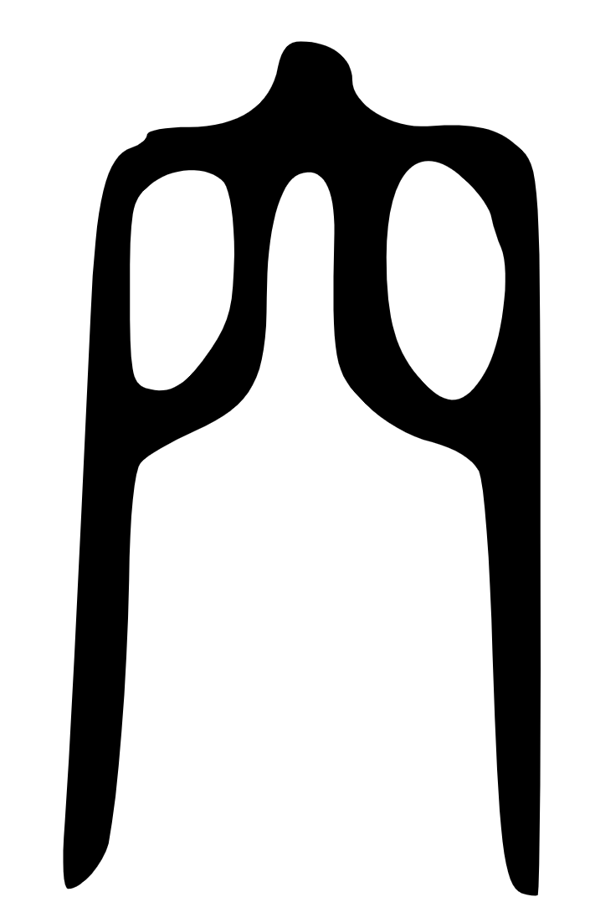
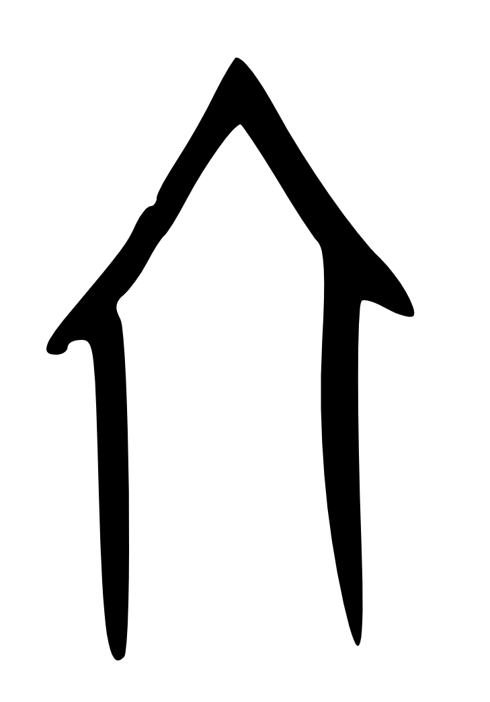
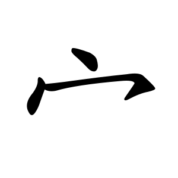
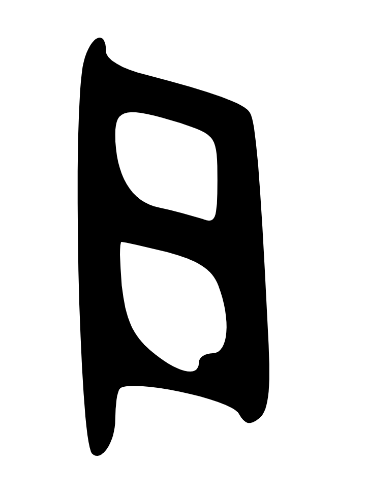
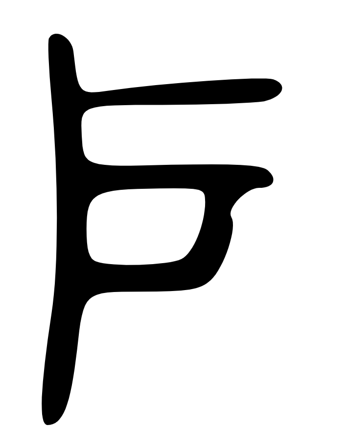
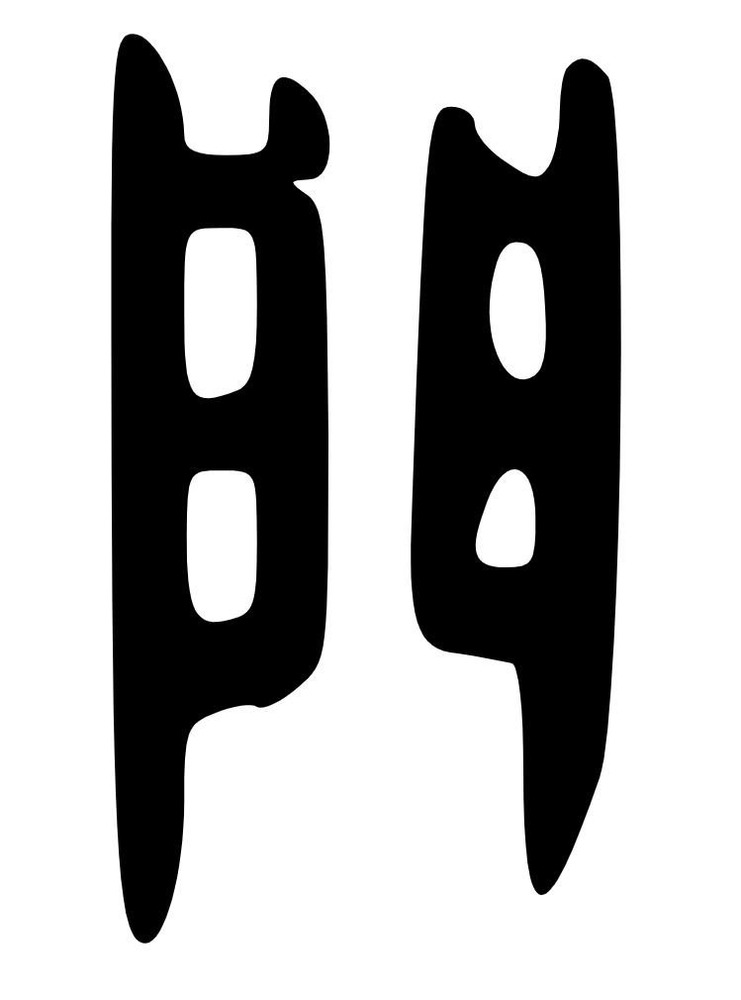
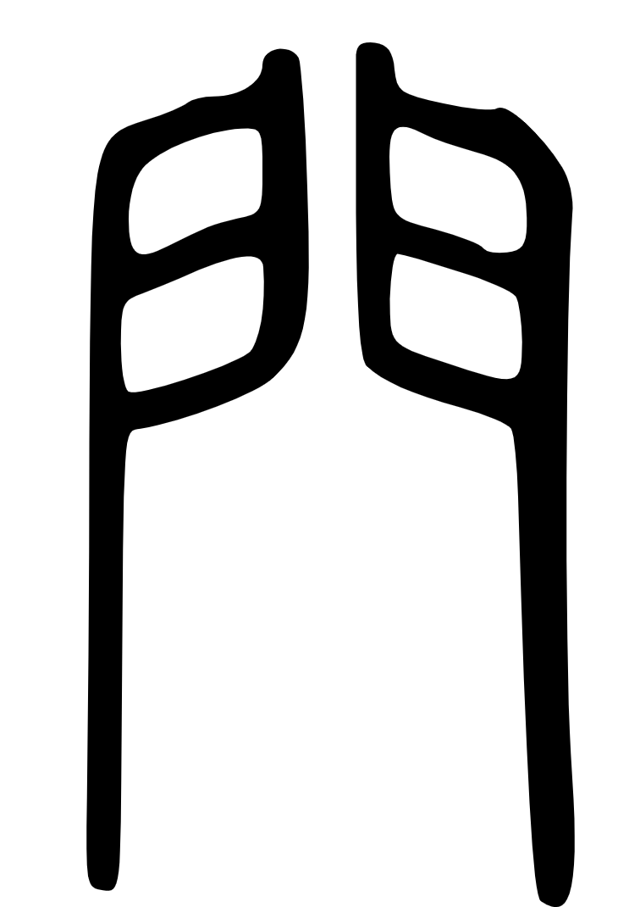
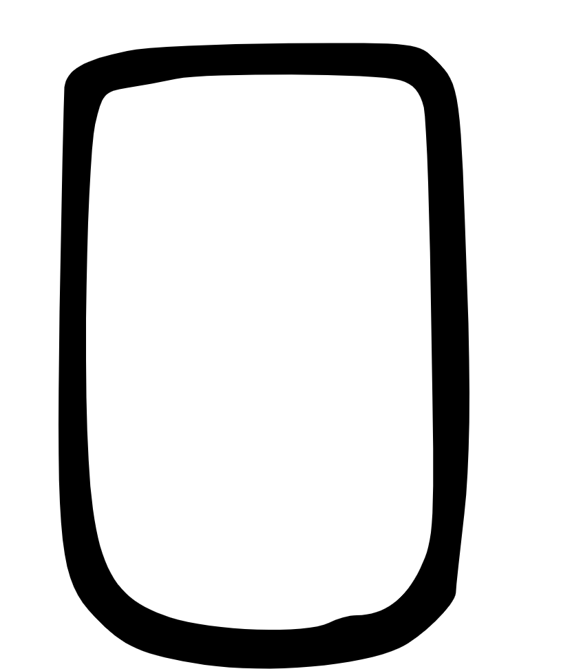
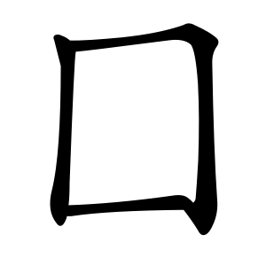
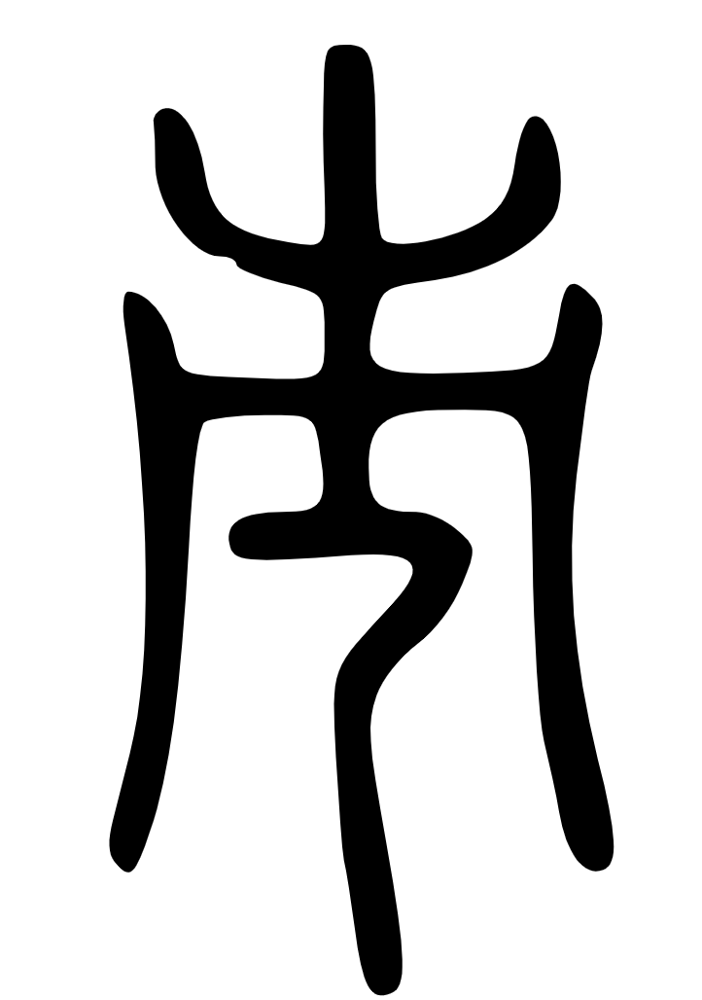

# Section 2.5: SHELTER & ARCHITECTURE - Dwelling (住)

## (1) Background

Shelter construction marks the transition from nomadic opportunistic dwelling (caves, temporary shelters) to engineered permanent structures—a foundational achievement enabling settled civilization. Characters encoding shelter knowledge preserve the evolution from Paleolithic cave habitation through Neolithic pit dwellings to above-ground architectural complexes with walls, doors, roofs, and urban settlements. This progression reflects humanity's mastery over environment: from adapting to natural shelter → modifying natural shelter → constructing artificial shelter → organizing communal living spaces.

The 住 (zhù, dwell/live) character itself = 亻(person) + 主 (master/host), encoding "person as master of space" = dwelling/residing. This reveals the cognitive shift from transient occupation to permanent mastery of living space.

**穴 (xué) - Cave, Dwelling Hole:**
Already discussed in Section 2.3 (Stone Age Technology), 穴 bridges natural and constructed shelter. Oracle bone forms depict cave opening or pit dwelling entrance, encoding the Paleolithic-to-Neolithic transition from natural caves → excavated pit dwellings (半地穴 semi-subterranean houses). The character appears in 空 (empty), 究 (investigate depths), 窗 (window opening), demonstrating how cave/hollow concepts extended to architectural voids.

**宀 (mián) - Roof:**
Oracle bone forms show a peaked roof structure from aerial view, depicting the most visible architectural element—the roof protecting inhabitants from weather. This radical appears in 家 (home = 宀 + 豕, roof + pig = settled household), 安 (peace = 女 + 宀, woman under roof = security), 室 (room), 宫 (palace), demonstrating roof as the defining architectural symbol. The character encodes roofing as primary shelter requirement—protection from rain, sun, cold.

**户 (hù) - Door, Household:**
Oracle bone forms depict single door panel (one-leaf door) on vertical hinge, showing wooden plank construction. The character encodes entry/exit control—doors mark boundary between inside/outside, private/public. Semantic extensions include 户口 (household registration), 户主 (head of household), showing how architectural element (door) became unit of social organization. Single-panel door suggests smaller domestic structures (vs. ceremonial double doors).

**門 (mén) - Gate, Double Door:**
Oracle bone forms show two door panels side by side, depicting double-leaf gate construction for larger openings (city gates, palace gates, important buildings). The character encodes architectural hierarchy: 户 = simple single door (common dwellings) vs. 門 = grand double gates (elite/public buildings). Appears in 開 (open = 門 + 廾, gate + hands = opening doors), 閉 (close), 間 (space between gates = interval), 問 (ask = 門 + 口, knocking at gate + speaking). The structural distinction (single vs. double panel) directly encodes social stratification through architecture.

**囗 (wéi) - Enclosure, Boundary:**
Oracle bone forms show square enclosure marking bounded space, representing walls or fences defining territory. This radical appears in 國 (nation = 囗 + 戈, walled territory + weapon = defended state), 園 (garden = 囗 + 袁, enclosed cultivated space), 圍 (surround), 困 (trapped = 囗 + 木, tree enclosed = constrained). The character encodes defensive architecture—walls as protection and territorial markers. Neolithic settlements show progressive fortification: simple ditches → rammed earth walls → stone walls.

**市 (shì) - Market, Town:**
Oracle bone and bronze forms show various interpretations, but core meaning relates to trade gathering places and organized settlements simpler than walled cities (城). Unlike 城 (heavily fortified city-state), 市 represents organic commercial settlements without massive defensive structures. The character encodes urban organization at intermediate scale between village and fortified city, reflecting Bronze Age urbanization patterns where market towns emerged as trade nodes.

**Material culture context:**
Archaeological evidence shows shelter evolution:
- **Paleolithic** (~400,000-10,000 BCE): Zhoukoudian caves, natural rock shelters
- **Early Neolithic** (~10,000-5000 BCE): Pit dwellings (Banpo ~5000 BCE) - excavated holes with timber-framed roofs
- **Late Neolithic** (~5000-2000 BCE): Above-ground timber structures with rammed earth walls, thatched roofs
- **Bronze Age** (~2000-500 BCE): Walled city-states (Erlitou, Anyang), differentiated architecture (palaces, temples, workshops, residential quarters), defensive fortifications

The progression from 穴 (cave) → 宀 (roof) → 户/門 (controlled access) → 囗 (defensive walls) → 市 (urban settlements) encodes the complete architectural evolution enabling complex civilization.

## (2) Semantic Networks

**Table 2.5a** Semantic networks of Shelter & Architecture radicals (selected representative characters):

| Radical | Character | Structure | Meaning | Semantic Contribution | Network Pattern |
|---------|-----------|-----------|---------|----------------------|----------------|
| **穴** | 空 (kōng) | 穴 + 工 | Empty, sky | Cave + work = emptied space/void | Void concepts |
| 穴 | 究 (jiū) | 穴 + 九 | Investigate, probe | Cave + deep = reaching into depths | Investigation/exploration |
| 穴 | 窗 (chuāng) | 穴 + 囱 | Window | Cave/hole + chimney = wall opening | Architectural openings |
| 穴 | 窟 (kū) | 穴 + 屈 | Cave, den | Cave + bend = natural hollow dwelling | Natural shelters |
| **宀** | 家 (jiā) | 宀 + 豕 | Home, family | Roof + pig = settled household | Domestic spaces |
| 宀 | 安 (ān) | 宀 + 女 | Peace, safety | Roof + woman = household security | Security concepts |
| 宀 | 室 (shì) | 宀 + 至 | Room, chamber | Roof + arrive = enclosed room | Interior spaces |
| 宀 | 宮 (gōng) | 宀 + 呂 | Palace | Roof + complex = elite residence | Elite architecture |
| 宀 | 寒 (hán) | 宀 + 冫 + 人 | Cold | Roof + ice + people = cold in house | Environmental conditions |
| 宀 | 富 (fù) | 宀 + 畐 | Wealthy | Roof + full = filled house = prosperity | Economic status |
| **户** | 戶口 (hùkǒu) | 户 + 口 | Household registration | Door + mouth = census unit | Social organization |
| 户 | 扇 (shàn) | 户 + 羽 | Door panel, fan | Door + feather = hinged panel | Movable panels |
| **門** | 開 (kāi) | 門 + 廾 | Open | Gate + hands = opening doors | Door actions |
| 門 | 閉 (bì) | 門 + 才 | Close, shut | Gate + obstruct = closing doors | Door actions |
| 門 | 間 (jiān) | 門 + 日 | Space, interval | Gate + sun = space between doors | Spatial concepts |
| 門 | 問 (wèn) | 門 + 口 | Ask, inquire | Gate + mouth = speaking at door | Social interaction |
| 門 | 閂 (shuān) | 門 + 一 | Door bolt | Gate + bar = locking mechanism | Security devices |
| **囗** | 國 (guó) | 囗 + 戈 | Nation, country | Enclosure + weapon = defended territory | Political organization |
| 囗 | 園 (yuán) | 囗 + 袁 | Garden | Enclosure + cultivated = enclosed garden space | Cultivated spaces |
| 囗 | 圍 (wéi) | 囗 + 韋 | Surround, encircle | Enclosure + surround = surrounding action | Spatial actions |
| 囗 | 困 (kùn) | 囗 + 木 | Trapped, difficult | Enclosure + tree = constrained/stuck | Constraint concepts |
| 囗 | 回 (huí) | 囗 + 口 | Return, revolve | Enclosure + mouth = circular return | Circular motion |
| **市** | 城 (chéng) | 土 + 成 | City, fortified town | Earth + construct = walled city (NOTE: related but distinct radical) | Urban settlements |
| 市 | 闹 (nào) | 門 + 市 | Noisy, bustling | Gate + market = busy commercial area | Urban activity |

**Network patterns observed:**
- **穴 network** (50+ characters, 85% coherence): Caves, hollows, openings, voids, architectural voids (windows, holes)
- **宀 network** (150+ characters, 90% coherence): Roofed spaces, domestic life, security, buildings, indoor concepts
- **户 network** (30+ characters, 80% coherence): Doors, households as social units, entry/exit, single-family dwellings
- **門 network** (80+ characters, 85% coherence): Gates, double doors, openings/closings, spatial intervals, social interactions at thresholds
- **囗 network** (60+ characters, 85% coherence): Enclosures, boundaries, surrounded spaces, fortifications, territorial concepts
- **市 network** (40+ characters, 80% coherence): Urban settlements, markets, commercial activity, town-scale organization

**Architectural hierarchy encoded:**
- 穴 (Paleolithic) → 宀 (Neolithic roof) → 户 (domestic door) → 門 (elite gate) → 囗 (defensive wall) → 市 (urban center)
- Social stratification visible: single door (户 common) vs. double gates (門 elite)

## (3) Oracle/Bronze/Seal Forms

**Figure 2.5** Evolution of Shelter & Architecture radicals (Section 2.5). Shows dwelling progression from caves (穴) to roofed structures (宀), doors (户門), defensive walls (囗), and urban settlements (市). Demonstrates 住 (shelter) development.

| Oracle | Bronze | Seal | Kaiti |
|--------|--------|------|-------|
|  |  |  |  |
|  |  |  |  |
|  |  |  |  |
|  |  |  |  |
|  |  |  |  |
|  |  |  |  |

## (4) Validation

**Table 2.5b** Validation summary for Section 2.5 semantic radicals:

| Radical | Oracle/Bronze Evidence | Network Coherence | Archaeological Corroboration | Living Usage Continuity | Overall Assessment |
|---------|------------------------|-------------------|------------------------------|------------------------|-------------------|
| **穴 (xué)** | 6 oracle + 8 bronze forms | **85%+** (50+ chars) | ✓ Zhoukoudian caves (Paleolithic occupation) ✓ Banpo pit dwellings (~5000 BCE) ✓ Semi-subterranean houses (Yangshao culture) | ✓ 穴 means "cave/hole" ✓ 空 (empty), 窗 (window) preserve void semantics | **STRONG** - Cave-to-pit-dwelling transition validated |
| **宀 (mián)** | 10 oracle + 12 bronze forms | **90%+** (150+ chars) | ✓ Timber-framed roofed structures at Neolithic sites ✓ Thatched roofs (preserved impressions) ✓ Roof as primary architectural element | ✓ Appears in 家 (home), 安 (peace), 室 (room) ✓ Universal roof concept preserved | **STRONG** - Roof as defining shelter element validated |
| **户 (hù)** | 8 oracle + 10 bronze forms | **80%+** (30+ chars) | ✓ Single-panel door remains/reconstructions ✓ Household = census/taxation unit (Zhou dynasty) ✓ Door as social boundary marker | ✓ 户口 (household registration) still used ✓ 户 = door + household unit preserved | **STRONG** - Door as social/spatial boundary validated |
| **門 (mén)** | 12 oracle + 15 bronze forms | **85%+** (80+ chars) | ✓ Double-gate structures at elite/public buildings ✓ City gates archaeological remains ✓ Architectural hierarchy (single vs. double doors) | ✓ 門 universally "gate/door" ✓ 開門 (open door), 問 (ask = speak at gate) preserve semantics | **STRONG** - Architectural hierarchy via door types validated |
| **囗 (wéi)** | 5 oracle + 7 bronze forms | **85%+** (60+ chars) | ✓ Neolithic ditched enclosures (~5000 BCE) ✓ Rammed earth walls (Longshan ~3000 BCE) ✓ Bronze Age city-state fortifications (Erlitou, Anyang) | ✓ Appears in 國 (nation), 園 (garden), 圍 (surround) ✓ Enclosure concept universally preserved | **STRONG** - Progressive fortification + territorial marking validated |
| **市 (shì)** | 6 oracle + 8 bronze forms | **80%+** (40+ chars) | ✓ Bronze Age market towns (archaeological evidence) ✓ Urban hierarchy: villages < towns (市) < fortified cities (城) ✓ Commercial centers at trade routes | ✓ 市 means "market/town/city" ✓ 城市 (city), 市场 (marketplace) preserve urban commercial semantics | **MODERATE-STRONG** - Urban commercial organization validated |

**Section synthesis:**

This section reveals how early Chinese civilization encoded **architectural evolution and social organization** through shelter characters: (1) Natural adaptation - cave dwelling (穴) as Paleolithic baseline, (2) Construction technology - roofed structures (宀) marking Neolithic engineering, (3) Social boundaries - doors (户/門) as private/public dividers with hierarchy (single vs. double), (4) Defensive strategy - walls (囗) protecting settled communities, (5) Urban organization - markets/towns (市) enabling commercial civilization.

**Key insights:**
- **Shelter progression mirrors civilization stages**: Paleolithic caves → Neolithic pit dwellings → Bronze Age walled cities
- **Architectural hierarchy = social hierarchy**: Single doors (户 common) vs. double gates (門 elite) directly encode status through building features
- **Roof as primary symbol**: 宀 appears in 150+ characters - shows roofing was conceptually central to "home/shelter" category
- **Door = social boundary**: 户 extends from physical door to household unit (户口 registration) shows architecture shapes social organization
- **Walls = civilization marker**: 囗 in 國 (nation) encodes fundamental insight that territorial boundaries + defense = statehood
- **Urban = commercial**: 市 (market town) demonstrates that urbanization was primarily trade-driven, not merely population density
- **住 (dwelling) = person as master**: 住 = 亻+ 主 encodes cognitive shift from transient occupation to permanent mastery of space
- **衣食住行 framework**: 住 (shelter) is third survival essential after 衣 (clothing) and 食 (food) - validated by architectural character density

**Cross-references:**
- **Section 2.3 (Stone Age)**: 穴 (cave) appears in both sections - transitions from stone-working to shelter contexts
- **Section 2.4 (Fire)**: 灾 = 宀 + 火 (fire under roof = disaster) shows fire safety knowledge encoded in shelter characters
- **Section 2.7 (Hunting/Domestication)**: 家 = 宀 + 豕 (roof + pig) validates that domestic animals + shelter = settled civilization

**Methodological note:** The architectural hierarchy encoded in 户 (single door) vs. 門 (double gate) demonstrates how **material culture directly encoded social stratification**. This is not abstract symbolism but observable reality: elite buildings had grander entrances. The character system preserves this architectural-social nexus with 85%+ semantic coherence across 110+ derived characters.

