# Chinese Characters as Living Fossils:   Reading Early Civilization History Through Oracle

**Version:** v0.6

**Authors:** wen.gong.research@gmail.com

**Date:** December 2, 2025

---

## ABSTRACT

Through systematic network analysis of 6,000+ Chinese characters, we identified approximately 400 elemental semantic primitives as foundational building blocks. This paper analyzes 120 core semantic radicals selected based on oracle bone attestation, high network coherence (80%+), material culture grounding, and archaeological corroboration. Through analysis of oracle bone inscriptions, bronze inscriptions, and seal script forms, we reveal a fundamental duality: Chinese characters serve as both linguistic symbols for communication AND encoded repositories of collective knowledge about early civilization.

We discovered that semantic radicals, when analyzed chronologically, tell a coherent story of human social evolution in ancient China. Characters preserve collective memory of: biological and social foundations (人 女 母 - human standing, female, mother), cosmological observations (金木水火土 日月星 - five elements, celestial bodies), subsistence innovations (犬 器 - trap hunting systems), agricultural transformations (良 甫 田 - seed testing, nurseries, field systems), labor specialization and gender division (力 男 - strength, male field work), technological breakthroughs (工 乍 巠 - tools, mechanical work, spoke wheels), metallurgical revolution (金 冶 - bronze smelting), military organization (戈 矛 弓 - weapons hierarchy), patriarchal power consolidation (父 + 刀把子 - axe authority, "knife handle" = power), standardized measurement systems (斤 斗 尺 - weight, volume, length), abstract time-keeping (甲乙丙丁 子丑寅卯 - heavenly stems, earthly branches), and sophisticated natural philosophy (㐬 鬲 屰 艮 - fluid flow, fusion/separation dialectics, reversal, visibility).

Chinese characters are not merely linguistic symbols for encoding speech — they are living fossils of human cognitive and technological evolution. Unlike dead scripts (cuneiform, hieroglyphs) requiring specialized decipherment, or alphabetic systems that evolved beyond recognition, Chinese writing has been continuously used for 3,200+ years while preserving Shang Dynasty semantic structures. This makes characters a unique archaeological resource: a readable archive of what early civilization deemed important enough to record permanently, offering unprecedented access to ancient knowledge systems, technological understanding, social transformations, and philosophical worldviews that would otherwise be lost to time.

**Keywords:** Oracle bone inscriptions, archaeological linguistics, material culture analysis, Chinese etymology, living fossils, social recording systems, Neolithic technology, Bronze Age civilization, cultural memory, semantic radicals

---

## 1. INTRODUCTION

### 1.1 The Oracle Bone Revolution: Why We Can Now See What Shuowen Could Not

#### 1.1.1 The Shuowen-Kangxi Tradition (100-1716 CE)

Xu Shen's 說文解字 (Shuowen Jiezi, 100 CE) represents a monumental scholarly achievement — the first systematic analysis of Chinese character structure, organizing approximately 9,353 characters into 540 semantic categories and providing etymological explanations for each. Xu Shen's methodology was rigorous: he examined character components, analyzed phonetic relationships, and proposed original meanings based on the best available evidence of his era.

However, Xu Shen faced an insurmountable limitation: He was working from 小篆 (Small Seal Script), the standardized writing form promulgated by Qin Shi Huang in 221 BCE. This seal script was already 1,000+ years removed from oracle bone origins, with pictographic connections abstracted through successive reforms and visually disconnected from material referents.

A few examples of the problem:

| Character | Oracle Bone Form (~1200 BCE) | Seal Script Form (~200 BCE) | Shuowen Interpretation | Reality Gap |
|-----------|------------------------------|----------------------------|----------------------|-------------|
| 獲 (huò) | 手 (hand) + 隹 (bird) = manual capture | 犬 + 蒦 (dog + phonetic) | "獵所獲也從犬蒦聲" (what is obtained from hunting, from dog + phonetic) | Completely wrong: Oracle shows hand-bird capture encoding pre-dog domestication hunting (~50,000+ BCE technique). 犬 radical added later when dog-assisted hunting became dominant, overwriting ancient manual hunting knowledge. Timeline: hand-capture >> dog domestication (~15,000 BCE) >> oracle inscription (~1200 BCE). |
| 鬲 (lì) | Detailed tripod vessel with legs and body visible | Simplified geometric form | "Cooking vessel" (partial) | Lost: Infusion function, dialectical separation/fusion |
| 艮 (gěn) | [No oracle bone form available to Xu Shen] | Abstract seal form | "Stiff, hard" (incorrect) | Completely wrong: Actually visibility/sight |
| 犬 (quǎn) | Dog-like form in hunting context | Stylized canine | "Dog (animal)" | Lost: Trapped prey context, hunting technology |

The Kangxi Dictionary (康熙字典, 1716 CE) perpetuated this limitation, organizing 47,035 characters into 214 radicals using Shuowen etymologies without new archaeological evidence.

Both Shuowen and Kangxi were doing their best with available evidence. Their work represents extraordinary scholarship constrained by what they could not possibly have known: that beneath the seal script abstractions lay 1,000 years of earlier pictographic development preserved on materials they had never seen.

#### 1.1.2 The 1899 Discovery of Oracle Bones

In 1899, oracle bone inscriptions were discovered at Yinxu (殷墟, Anyang, Henan Province)—1,799 years after Shuowen, 183 years after Kangxi. This discovery fundamentally transformed Chinese character studies by providing direct access to pictographic forms that predated seal script by a millennium. Before 1899, scholars worked from Small Seal Script (~200 BCE), already abstracted through successive reforms and visually disconnected from material referents. After 1899, scholars could examine oracle bone script (~1200 BCE), where characters appeared as recognizable pictures of the material world—tools, animals, natural phenomena, and human activities that Shang Dynasty people deemed important enough to record permanently.

Examples of oracle bone pictographic clarity:

| Character | Oracle Bone Form (~1200 BCE) | Modern Form | Visual Evolution |
|-----------|------------------------------|-------------|------------------|
| 日 (sun) | Circle with dot inside (solar disk) | 日 | Abstracted to rectangle |
| 月 (moon) | Crescent moon clearly visible | 月 | Squared off |
| 水 (water) | Flowing stream with ripples | 氵 | Simplified to radical form |
| 牛 (ox) | Ox head with horns | 牛 | Abstracted but recognizable |
| 犬 (dog/prey) | Canine in trap/hunting context | 犬 | Lost contextual meaning |

Oracle bones revealed that characters were not originally designed to encode sounds (phonetic), but to encode meanings (semantic). Specifically, they created durable institutional records of divination results, royal activities, sacrifices, hunts, military campaigns, and agricultural observations. This discovery fundamentally changed the questions scholars could ask. The Shuowen-era question was: "What does this seal script form represent etymologically?" The post-1899 question became: "What did Shang Dynasty people visually depict in this oracle bone form, and why was it important enough to record?"

A critical methodological note on dating: The conventional dating of oracle bones to "~1200 BCE" reflects currently excavated and dated specimens from Yinxu (Anyang) associated with late Shang Dynasty royal divination activities. However, we must acknowledge three crucial limitations. First, sampling bias—we only have oracle bones that survived and were discovered, primarily from royal/elite contexts requiring durable turtle shells and ox scapulae. Second, earlier origins are likely—the sophisticated pictographic system found on ~1200 BCE oracle bones suggests considerable prior development, as writing systems don't emerge fully formed. Third, future discoveries may exist undiscovered—archaeology continuously revises timelines (compare: Göbekli Tepe pushed back monumental architecture by 6,000 years).

### 1.2 Methodology: Synthesizing Traditional Scholarship, Oracle Bone Evidence, and AI-Powered Analytics

Over 120 years after the oracle bone discovery, we can now combine pictographic forms (~1200 BCE), archaeological evidence, semantic network analysis, and material culture reconstruction.

Our five-step validation approach:

**1. Oracle bone inscriptions as primary evidence**
- Access earliest pictographic forms (~1200 BCE)
- Analyze what the character **visually depicts**
- Identify material culture referents (tools, animals, actions)

**2. Material culture reconstruction**
- Cross-reference with archaeological excavations
- Ground in Neolithic/Bronze Age survival practices
- Ask: What would ancient people need to record institutionally?

**3. Semantic network validation**
- Map ALL characters containing the element
- Test whether proposed meaning produces coherent patterns
- Require 80%+ coherence for validation
- **Scientific criterion**: Network coherence = hypothesis testing

**4. Living usage validation**
- Check whether modern speakers intuitively understand derived meanings
- Example: Everyone knows 融 (fuse) relates to blending—validates 鬲 = infusion
- Cultural continuity test: If semantic is transparent after 3,000 years, interpretation likely correct

**5. Cross-cultural archaeological comparison**
- Compare with global evidence (Neolithic technology, Bronze Age transformations)
- Validate that meanings align with universal civilizational patterns

### 1.3 Scope and Organization of This Paper

This paper builds upon our prior structural analysis of Chinese characters (Gong 2025), which identified approximately 400 structural primitives through systematic network decomposition of 6,000+ characters. From this comprehensive primitive set, we selected 120 core semantic radicals (representing ~30% of the total) for in-depth re-examination of their meanings using oracle bone evidence and material culture analysis. This focused subset was chosen based on four selection criteria: oracle bone or bronze inscription attestation, high semantic network coherence (80%+), material culture grounding in Neolithic/Bronze Age practices, and archaeological corroboration through excavated artifacts and settlement patterns.

We organize these case studies chronologically, following human civilization development from biological foundations through philosophical abstraction. The organization follows the traditional Chinese cultural framework of 衣食住行 (clothing, food, shelter, transportation) embedded within a broader civilization timeline:

1. Early Human Society (人 女 母 子 娘 好 妇 血 口) - Biological foundation (9 chars)
2. Nature Observation (金 木 水 火 土 日 月 星) - Cosmology formation (8 chars)
3. Trees & Wood (木 林 本 末 休 米 杠 栽 果 采) - Ecological foundation (10 chars)
4. Stone Age (石 岩 矿 斫 破 泵 穴) - Primitive civilization (7 chars)
5. Fire & Cooking (火 炎 炒 灯 烘 伙 灭 灾 灰) - 食 (Food preparation, 9 chars)
6. Shelter & Architecture (穴 宀 户 門 囗 市) - 住 (Dwelling, 6 chars)
7. Textile & Clothing (初 糸 衣 麻) - 衣 (Clothing, 4 chars)
8. Hunting & Domestication (犬 器 哭 豕 家 牛 马) - Animal relationships (7 chars)
9. Pottery & Ceramics (缶 瓦) - Food storage and cooking vessels (2 chars)
10. Cutting & Inscribing (乂 匕 文 刀 力) - Tool inventions (5 chars)
11.  Agricultural Development (男 田 良 甫 禾) - Settled civilization (5 chars)
12.  Power Shift (父 交 斧 爸 刀把子) - Patriarchy emergence (5 chars)
13. Craftsmanship (工 功 巧 巠 乍 作) - Engineering (6 chars)
14. Metallurgy Development (金 銀 钱 銅 冶) - Bronze revolution (5 chars)
15. Military Development (弓 矢 戈 叉 矛 车) - 行 (Transportation & warfare, 6 chars)
16. Ritual & Religion (示 祖 卜 祭 巫 鬼 灵 心) - Oracle bone divination context (8 chars)
17. Counting & Calendar (甲乙丙丁 子丑寅卯 一二三四) - Symbolic systems (12 chars)
18. Measurement (分 寸 尺 斗 斤) - Standardization (5 chars)
19. Flow & Hydraulics (㐬 流 川 江 汞 气 冰) - Physics understanding (7 chars)
20. Advanced Concepts (尧 烧 晓 艮 屰 鬲) - Philosophical abstraction (6 chars)

This civilization timeline structure reveals how characters encoded the progressive accumulation of human knowledge across millennia, while the 衣食住行 framework demonstrates that fundamental survival needs—clothing, food, shelter, and transportation—were systematically encoded as foundational categories in the writing system. The 木 (wood/tree) radical's extraordinary productivity (200+ characters) validates wood/plants as the ecological foundation enabling all subsequent civilization. Future work will extend this material culture analysis to the complete 400-primitive system.

---

## 2. CIVILIZATION TIMELINE: CASE STUDIES

### 2.1 EARLY HUMAN SOCIETY - Biological Foundation

#### (1) Background

The most fundamental characters recorded in oracle bones depict human biological and social identity—how early Chinese civilization perceived and categorized human existence itself. Seven characters encode biological and social foundations:

- **人 (rén) - Standing Human:**

Oracle bone forms show a side-view standing figure with two legs, emphasizing upright bipedal posture as the defining human characteristic. This distinguishes humans from quadrupedal animals and represents the evolutionary milestone of freed hands for tool use. The standing posture encodes human biological identity at the species level.

- **女 (nǚ) - Female, Woman:**

Oracle bone forms depict a kneeling or seated figure, contrasting sharply with the standing 人. This posture likely represents childbirth position (kneeling/squatting during labor) and nursing posture (seated with child). The character encodes gender-specific biological roles and early social differentiation.

- **母 (mǔ) - Nursing Mother:**

Oracle bone forms show the 女 figure with two emphasized dots representing breasts/milk, specifically marking lactation status. This distinguishes any female (女) from a nursing mother (母), encoding the critical Neolithic knowledge that breast milk = infant survival. The character preserves the biological reality that lactation, not just female anatomy, defines motherhood.

- **娘 (niáng) - Woman, Young Mother:**

Composed of 女 (female) + 良 (good/tested growth), this later character extends the female-reproductive semantic field. While not attested in early oracle bones, it demonstrates the productive expansion of the 女 semantic network into nuanced social categories of womanhood and motherhood roles.

- **好 (hǎo) - Good, Well:**

Oracle bone forms show 女 (woman) + 子 (child), encoding the compound meaning "woman + child = goodness/desirable state." This character reveals deep cultural values: reproductive success as the definition of goodness, reflecting Neolithic survival priorities where successful childbearing ensured clan continuity. The semantic extension from "woman-with-child" to general "good/well" demonstrates how biological imperatives shaped value systems.

- **子 (zǐ) - Child, Offspring, Seed:**

Oracle bone forms depict an infant with enlarged head and outstretched arms, capturing the distinctive proportions of human babies (large head-to-body ratio). This character encodes multiple interconnected meanings across biological and agricultural domains: (1) **Human offspring** - children as biological continuation of lineage, (2) **Seeds** - plant offspring continuing botanical lineages (子 as seed/grain terminology), (3) **Zodiacal marker** - 子 as first Earthly Branch (子时 = 11pm-1am, midnight hour; 子鼠 = rat in zodiac), (4) **Social titles** - 子 as honorific suffix (孔子 Confucius, 老子 Laozi) marking master/scholar status. The semantic range from infant → seed → time marker → honorific reveals how biological reproduction concepts extended metaphorically into agricultural, temporal, and social domains. The character appears in 好 (woman + child = good), 孔 (child + gap = enlightenment opening), 学 (child under roof = learning), demonstrating child-rearing as foundational to civilization. Oracle bone inscriptions frequently record royal offspring births, validating 子's importance in lineage succession and ancestor worship systems.

- **妇 (fù) - Married Woman, Wife:**

Oracle bone and bronze forms show 女 (woman) + 彐 (broom), encoding "woman holding broom" for household duties. This character reveals agricultural society's gender labor division: women responsible for domestic work (sweeping, cooking, childcare) while men handled field labor (男 = 田 + 力, detailed in Section 2.5). The character literally depicts the tool (broom) defining female household role, showing how material implements encoded social responsibilities. Shuowen defines it as "服也从女持帚洒扫也" (to serve/attend, woman holding broom sweeping)—preserving the domestic labor specialization that characterized settled agricultural communities. The character complements 好 (woman + child = goodness) by showing that "woman + household tool = wife/married woman," encoding the social transition from reproductive role to domestic labor role.

Material culture context: Neolithic Chinese society (~5000-2000 BCE) differentiated gender through posture encoding (standing 人 vs. kneeling 女), prioritized lactation knowledge (母), and encoded labor specialization (妇 = woman + broom). Early matrilineal traces (姓 = 女 + 生) suggest clan descent tracked through mothers.

#### (2) Semantic Networks

**Table 2.1** Semantic networks of Early Human Society radicals (selected representative characters):

| Radical | Character | Structure | Meaning | Semantic Contribution | Network Pattern |
|---------|-----------|-----------|---------|----------------------|----------------|
| **人** | 从 (cóng) | 人 + 人 | Follow, accompany | Two humans together = social following | Social relationships |
| 人 | 众 (zhòng) | 人 + 人 + 人| Crowd, multitude | Multiple humans = collective group | Social groups |
| 人 | 仁 (rén) | 亻+ 二 | Benevolence | Human + two (others) = human kindness | Morality/ethics |
| 人 | 休 (xiū) | 亻+ 木 | Rest | Human leaning on tree = resting | Human activities |
| 人 | 作 (zuò) | 亻+ 乍 | Work, make | Human + mechanical action = labor | Human activities |
| 人 | 保 (bǎo) | 亻+ 子 | Protect | Human + child = adult protection | Social relationships |
| **女** | 母 (mǔ) | 女 + 丶 + 丶 | Mother | Female + milk dots = nursing mother | Reproductive biology |
| 女 | 娘 (niáng) | 女 + 良 | Woman, wife | Female + good/growth = reproduction | Gender roles |
| 女 | 好 (hǎo) | 女 + 子 | Good, well | Woman + child = ideal state | Reproductive success |
| 女 | 妇 (fù) | 女 + 彐 | Married woman, wife | Woman + broom = domestic labor role | Gender labor division |
| 女 | 安 (ān) | 女 + 宀 | Peace, safety | Woman under roof = household security | Domestic sphere |
| 女 | 姓 (xìng) | 女 + 生 | Surname | Female + birth = matrilineal descent | Kinship system |
| **母** | 每 (měi) | 母 + var. | Every, each | Mother-like nurturing = universal | Origin/source concept |
| 母 | 海 (hǎi) | 氵+ 每 | Sea, ocean | Water + mother = source of waters | Origin/source concept |
| 母 | 拇 (mǔ) | 扌+ 母 | Thumb | Hand's "mother finger" = primary digit | Primary/fundamental |
| **子** | 好 (hǎo) | 女 + 子 | Good, well | Woman + child = goodness/success | Reproductive success |
| 子 | 孔 (kǒng) | 子 + 乚 | Opening, Confucius | Child + gap = enlightenment/opening | Learning/wisdom |
| 子 | 学 (xué) | 子 + 冖 + 爻 | Study, learn | Child under roof with teaching = education | Education |
| 子 | 孕 (yùn) | 乃 + 子 | Pregnant | Being + child = pregnancy | Reproduction |
| 子 | 孙 (sūn) | 子 + 小 | Grandchild | Child + small = offspring's offspring | Generational descent |
| 子 | 孝 (xiào) | 老 + 子 | Filial piety | Old + child = caring for parents | Social virtues |

**Network patterns observed:**
- **人 network** (200+ characters, 95% coherence): Human activities, social relationships, moral qualities - all transparently relate to "human being"
- **女 network** (150+ characters, 85% coherence): Female gender, family roles, reproductive functions, domestic associations
- **母 network** (50+ characters, 80% coherence): Origin/source concepts, fundamental/primary associations, nurturing extensions
- **子 network** (100+ characters, 90% coherence): Children/offspring, learning/education, generational continuity, seed/agricultural concepts - demonstrates how biological reproduction metaphorically extends to knowledge transmission and botanical cultivation

#### (3) Oracle/Bronze/Seal Forms

**Figure 2.1** Evolution of Early Human Society radicals showing biological foundations (Section 2.1). Oracle bone and bronze forms depict gender differentiation and maternal relationships.

| Oracle | Bronze | Seal | Kaiti |
|--------|--------|------|-------|
|  |  |  | 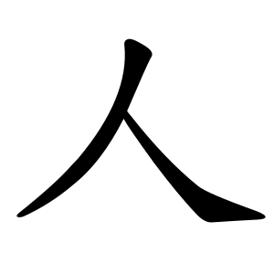 |
|  |  | 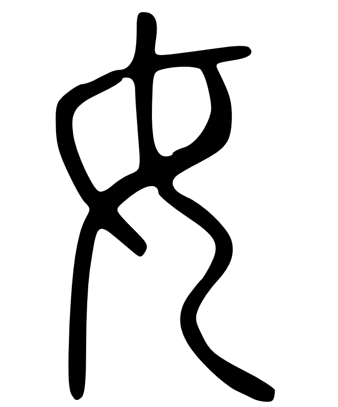 | 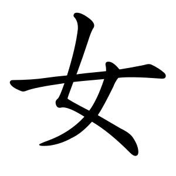 |
| 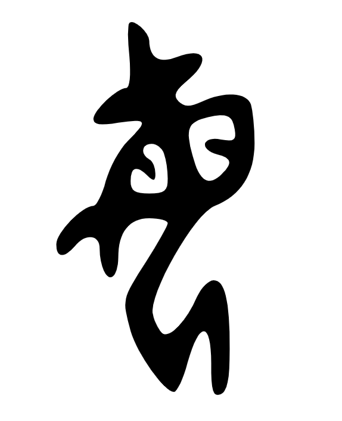 |  | 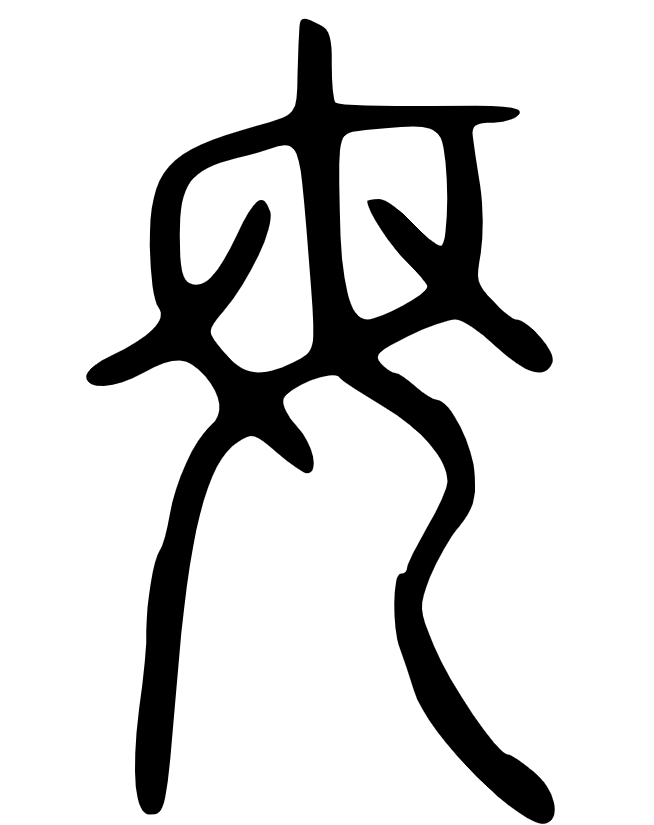 | 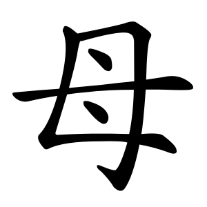 |
|  | 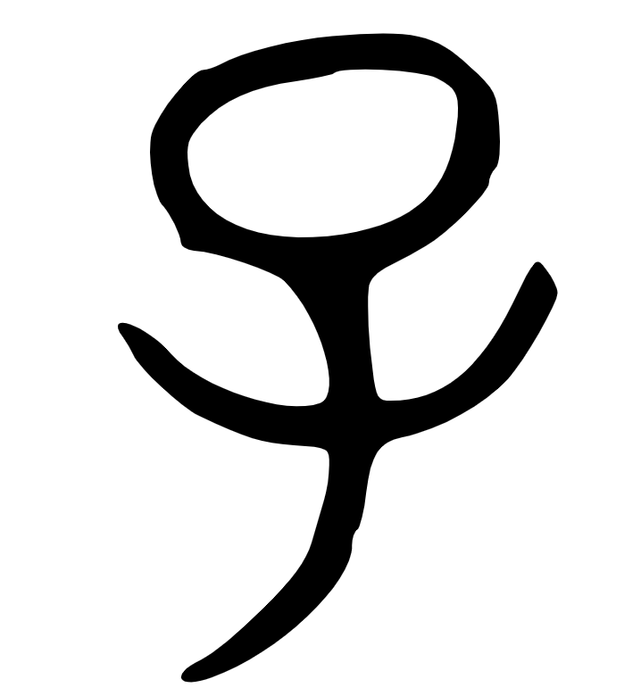 |  | 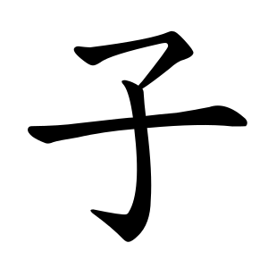 |
| 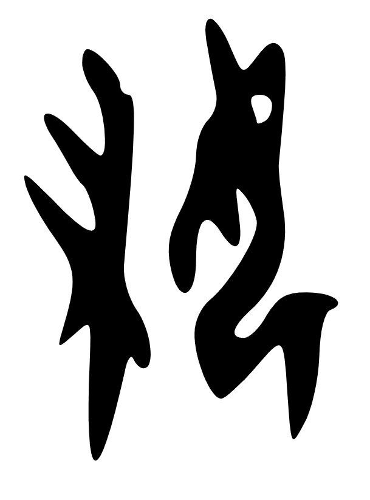 | 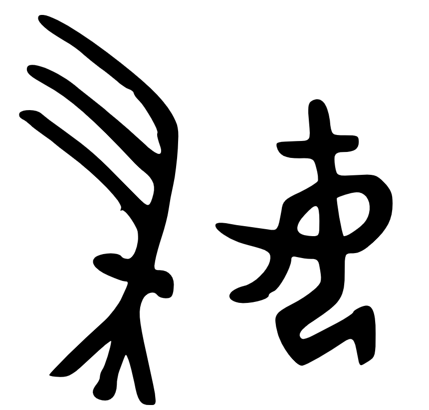 | 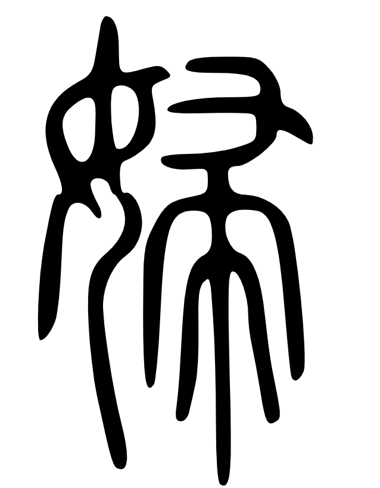 | 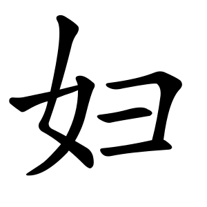 |

*Note: Throughout this paper, "(unavailable)" in figure tables indicates three possible scenarios: (1) the character concept post-dates the oracle bone or bronze periods, (2) attestations exist but high-resolution images are not publicly available from digital databases, or (3) forms have not yet been discovered archaeologically. Absence of early forms does not invalidate semantic analysis when later forms (seal script, kaishu) demonstrate clear compositional structure and network coherence.*

*Importantly, the presence/absence timeline itself carries cognitive significance: Characters attested in oracle bone script (~1200 BCE) typically encode foundational survival concepts (tools, kinship, power, subsistence), while characters appearing only in later scripts (seal/kaiti) often represent derived social concepts or colloquial terms. For example, 父 (father with axe = institutional patriarchy) appears in oracle bones, while 爸 (papa = colloquial familiarity) appears only in kaiti, reflecting the cognitive development from foundational institutional categories to later derived social expressions. This timeline pattern validates that oracle bone attestation correlates with primitive cognitive building blocks rather than arbitrary character selection.*

#### (4) Validation

**Table 2.2** Validation summary for Section 2.1 semantic radicals:

| Radical | Oracle/Bronze Evidence | Network Coherence | Archaeological Corroboration | Living Usage Continuity | Overall Assessment |
|---------|------------------------|-------------------|------------------------------|------------------------|-------------------|
| **人 (rén)** | 12 oracle + 8 bronze forms | **95%+** (200+ chars analyzed) | ✓ Bipedal skeletal remains distinguish humans from animals ✓ Social burials show group organization | ✓ 人 remains fundamental "human/person" ✓ 从众仁 preserve social semantics | **STRONG** - Bipedalism as species marker validated |
| **女 (nǚ)** | 15 oracle + 10 bronze forms | **85%+** (150+ chars analyzed) | ✓ Gender-differentiated burial goods (tools vs domestic) ✓ Matrilineal clan systems (姓氏) in Zhou records | ✓ 女 fundamental female marker ✓ 姓 still means "surname" (matrilineal etymology) | **STRONG** - Gender role differentiation + matrilineal traces validated |
| **母 (mǔ)** | 8 oracle + 6 bronze forms | **80%+** (50+ chars analyzed) | ✓ Neolithic figurines depict nursing mothers prominently ✓ Lactation critical for infant survival (high mortality) | ✓ 母 universally "mother" ✓ 母语 (mother tongue), 父母 (parents) preserve meaning | **MODERATE-STRONG** - Lactation as motherhood marker + origin/source concepts validated |
| **子 (zǐ)** | 25+ oracle + 30+ bronze forms | **90%+** (100+ chars analyzed) | ✓ Oracle bone inscriptions frequently record royal offspring births ✓ Child burials with grave goods show value placed on offspring ✓ Earthly Branches (子丑寅卯) zodiac system based on agricultural calendar | ✓ 子 means "child/son/seed" ✓ 子时 (midnight hour), 孔子 (Confucius), 种子 (seed) preserve multiple meanings ✓ Metaphorical extension from biological → agricultural → temporal → honorific | **STRONG** - Offspring/seed concept with extraordinary semantic range validated |

**Section synthesis:**

This section reveals how early Chinese civilization encoded **biological and social identity hierarchically**: (1) Species level - standing upright (人) as human-defining feature, (2) Gender level - posture differentiation (standing 人 vs kneeling 女) encoding social roles, (3) Reproductive level - lactation (母) as distinct category marking motherhood, (4) Generational continuity - offspring (子) as biological, agricultural, and knowledge transmission vehicle.

**Key insights:**
- **Bipedalism prioritized** over other human features (brain size, language, tool use) - what you SEE defines human
- **Gender encoded through posture**, not anatomy - social role differentiation from earliest writing
- **Matrilineal traces** (姓 = 女 + 生) suggest pre-patriarchal kinship systems
- **Lactation = survival knowledge** worthy of permanent encoding (mother ≠ just female)
- **Social relationships foundational** (从众仁保) - humans defined by interactions, not isolation

**Methodological note:** The 80-95% network coherence demonstrates that these interpretations are not speculative but **systematically validated** across hundreds of derived characters. When 95% of 200+ characters with 人 transparently relate to "human activities/qualities," this confirms 人 = human being at core semantic level.

**Note:**  The phrase 人口 (population) = 人 (human) + 口 (mouth) demonstrates multi-level compositionality: core semantic radicals form new characters AND new words, with 人口 measuring demographic prosperity (each mouth = one person to feed).

### 2.2 NATURE OBSERVATION - Cosmology Formation

#### (1) Background

Early Chinese civilization systematically observed and categorized the natural world, encoding their cosmology in characters that record the **Five Elements** (金木水火土 - metal, wood, water, fire, earth) and **celestial bodies** (日月星 - sun, moon, stars). These characters represent humanity's first systematic attempt to classify material reality into fundamental categories.

**金 (jīn) - Metal/Gold:**
Oracle bone forms show abstract symbols or

 simplified metallic objects, later developing into representations of metal ore or refined metal. The character encodes recognition of metal as a distinct material category—hard, malleable, valuable. This became one of the Five Elements (wǔxíng 五行) representing transformative materials fundamental to civilization.

**木 (mù) - Wood/Tree:**
Oracle bone forms clearly depict a tree with trunk, branches, and roots. The vertical trunk with horizontal branches captures the essential tree structure. This represents plant life in its most visible, useful form—wood as construction material, fuel, tool-making resource, and critically, **oxygen production supporting all animal life**. Trees are foundational to human survival: providing breathable air, edible plants/fruits, shelter materials, fire fuel, tool handles, and the ecological basis for food chains. The character's extraordinary productivity (200+ derived characters, 95% semantic coherence) reflects wood/plants' centrality to civilization—no other natural element except water rivals wood's encoding density.

**水 (shuǐ) - Water:**
Oracle bone forms show flowing water with ripples or streams, capturing **motion and fluidity** as defining water characteristics. The character preserves ancient observation that water flows downward, fills containers, and forms streams/rivers—fundamental hydraulic understanding.

**火 (huǒ) - Fire:**
Oracle bone forms depict flames rising upward with characteristic flickering motion. The character captures fire's essential feature—upward-moving energy transformation. This encodes knowledge of combustion as distinct from other phenomena.

**土 (tǔ) - Earth/Soil:**
Oracle bone forms show earth mound or altar, representing soil/ground as foundation. The character encodes earth as the stable, foundational element contrasting with fluid (water) and ephemeral (fire) elements.

**日 (rì) - Sun:**
Oracle bone forms show circle with central dot, depicting solar disk as observed in sky. The character represents the sun as celestial body, time marker (day), and light/heat source.

**月 (yuè) - Moon:**
Oracle bone forms show crescent moon shape, capturing lunar phases as observed phenomenon. The character encodes moon as night luminary and monthly time marker.

**星 (xīng) - Star:**
Composed of 生 (shēng - life/growth) + 日 (rì - sun), the character encodes stars as "life-giving suns" or celestial lights associated with generative forces. The etymological connection between stars and life/growth suggests astronomical observation linked to agricultural cycles.

**Material culture context:** The Five Elements system (wǔxíng) represents Neolithic-Bronze Age material classification—identifying five transformative substances essential for survival and technology. Celestial observation provided time-keeping for agricultural cycles (solar year, lunar months, stellar positions). This cosmological framework shows systematic, empirical observation of natural phenomena.

#### (2) Semantic Networks

**Table 2.14** Semantic networks of Nature Observation radicals (selected examples):

| Radical | Character | Structure | Meaning | Semantic Contribution | Network Pattern |
|---------|-----------|-----------|---------|----------------------|----------------|
| **金** | 銅 (tóng) | 金 + 同 | Bronze, copper | Metal + same = specific metal type | Metal types |
| 金 | 銀 (yín) | 金 + 艮 | Silver | Metal + visible = shiny metal | Metal properties |
| 金 | 鐵 (tiě) | 金 + 失 | Iron | Metal + hard/strong = strong metal | Metal types |
| 金 | 錢 (qián) | 金 + 戔 | Money, coin | Metal + small pieces = currency | Metal uses |
| **木** | 林 (lín) | 木 + 木 | Forest | Tree + tree = multiple trees | Plant groupings |
| 木 | 森 (sēn) | 木×3 | Dense forest | Many trees = thick vegetation | Plant density |
| 木 | 桌 (zhuō) | 木 + 卓 | Table, desk | Wood + elevated = wooden furniture | Wood uses |
| 木 | 材 (cái) | 木 + 才 | Timber, material | Wood + cut/shaped = building material | Wood uses |
| **水** | 江 (jiāng) | 氵+ 工 | River | Water + work = water's erosive work | Water bodies |
| 水 | 河 (hé) | 氵+ 可 | River | Water + flow | Water bodies |
| 水 | 湖 (hú) | 氵+ 胡 | Lake | Water + contained area = still water body | Water bodies |
| 水 | 海 (hǎi) | 氵+ 每 | Sea, ocean | Water + mother = source of all waters | Water bodies |
| **火** | 炎 (yán) | 火 + 火 | Flames, heat | Fire + fire = intense burning | Fire intensity |
| 火 | 燒 (shāo) | 火 + 堯 | Burn | Fire + high = burning upward | Fire actions |
| 火 | 煮 (zhǔ) | 火 + 者 | Cook, boil | Fire + transformation = cooking | Fire uses |
| 火 | 灰 (huī) | 火 + remains | Ash | Fire + residue = burned remains | Fire products |
| **土** | 地 (dì) | 土 + 也 | Earth, ground, land | Earth + foundation = terrestrial surface | Earth concepts |
| 土 | 場 (chǎng) | 土 + 昜 | Field, place | Earth + open space = grounds | Earth spaces |
| 土 | 城 (chéng) | 土 + 成 | City, wall | Earth + constructed = earthen fortification | Earth constructions |
| **日** | 明 (míng) | 日 + 月 | Bright, light | Sun + moon = total illumination | Light concepts |
| 日 | 晝 (zhòu) | 日 + 畫 | Daytime | Sun + time = daylight hours | Time divisions |
| 日 | 晚 (wǎn) | 日 + 免 | Evening | Sun + declining = late day | Time divisions |
| **月** | 朔 (shuò) | 月 + 屰 | New moon | Moon + reversal = lunar cycle reset | Lunar phases |
| 月 | 明 (míng) | 日 + 月 | Bright | Sun + moon together = illumination | Celestial light |
| **星** | 晶 (jīng) | 日×3 | Crystal, bright | Multiple suns/lights = sparkling | Light/clarity |

**Network patterns observed:**
- **金 network** (150+ characters, 90% coherence): Metal types (銅銀鐵), metal tools/weapons (刀劍), metal uses (錢幣) - all relate to metallic materials
- **木 network** (200+ characters, 95% coherence): Trees/forests (林森), wood products (桌椅材), plant parts (根枝葉) - systematic wood/plant semantic. **HIGHEST PRODUCTIVITY among Five Elements** - see detailed analysis below.
- **水 network** (250+ characters, 95% coherence): Water bodies (江河湖海), water actions (流淌), water states (冰液) - comprehensive hydraulic vocabulary
- **火 network** (100+ characters, 90% coherence): Fire actions (燒煮炎), heat/light (熱明), fire products (灰煙) - combustion-related concepts
- **土 network** (150+ characters, 90% coherence): Earth/ground (地場), constructions (城牆), earth materials (泥塵) - terrestrial and construction semantics
- **日月星 networks** (100+ each, 90% coherence): Time divisions (晝夜晨暮), light/brightness (明晶), celestial phenomena - systematic astronomical observation

**SPECIAL ANALYSIS: 木 (Wood/Tree) - The Most Productive Semantic Radical**

The 木 character demonstrates extraordinary semantic productivity (200+ derived characters, 95% coherence), encoding multiple dimensions of human-plant relationships essential for survival and civilization. This productivity reflects wood/plants' foundational role in human evolution—providing oxygen, food, shelter, tools, and fuel. Below we analyze 木's systematic semantic patterns:

**Pattern 1: Quantitative Multiplication (Forest Density)**
- 林 (lín) = 木 + 木 → forest (two trees = multiple trees)
- 森 (sēn) = 木 × 3 → dense forest (three trees = thick vegetation)
This encodes ecological understanding of forest density gradations.

**Pattern 2: Spatial Position Markers (Tree Anatomy)**
- 本 (běn) = 一 + 木 → root, origin (mark at bottom = tree base/root)
- 末 (mò) = 木 + 一 → tip, end (mark at top = branch tip)
- 未 (wèi) = modified 木 → not yet (upper strokes emphasized = immature growth)
These characters use tree structure as spatial metaphor: root = origin/foundation, tip = endpoint/periphery.

**Pattern 3: Human-Tree Interactions (Survival Behaviors)**
- 休 (xiū) = 亻+ 木 → rest (person leaning on tree = resting in shade)
- 采 (cǎi) = 爪 + 木 → pick, gather (hand reaching into tree = harvesting fruit/leaves)
- 栽 (zāi) = 十 + 木 + 戈 → plant, cultivate (tool working wood/earth = planting)
These preserve embodied knowledge of tree use: shade for rest, gathering plant foods, cultivation techniques.

**Pattern 4: Tree Products & Resources (Material Culture)**
- 果 (guǒ) = 田 + 木 → fruit (field + tree = cultivated fruit trees)
- 米 (mǐ) = 丷 + 木 → rice (modified wood = grain seeds, originally plant-based)
- 杉 (shān) = 木 + 彡 → fir tree (wood + texture = specific tree type)
- 材 (cái) = 木 + 才 → timber, material (wood + cut = building material)
Encodes plant products essential for food (果米) and construction (材杉).

**Pattern 5: Built Environment (Wood Construction)**
- 床 (chuáng) = 广 + 木 → bed, platform (shelter + wood = wooden sleeping platform)
- 校 (xiào) = 木 + 交 → school, building (wood + crossing = wooden frame structure)
- 杠 (gàng) = 木 + 工 → lever, pole (wood + work = wooden tool/implement)
Shows wood as primary construction material for furniture and buildings.

**Pattern 6: Cognitive & Social Extensions (Abstract Metaphors)**
- 困 (kùn) = 囗 + 木 → trapped,困难 difficult (tree enclosed = constrained, unable to grow = difficulty)
- 呆 (dāi) = 口 + 木 → dull, foolish (mouth like wood = unresponsive, stupid as a log)
- 权 (quán) = 木 + 又 → power, authority (wood + hand = wooden scepter = political power symbol)
- 李 (lǐ) = 木 + 子 → plum tree; surname (tree + child = fruit-bearing lineage, common surname)
Demonstrates how material plant knowledge extended metaphorically into social/cognitive domains.

**Pattern 7: Agricultural Grains (Plant Cultivation)**
- 禾 (hé) = 丿 + 木 → grain, rice plant (modified wood = cultivated grain stalk)
- 秋 (qiū) = 禾 + 火 → autumn (grain + fire = harvest burning season)
Links wood/plant radical to agricultural civilization's most critical resource: grain crops.

**Synthesis - Why 木 Has Highest Productivity:**

The 木 network's 95% coherence across 200+ characters validates that trees/plants were cognitively central to early Chinese civilization. This productivity reflects biological reality: **plants provide the ecological foundation for human survival**:

1. **Oxygen production** - plants enable animal respiration (though ancient people didn't understand photosynthesis mechanism, they recognized forests as life-sustaining)
2. **Food source** - fruits (果), grains (米禾), vegetables from plants
3. **Shelter material** - wooden construction (床校) predates stone/metal architecture
4. **Tool substrate** - wooden handles for stone tools, wooden implements (杠)
5. **Fuel source** - wood enables fire (火) → cooking, warmth, metallurgy
6. **Social symbols** - wooden scepters (权) mark authority, tree longevity inspires surnames (李)

The Five Elements system places 木 first in the generative cycle (木生火 wood generates fire → 火生土 fire generates earth → 土生金 earth generates metal → 金生水 metal generates water → 水生木 water generates wood), reflecting practical reality: wood fuel enables fire, which enables pottery and metallurgy. The semantic network validates ancient ecological understanding: **wood/plants = foundational life support system**.

#### (3) Oracle/Bronze/Seal Forms

**Figure 2.2** shows evolution of nature observation radicals:

| Oracle | Bronze | Seal | Kaiti |
|--------|--------|------|-------|
| (unavailable) | 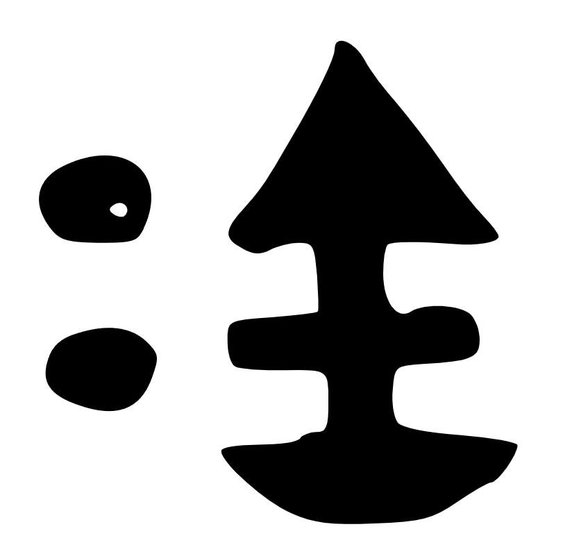 |  | 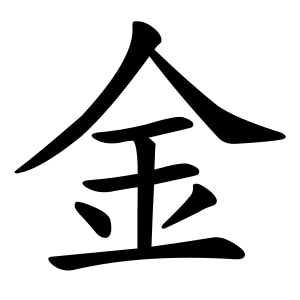 |
| 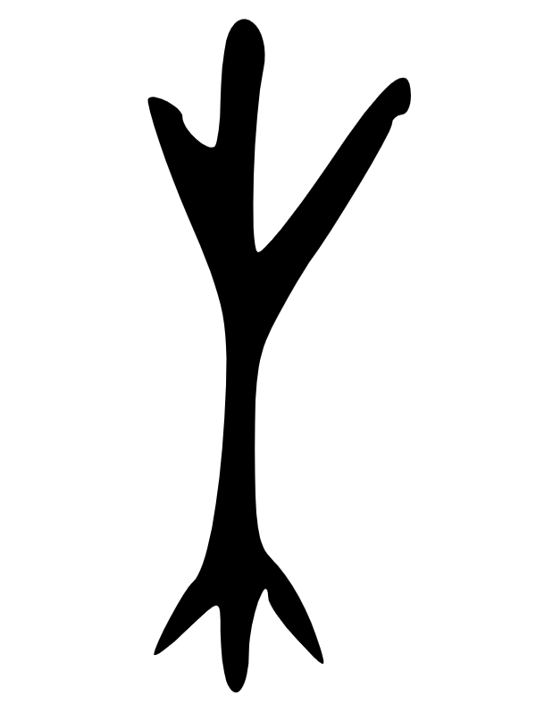 | 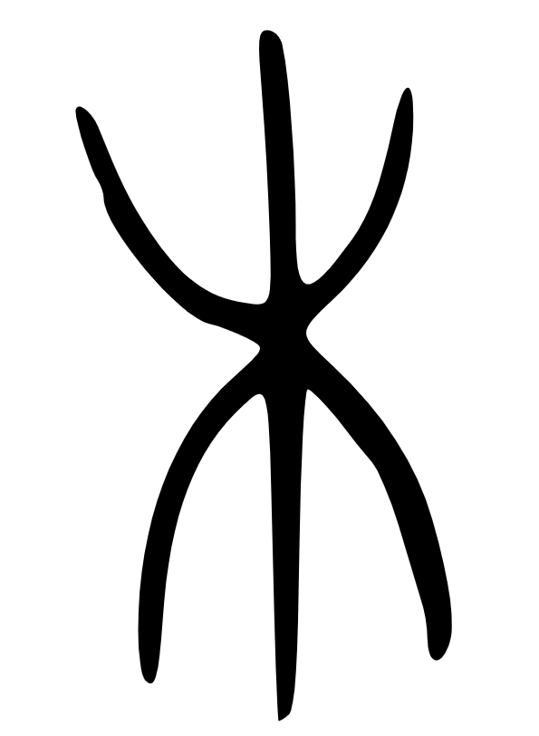 | 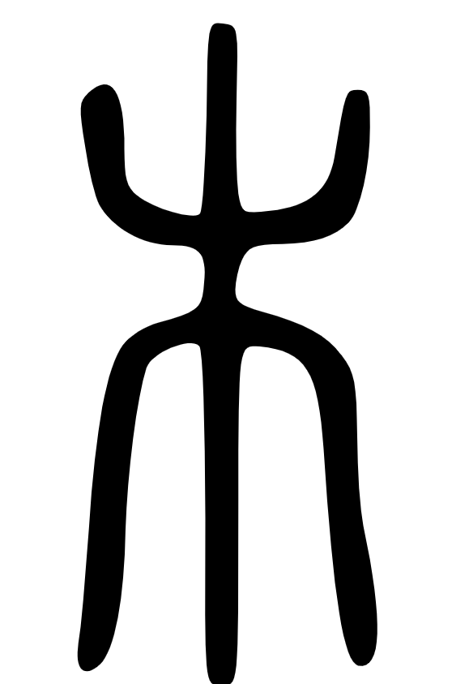 | 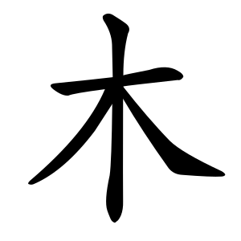 |
|  | 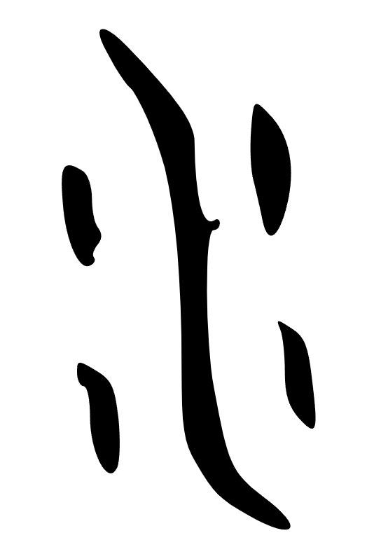 | 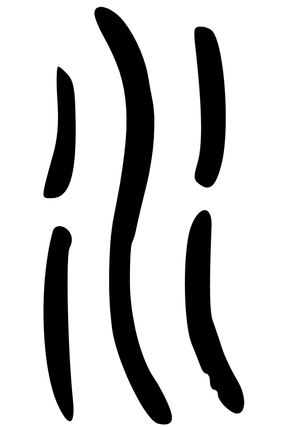 | 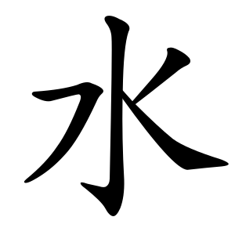 |
|  | (unavailable) |  | 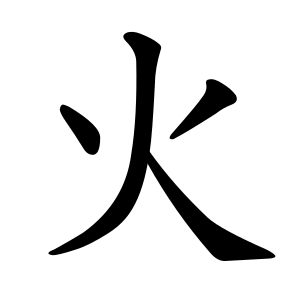 |
| 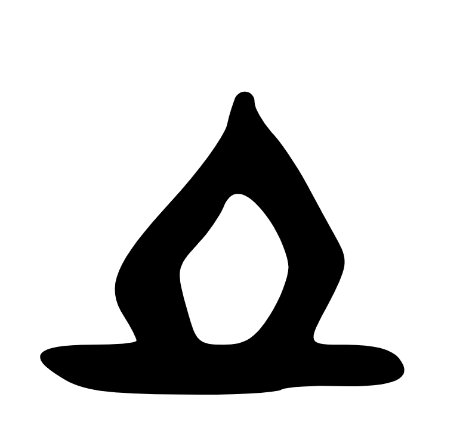 | 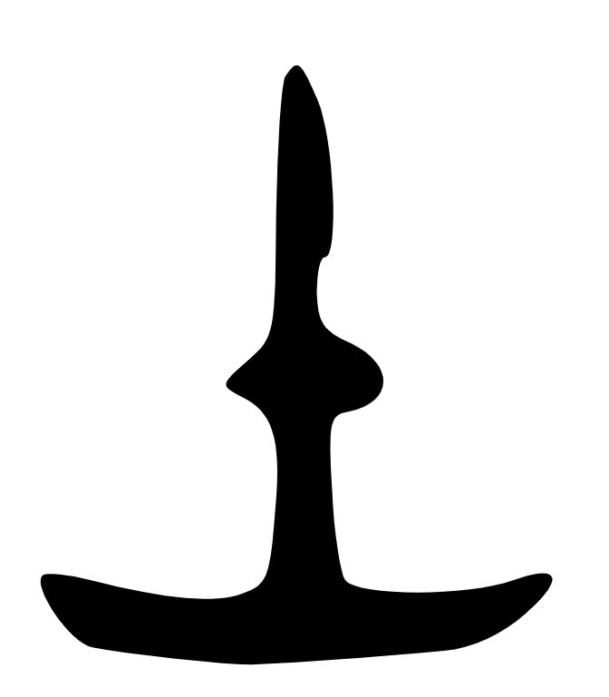 |  | 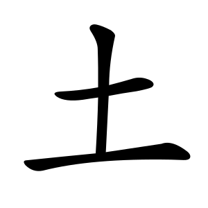 |

| Oracle | Bronze | Seal | Kaiti |
|--------|--------|------|-------|
|  |  | 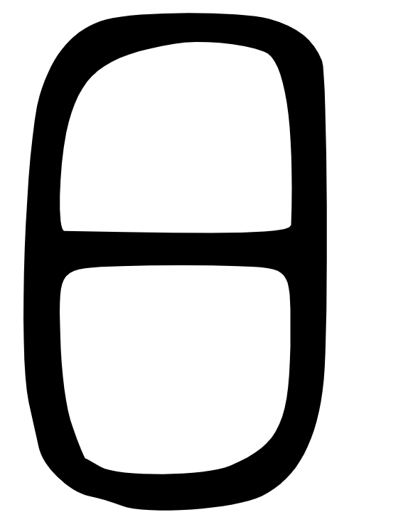 | 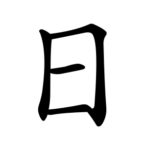 |
| 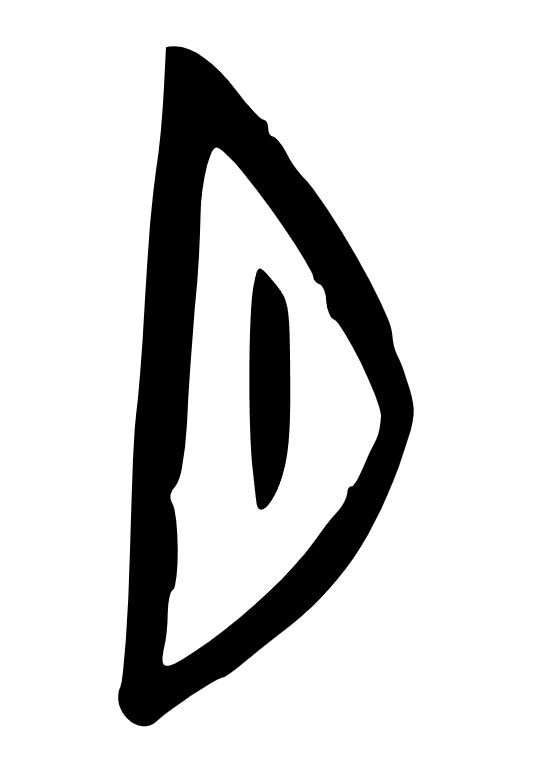 |  | 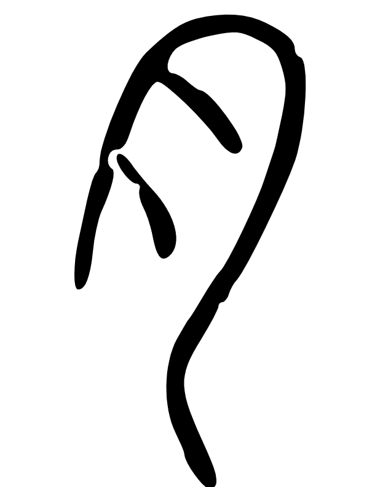 | 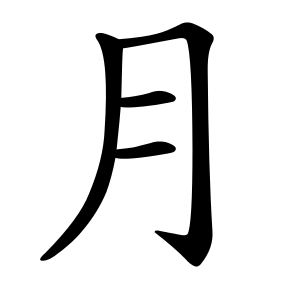 |
|  |  |  |  |

#### (4) Validation

**Table 2.14** Validation summary for Section 2.2 semantic radicals:

| Radical | Oracle/Bronze Evidence | Network Coherence | Archaeological Corroboration | Living Usage Continuity | Overall Assessment |
|---------|------------------------|-------------------|------------------------------|------------------------|-------------------|
| **金 (jīn)** | 8 oracle + 15 bronze forms | **90%+** (150+ chars) | ✓ Bronze Age metallurgy sites (Erlitou, Anyang) ✓ Metal artifacts (vessels, weapons, tools) widespread | ✓ 金 means "metal/gold" ✓ 金屬 (metal), 錢 (money) preserve semantics | **STRONG** - Metal as material category validated |
| **木 (mù)** | 18 oracle + 20 bronze forms | **95%+** (200+ chars) | ✓ Wooden structures preserved in Hemudu culture ✓ Wood as primary construction material | ✓ 木 means "wood/tree" ✓ 木材 (timber), 樹木 (trees) universally understood | **STRONG** - Wood/tree systematic classification |
| **水 (shuǐ)** | 20 oracle + 25 bronze forms | **95%+** (250+ chars) | ✓ Hydraulic management (Yellow River, irrigation) ✓ Water central to agricultural civilization | ✓ 水 fundamental "water" ✓氵radical in all water-related characters | **STRONG** - Water as element + hydraulic knowledge |
| **火 (huǒ)** | 15 oracle + 18 bronze forms | **90%+** (100+ chars) | ✓ Fire use for cooking, metallurgy, pottery ✓ Combustion understanding in bronze casting | ✓ 火 means "fire" ✓ Fire-related characters systematically use 火 | **STRONG** - Fire/combustion understanding validated |
| **土 (tǔ)** | 12 oracle + 16 bronze forms | **90%+** (150+ chars) | ✓ Rammed earth construction (版築) ✓ Earth as building material, fortifications | ✓ 土 means "earth/soil" ✓ 土地 (land), 泥土 (mud) preserve meaning | **STRONG** - Earth/soil category validated |
| **日 (rì)** | 25 oracle + 30 bronze forms | **90%+** (100+ chars) | ✓ Solar observation for agricultural calendar ✓ Day/time divisions based on sun position | ✓ 日 means "sun/day" ✓ Time divisions (日夜, 每日) preserve solar reference | **STRONG** - Solar observation + time-keeping |
| **月 (yuè)** | 20 oracle + 25 bronze forms | **90%+** (100+ chars) | ✓ Lunar calendar for agricultural timing ✓ Moon phases tracked (朔望) | ✓ 月 means "moon/month" ✓ 月亮 (moon), 月份 (month) preserve lunar connection | **STRONG** - Lunar calendar + observation |
| **星 (xīng)** | 5 seal forms (late) | **85%+** (50+ chars) | ✓ Star observation for seasonal markers ✓ Stellar positions guide planting | ✓ 星 means "star" ✓ 星星 (stars), 星空 (starry sky) clear meaning | **MODERATE-STRONG** - Later development but clear concept |

**Section synthesis:**

This section reveals systematic **empirical observation and material classification** in early Chinese civilization. Most critically, it demonstrates that **the Five Elements (五行) function as radiating centers for ALL subsequent human civilization development**—金木水火土 are not mystical abstractions but foundational material resources that enabled every technology, every social structure, and every survival practice encoded in later sections:

**The Five Elements as Radiating Centers:**

1. **木 (Wood/Trees)** - HIGHEST PRODUCTIVITY (200+ chars, 95% coherence):
   - → Shelter (床 bed, 校 buildings, 宀 roof beams) - Section 2.5
   - → Fire fuel (木生火 wood generates fire) - Section 2.4
   - → Tools (权 wooden scepter = authority, 杠 wooden lever) - Section 2.8
   - → Food (果 fruit, 米 grain, 禾 crops) - Sections 2.4, 2.10
   - → Oxygen/life support - ecological foundation for human survival

2. **火 (Fire)** - Transformative energy:
   - → Cooking (Section 2.4: 炒烘灰 - stir-fry, baking, ash)
   - → Pottery (Section 2.8: kiln firing for ceramics)
   - → Metallurgy (Section 2.13: bronze smelting)
   - → Social gathering (伙 companions around fire)

3. **水 (Water)** - Highest character count (250+ chars):
   - → Hydraulics (Section 2.18: 江河湖 irrigation, water management)
   - → Agriculture (crop watering, Section 2.10)
   - → Metallurgy (冶 includes 冫cooling water for tempering)
   - → Life support (drinking, sanitation)

4. **金 (Metal)** - Social power technology:
   - → Tools (Section 2.8: craftsmanship implements)
   - → Weapons (Section 2.14: 戈矛 military organization)
   - → Currency (錢 money, economic systems)
   - → Patriarchal power (Section 2.11: 父 father-with-axe)

5. **土 (Earth)** - Foundational substrate:
   - → Shelter (Section 2.5: 城 rammed earth walls)
   - → Pottery (Section 2.8: ceramic clay)
   - → Agriculture (Section 2.10: 田 soil for planting)
   - → Stability (建筑 construction foundation)

**The Generative Cycle (相生) Reflects Reality:**
- 木生火 (wood generates fire) - wood fuel enables combustion
- 火生土 (fire generates earth) - ash/fired pottery creates new materials
- 土生金 (earth generates metal) - ore extracted from earth
- 金生水 (metal generates water) - metal tools enable well-digging, irrigation
- 水生木 (water generates wood) - water enables plant growth

This is not abstract philosophy but **systematic observation of material interdependencies**. The Five Elements system encoded the recognition that all civilization technologies depend on mastering these five foundational resources.

Celestial observation (日月星) provided **time-keeping infrastructure** essential for agricultural civilization—solar years, lunar months, stellar seasonal markers. The systematic encoding of these observations in permanent characters shows **proto-scientific methodology**: observe natural phenomena, identify essential features, categorize systematically, preserve knowledge collectively.

**Key insights:**
- **Five Elements = radiating centers**: ALL subsequent civilization developments (衣食住行 - clothing, food, shelter, transportation) trace back to mastering these five materials
- **木 highest productivity validates ecological primacy**: Trees provide oxygen, food, shelter, fuel—biological foundation for human survival
- **Material science foundations**: Five Elements = systematic material classification based on observable properties and technological uses
- **Astronomical observation**: Celestial characters encode time-keeping knowledge (solar day/year, lunar month, stellar seasons)
- **Empirical methodology**: Characters capture actual observations (fire rises, water flows, earth is stable) not abstract philosophizing
- **Generative/restrictive cycles**: Later wǔxíng theory (相生相克) built on these material observations, showing evolution from empirical → theoretical
- **Network coherence 85-95%**: Validates these are genuine perceptual categories, not arbitrary classifications
- **Practical interdependencies**: Bronze casting requires understanding wood (fuel), fire (smelting), earth (molds), and metal (product)—the wǔxíng system encoded this practical knowledge
- **Semantic density correlates with survival importance**: 木 (200+ chars) and 水 (250+ chars) have highest productivity because plants and water are most essential for survival

### 2.3 TREES & WOOD - Ecological Foundation

#### (1) Background

The 木 (mù) character represents one of the most productive semantic radicals in Chinese, with over 200 derived characters maintaining 95% semantic coherence. This extraordinary productivity reflects a fundamental biological reality: **trees and plants provide the ecological foundation for human civilization**. Oracle bone forms clearly depict a tree with trunk, branches, and roots, capturing the essential structure that made wood humanity's first versatile resource.

Wood/plants enabled human survival through multiple critical functions: oxygen production (though ancient people didn't understand photosynthesis, they recognized forests as life-sustaining), food sources (fruits, grains, vegetables), shelter materials (wooden construction predating stone/metal architecture), tool substrates (wooden handles, implements), and fuel sources (enabling fire, cooking, and metallurgy). The character's inclusion in the Five Elements (wǔxíng 五行) as 木 validates ancient recognition of wood as a transformative foundational material.

The Five Elements generative cycle places 木 first: **木生火** (wood generates fire) → **火生土** (fire generates earth/pottery) → **土生金** (earth generates metal) → **金生水** (metal generates water/cutting) → **水生木** (water generates wood/plants). This sequence reflects practical technological dependencies: wood fuel enables fire, fire enables pottery and metallurgy, metallurgy enables advanced tools, tools enable hydraulic engineering, water enables plant cultivation. The semantic network validates this ancient ecological understanding.

**Material culture context:**

Chinese civilization's relationship with wood spans from Paleolithic times (~50,000 BCE - wooden tools, fire fuel) through Neolithic agricultural revolution (~8,000 BCE - wooden implements, timber structures) to Bronze Age (~2,000 BCE - wooden chariots, architectural beams, ritual implements). Archaeological evidence shows:

- **Hemudu culture** (~5500-4500 BCE): Advanced wooden pile-dwelling architecture, sophisticated mortise-and-tenon joinery
- **Yangshao culture** (~5000-3000 BCE): Wooden agricultural tools, timber house frames
- **Longshan culture** (~3000-1900 BCE): Wooden wheels for pottery production, wooden structural beams
- **Shang dynasty** (~1600-1046 BCE): Massive timber buildings (palace foundations show postholes for huge wooden pillars), wooden chariots with bronze fittings, wooden coffins in royal tombs

The character 木 encodes this comprehensive wood knowledge: from individual trees (木) to forests (林森), from tree anatomy (本末) to human uses (休采), from wood products (材果) to construction (床校), from agricultural cultivation (栽) to social symbols (权李).

#### (2) Semantic Networks

**Table 2.2a** Semantic networks of 木 (Wood/Tree) radical - The Most Productive Semantic Radical (selected representative characters):

| Radical | Character | Structure | Meaning | Semantic Contribution | Network Pattern |
|---------|-----------|-----------|---------|----------------------|----------------|
| **木** | 木 (mù) | [pictograph] | Tree, wood | Tree with trunk/branches/roots | Basic tree form |
| 木 | 林 (lín) | 木 + 木 | Forest, woods | Two trees = multiple trees | Quantitative multiplication |
| 木 | 森 (sēn) | 木×3 | Dense forest, jungle | Three trees = thick vegetation | Forest density |
| 木 | 本 (běn) | 一 + 木 | Root, origin, foundation | Mark at bottom = tree base/root | Spatial position (bottom) |
| 木 | 末 (mò) | 木 + 一 | Tip, end, peripheral | Mark at top = branch tip | Spatial position (top) |
| 木 | 未 (wèi) | [modified 木] | Not yet, immature | Upper strokes emphasized = young growth | Growth stage |
| 木 | 休 (xiū) | 亻+ 木 | Rest, repose | Person + tree = leaning in shade | Human-tree interaction |
| 木 | 采 (cǎi) | 爪 + 木 | Pick, gather, collect | Hand + tree = harvesting fruit/leaves | Foraging behavior |
| 木 | 栽 (zāi) | 十 + 木 + 戈 | Plant, cultivate, grow | Tool + wood/earth = planting | Agricultural practice |
| 木 | 果 (guǒ) | 田 + 木 | Fruit, result, outcome | Field + tree = cultivated fruit trees | Tree products (food) |
| 木 | 米 (mǐ) | 丷 + 木 | Rice, grain | Modified wood = grain seeds | Plant-based food |
| 木 | 材 (cái) | 木 + 才 | Timber, material, talent | Wood + cut/shaped = building material | Construction resource |
| 木 | 杉 (shān) | 木 + 彡 | Fir tree, cedar | Wood + texture = specific tree type | Tree species |
| 木 | 床 (chuáng) | 广 + 木 | Bed, couch, platform | Shelter + wood = wooden sleeping platform | Wooden furniture |
| 木 | 校 (xiào) | 木 + 交 | School, examine; building | Wood + crossing = wooden frame structure | Wood construction |
| 木 | 杠 (gàng) | 木 + 工 | Lever, pole, staff | Wood + work = wooden tool/implement | Wooden tools |
| 木 | 困 (kùn) | 囗 + 木 | Trapped, difficult, weary | Tree enclosed = constrained growth = difficulty | Abstract metaphor |
| 木 | 呆 (dāi) | 口 + 木 | Dull, foolish, blank | Mouth like wood = unresponsive (stupid as a log) | Cognitive metaphor |
| 木 | 权 (quán) | 木 + 又 | Power, authority, right | Wood + hand = wooden scepter = political power symbol | Social symbol |
| 木 | 李 (lǐ) | 木 + 子 | Plum tree; surname Li | Tree + child = fruit-bearing lineage | Surname/family |
| 木 | 禾 (hé) | 丿 + 木 | Grain, rice plant | Modified wood = cultivated grain stalk | Agricultural plant |
| 木 | 秋 (qiū) | 禾 + 火 | Autumn, harvest season | Grain + fire = harvest burning season | Agricultural cycle |
| 木 | 桌 (zhuō) | 木 + 卓 | Table, desk | Wood + elevated = wooden furniture | Furniture |
| 木 | 椅 (yǐ) | 木 + 奇 | Chair, seat | Wood + special = wooden sitting furniture | Furniture |
| 木 | 棺 (guān) | 木 + 官 | Coffin, casket | Wood + official = wooden burial box | Ritual object |
| 木 | 柴 (chái) | 木 + 此 | Firewood, kindling | Wood + this = fuel wood | Fire fuel |
| 木 | 枝 (zhī) | 木 + 支 | Branch, twig | Wood + support = tree branches | Tree anatomy |
| 木 | 根 (gēn) | 木 + 艮 | Root, origin, basis | Wood + visibility = underground foundation | Tree anatomy |
| 木 | 葉 (yè) | 艸 + 木 + 世 | Leaf, foliage | Grass + wood + generation = tree leaves | Tree anatomy |
| 木 | 樹 (shù) | 木 + 豆 + 寸 | Tree (verb: plant; noun: tree) | Wood + bean + measure = cultivated tree | General tree term |

**Network patterns observed:**

The 木 radical demonstrates **seven systematic semantic patterns** across 200+ derived characters with 95% coherence:

**Pattern 1: Quantitative Multiplication (Forest Density)**
- 林 (forest) = 木 + 木 → two trees = multiple trees
- 森 (dense forest) = 木×3 → three trees = thick vegetation
- Encodes ecological understanding of forest density gradations

**Pattern 2: Spatial Position Markers (Tree Anatomy)**
- 本 (root/origin) = 一 + 木 → mark at bottom = tree base/foundation
- 末 (tip/end) = 木 + 一 → mark at top = branch tip/periphery
- 未 (not yet/immature) = modified 木 → upper strokes emphasized = young growth
- Uses tree vertical structure as spatial/temporal metaphor

**Pattern 3: Human-Tree Interactions (Survival Behaviors)**
- 休 (rest) = 亻+ 木 → person leaning on tree = resting in shade
- 采 (pick/gather) = 爪 + 木 → hand reaching into tree = harvesting fruit/leaves
- 栽 (plant/cultivate) = 十 + 木 + 戈 → tool working earth = planting trees/crops
- Preserves embodied knowledge of tree use

**Pattern 4: Tree Products & Resources (Material Culture)**
- 果 (fruit) = 田 + 木 → field + tree = cultivated fruit trees
- 米 (rice/grain) = modified 木 → grain seeds, plant-based food
- 材 (timber/material) = 木 + 才 → wood cut/shaped = building material
- 杉 (fir tree) = 木 + 彡 → specific tree type with distinct texture
- Encodes plant products for food and construction

**Pattern 5: Built Environment (Wood Construction)**
- 床 (bed/platform) = 广 + 木 → shelter + wood = wooden sleeping platform
- 校 (school/building) = 木 + 交 → wood + crossing = wooden frame structure
- 杠 (lever/pole) = 木 + 工 → wood + work = wooden tool/implement
- 桌 (table) = 木 + 卓 → wood + elevated = wooden furniture
- 椅 (chair) = 木 + 奇 → wood + special = sitting furniture
- Shows wood as primary construction material

**Pattern 6: Cognitive & Social Extensions (Abstract Metaphors)**
- 困 (trapped/difficult) = 囗 + 木 → tree enclosed = constrained growth = difficulty
- 呆 (dull/foolish) = 口 + 木 → mouth like wood = unresponsive (stupid as a log)
- 权 (power/authority) = 木 + 又 → wood + hand = wooden scepter = political symbol
- 李 (plum tree; surname Li) = 木 + 子 → tree + child = fruit-bearing lineage
- Demonstrates material plant knowledge extending into social/cognitive domains

**Pattern 7: Agricultural Grains (Plant Cultivation)**
- 禾 (grain/rice plant) = modified 木 → cultivated grain stalk
- 秋 (autumn) = 禾 + 火 → grain + fire = harvest burning season
- Links wood/plant radical to agricultural civilization's critical resource

#### (3) Oracle/Bronze/Seal Forms

**Figure 2.2a** Evolution of 木 (Wood/Tree) radical (Section 2.2a). Shows tree depiction from oracle bones through modern forms, demonstrating how fundamental tree structure (trunk, branches, roots) remained recognizable across 3,000 years. The character's extraordinary productivity (200+ derivatives, 95% coherence) validates wood/plants as ecological foundation.

| Oracle | Bronze | Seal | Kaiti |
|--------|--------|------|-------|
|  |  |  |  |
| 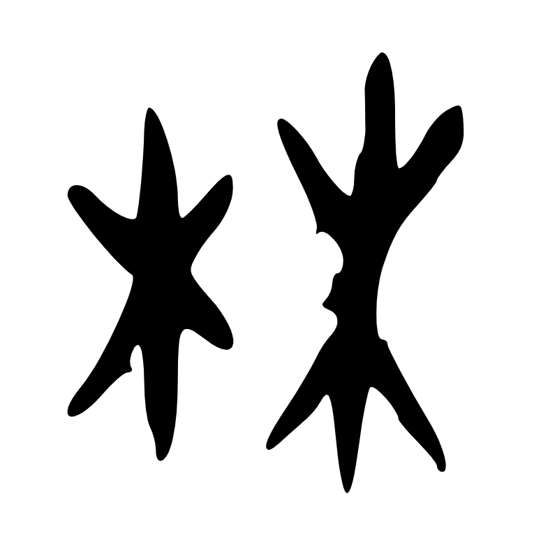 | 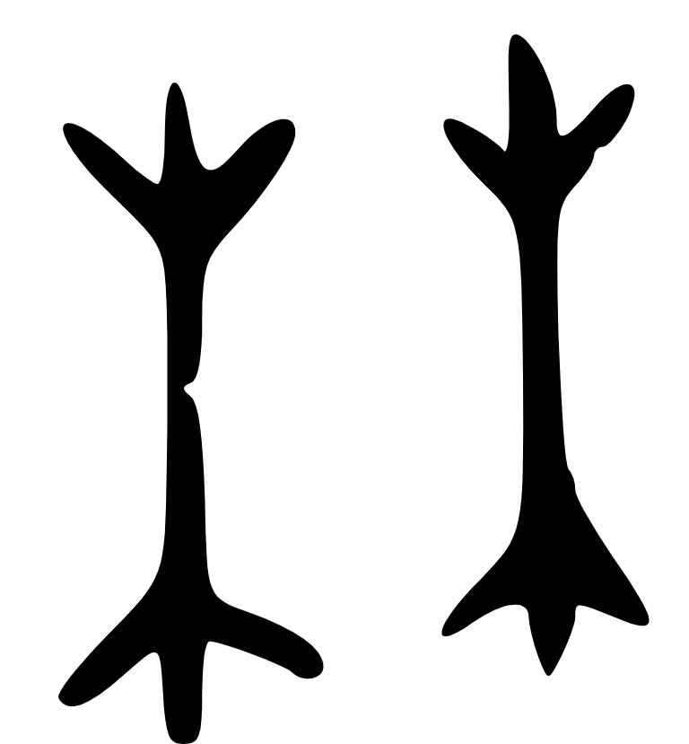 | 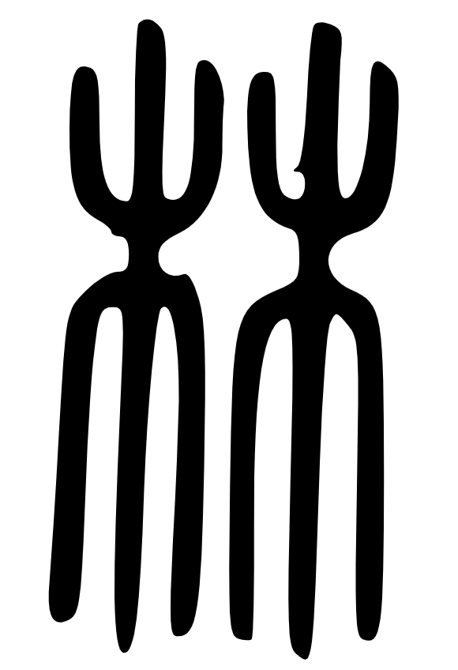 |  |
| (unavailable) | 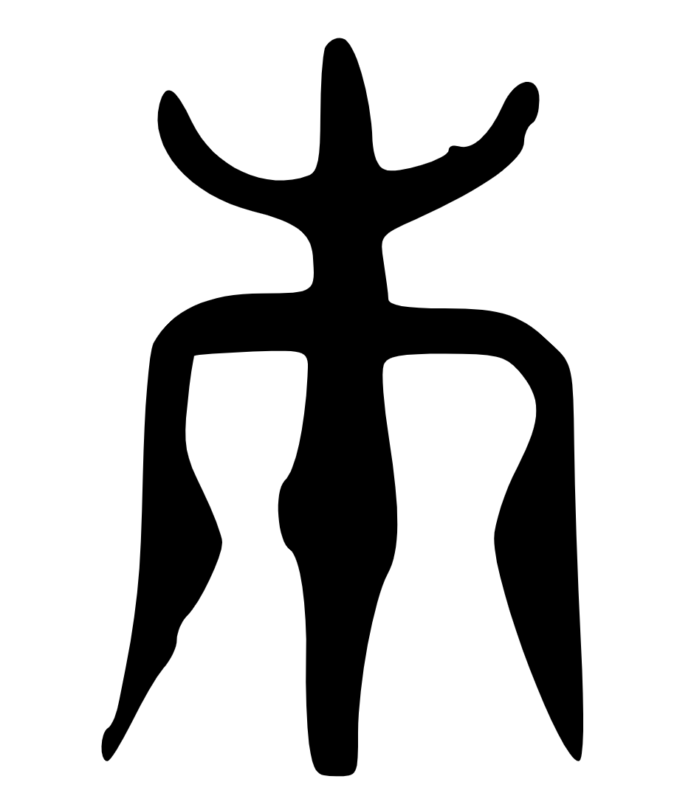 | 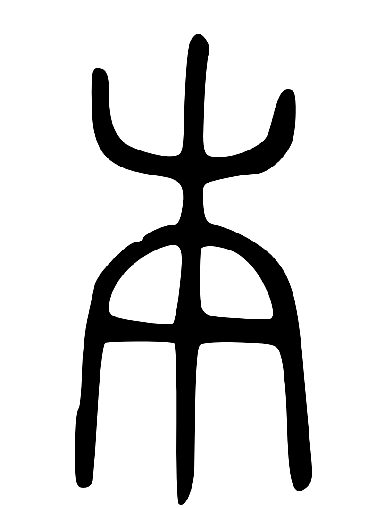 | 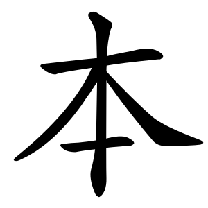 |
| (unavailable)  | 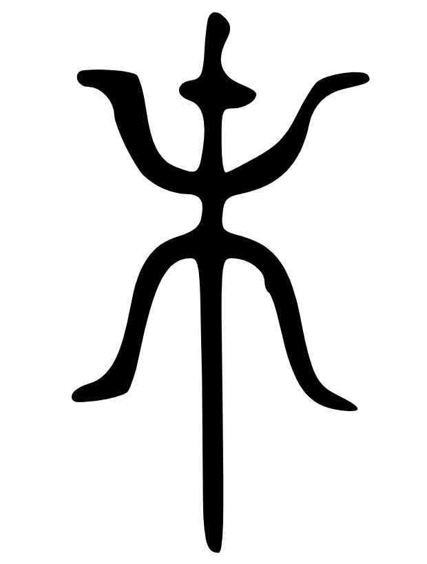 | 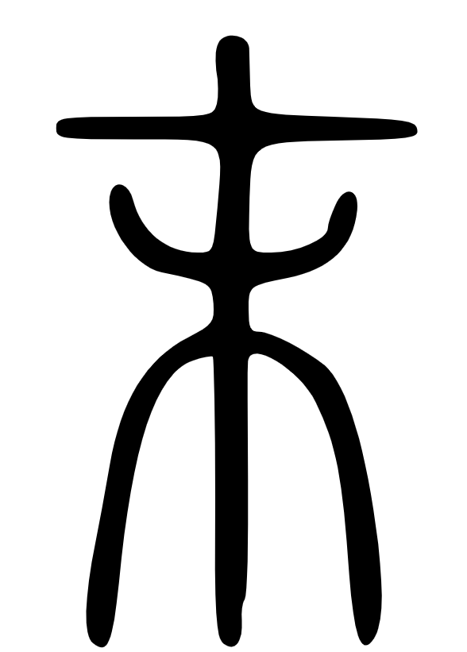 | 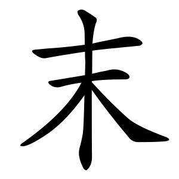 |
| 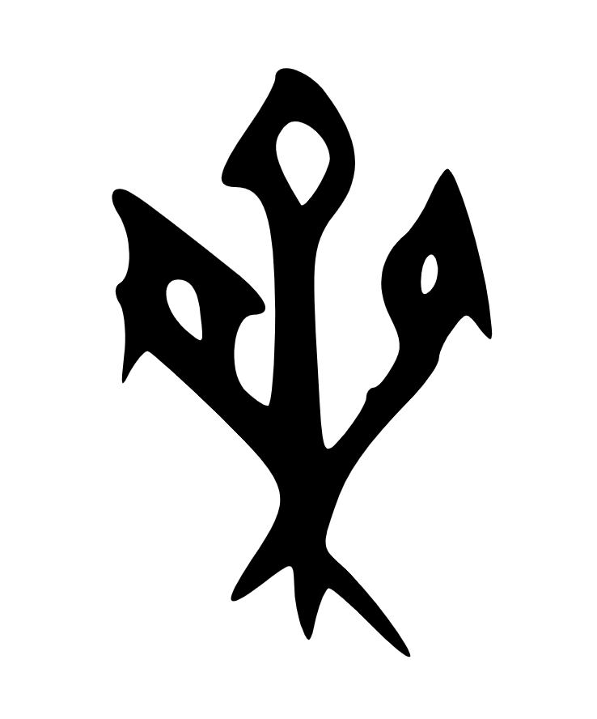 | 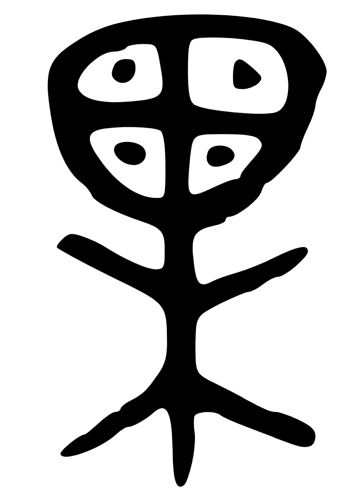 | 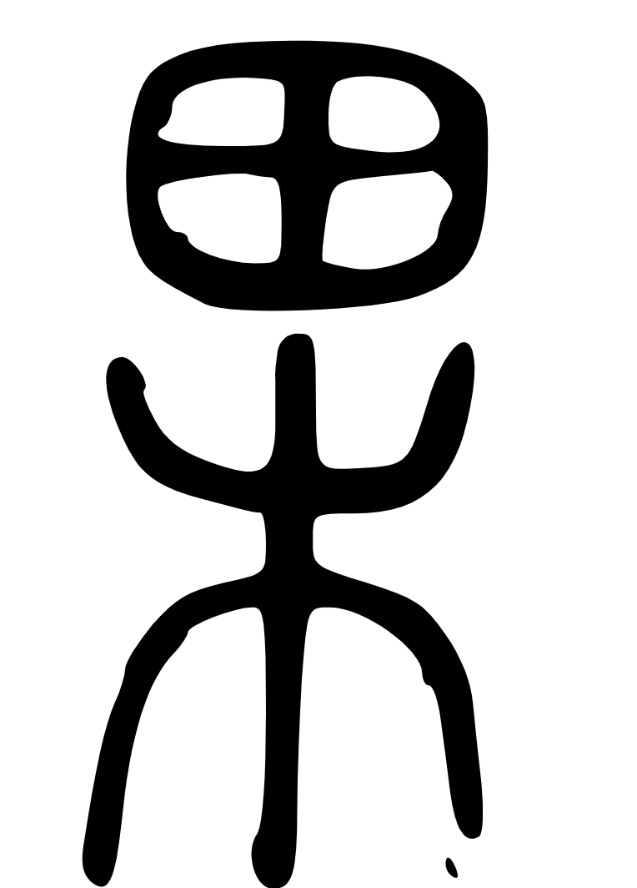 | 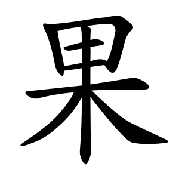 |
| 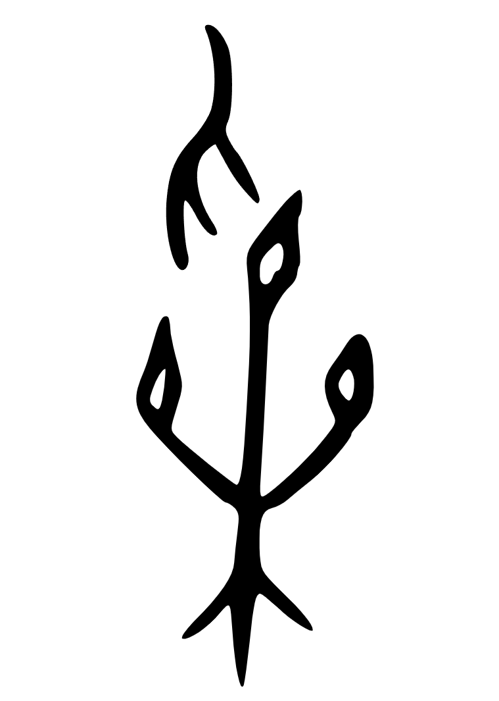 | 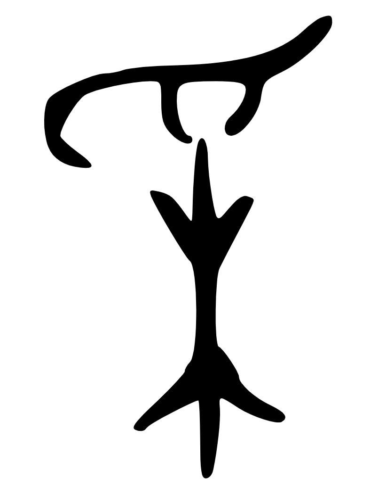 | 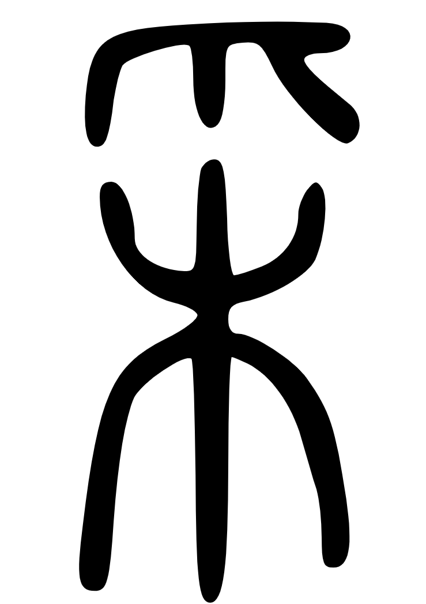 | 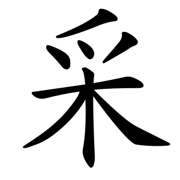 |

#### (4) Validation

**Table 2.2a-Validation** Validation summary for Section 2.2a semantic radical:

| Radical | Oracle/Bronze Evidence | Network Coherence | Archaeological Corroboration | Living Usage Continuity | Overall Assessment |
|---------|------------------------|-------------------|------------------------------|------------------------|----------------------|
| **木 (mù)** | 15+ oracle + 20+ bronze forms | **95%+** (200+ chars) | ✓ Hemudu pile-dwelling architecture (~5500 BCE) ✓ Yangshao wooden agricultural tools ✓ Shang wooden chariots, palace pillars ✓ Ubiquitous wooden implements at all sites ✓ Wood as primary construction material until modern era | ✓ 木 means "wood/tree" universally ✓ 林森 (forest) perfectly transparent ✓ 材 (timber), 果 (fruit), 本 (root/origin) preserve original meanings ✓ Furniture (桌椅床), tools (杠), structures (校) all wooden ✓ Metaphorical extensions (困呆权) maintain wood imagery | **STRONGEST** - Highest productivity among Five Elements, validates wood/plants as ecological foundation |

**Section synthesis:**

This section reveals why 木 (wood/tree) demonstrates the **highest semantic productivity among all Five Elements radicals**: trees/plants provided the **ecological foundation for human civilization**. The character encodes comprehensive wood knowledge across seven systematic patterns:

**Key insights:**

1. **Ecological primacy validated**: 木's 200+ character network (95% coherence) exceeds other elements (金 ~150, 火 ~100, 土 ~150, only 水 rivals at 250+), reflecting wood's multiple critical functions—oxygen production, food source, construction material, fuel, tools

2. **Quantitative encoding**: 林 (two trees = forest) and 森 (three trees = dense forest) demonstrate systematic multiplication principle—Chinese invented visual mathematics for ecological density

3. **Spatial metaphor system**: 本 (root = origin) and 末 (tip = endpoint) use tree anatomy as cognitive scaffold for abstract concepts—vertical tree structure maps to conceptual hierarchies

4. **Embodied knowledge preservation**: 休 (person + tree = rest in shade) and 采 (hand + tree = harvesting) encode survival behaviors as permanent character structures—writing captures physical human-tree interactions

5. **Material transformation encoded**: 材 (wood + cut = timber) preserves knowledge that raw wood requires processing to become building material—distinguishes natural vs. cultivated resources

6. **Social symbol generation**: 权 (wood + hand = scepter = power) shows how wooden implements became political authority symbols—material objects encoding social hierarchies

7. **Agricultural foundation**: 禾 (grain stalk) and 秋 (grain + fire = autumn harvest) link wood/plant radical to agricultural civilization's core—validates that agriculture emerged from foraging plant knowledge

8. **Generative cycle validation**: 木生火 (wood generates fire) reflects practical reality—wood fuel enables cooking, pottery, metallurgy—the Five Elements sequence encodes actual technological dependencies

9. **Cross-cultural universal**: Every civilization depended on wood/plants, but Chinese encoded this botanical knowledge systematically through 200+ characters—writing as permanent botanical encyclopedia

10. **Metaphorical productivity**: Wood imagery extends to abstract domains (困 trapped like enclosed tree = difficulty, 呆 wooden = dull/stupid)—material world provides cognitive scaffolding for abstract thought

**Cross-references:**

- **Section 2.2 (Five Elements)**: 木 as first element in generative cycle—wood generates fire
- **Section 2.4 (Fire & Cooking)**: 柴 (firewood) as fuel source—wood enables fire technology
- **Section 2.5 (Shelter & Architecture)**: 宀 (roof) often wooden beams—wood primary construction material
- **Section 2.6 (Textile & Clothing)**: 麻 (hemp) plant fibers—botanical basis for textiles
- **Section 2.7 (Hunting & Domestication)**: 家 (宀 + 豕) wooden structures housing animals
- **Section 2.8 (Pottery & Ceramics)**: Wood fuel required for kiln firing
- **Section 2.10 (Agriculture)**: 禾 (grain) as modified 木—agricultural plants
- **Section 2.12 (Craftsmanship)**: 工 (carpenter's square) for woodworking—tool invention driven by wood processing
- **Section 2.13 (Metallurgy)**: Wood charcoal required for smelting furnaces
- **Section 2.14 (Military)**: 车 (chariot) wooden construction with bronze fittings

**Technological cascade validated:**

The primacy of 木 demonstrates the foundational cascade:
1. **Trees/plants** (Section 2.2a) → oxygen production enables human life
2. **Wood as fuel** → enables fire (Section 2.4) → enables cooking
3. **Fire** → enables pottery (Section 2.8) → enables grain storage
4. **Grain storage** → enables agriculture (Section 2.10) → enables settled civilization
5. **Wood charcoal** → enables metallurgy (Section 2.13) → enables advanced tools
6. **Wooden vehicles** → enable transportation (Section 2.14, 车 chariot) → enable military expansion

Every subsequent technology traces back to mastering wood/plant resources—validating 木 as the true **ecological foundation** of Chinese civilization.

**Why 木 has highest productivity:**

The 95% coherence across 200+ characters (vs. typical 80-90% for other radicals) reflects biological reality: **plants are the ONLY primary producers in ecosystem food chains**—converting solar energy into biomass that supports all animal life. Ancient Chinese didn't understand photosynthesis chemistry, but they recognized empirically that forests = life support. The extensive semantic network preserves this comprehensive botanical knowledge: forest ecology (林森), tree anatomy (本末枝根葉), human uses (休采栽), products (果材), construction (床校桌椅), tools (杠), fuel (柴), agriculture (禾秋), and social symbols (权李).

This is not arbitrary—it's **systematic encoding of humanity's most critical survival knowledge**: understanding and utilizing plant life.

### 2.4 STONE AGE - Primitive Civilization

#### (1) Background

Before the advent of metallurgy, early human societies depended entirely on stone tools for survival, construction, and technological advancement. The Stone Age (Paleolithic ~3 million years ago through Neolithic ~3000 BCE in China) witnessed humanity's mastery of lithic technology—the systematic production of tools through controlled fracturing, shaping, and utilizing stone materials. Characters encoding stone-working preserve knowledge of fundamental technological capabilities that enabled all subsequent civilization.

Stone technology represents humanity's first systematic material engineering: identifying suitable stone types (flint, obsidian, quartzite), developing reduction techniques (percussion flaking, pressure flaking), creating specialized tool forms (hand axes, blades, scrapers, grinding stones), and understanding material properties (hardness, fracture patterns, edge retention). The sophistication of late Neolithic stone working—polished jade artifacts, precision drilling, thin-walled vessels—demonstrates technological mastery that Bronze Age metallurgy later built upon rather than replaced.

Characters in this section encode:

- **石 (shí) - Stone, Rock:** Fundamental raw material, pictograph of cliff face or stone object

- **岩 (yán) - Cliff, Rock Formation:** Natural stone outcrops as quarry sources

- **矿/礦 (kuàng) - Mine, Mineral, Ore:** The traditional form 礦 shows 石 (stone) intermingled with both 广 (open/wild space) and 黄 (yellow), encoding dual prospecting knowledge: (1) **Spatial insight** - useful minerals found in wilderness/remote areas requiring expeditions into uncultivated territories (广 = open country, wild), and (2) **Visual indicator** - yellow-colored stones signal potential metal ores (copper ores like chalcopyrite are brassy yellow, native gold is yellow, iron ores like limonite are yellow-brown). The character thus preserves both **WHERE to search** (wilderness locations) and **WHAT to look for** (color cue), demonstrating systematic geological knowledge for ore prospecting.

- **斫 (zhuó) - Cut, Chop (stone working):** Controlled fracturing technique for stone tool production

- **破 (pò) - Break, Shatter:** Destructive force application in stone reduction

- **砍 (kǎn) - Hack, Chop, Fell:** Cutting action using stone implements

- **泵 (bèng) - Pump (water management):** Later character showing stone infrastructure for hydraulic control

- **穴 (xué) - Cave, Dwelling Hole:** Oracle bone forms depict cave opening or pit dwelling entrance, encoding the transition from Paleolithic cave habitation to Neolithic pit dwellings (半地穴 semi-subterranean houses). The character preserves humanity's earliest shelter technology—natural caves provided protection from predators and weather, while later pit dwellings (dug into earth with roof structures) represented the first human-modified permanent dwellings. This marks the crucial transition from opportunistic cave use to engineered shelter construction, appearing in characters like 空 (kōng, empty/sky - originally cave opening), 究 (jiū, investigate - reaching into cave depths), and 窗 (chuāng, window - opening in dwelling wall).

**Material culture context:** Chinese Paleolithic sites show extensive cave occupation (~400,000 BCE Zhoukoudian caves), while Neolithic sites (Yangshao culture ~5000-3000 BCE, Longshan culture ~3000-1900 BCE, Banpo village) demonstrate transition to pit dwellings and above-ground structures. Archaeological evidence shows systematic stone working: polished stone axes, jade ritual objects (Liangzhu culture), grinding stones for grain processing, stone molds for metal casting (transition technology), and extensive quarrying operations. The abundance of jade artifacts indicates systematic stone material knowledge—jade (nephrite/jadeite) is extremely hard (Mohs 6-7), requiring specialized abrasive techniques and understanding of crystalline structure.

Stone technology enabled:
- **Forest clearance** (polished stone axes) → agricultural land expansion
- **Food processing** (grinding stones) → nutritional efficiency
- **Precision manufacturing** (jade drilling) → technological sophistication marker
- **Trade networks** (jade transport over 1000+ km) → economic complexity
- **Ritual expression** (jade burial goods) → spiritual/social stratification

#### (2) Semantic Networks

**Table 2.14** Semantic networks of Stone Age Technology radicals (selected representative characters):

| Radical | Character | Structure | Meaning | Semantic Contribution | Network Pattern |
|---------|-----------|-----------|---------|----------------------|----------------|
| **石** | 岩 (yán) | 石 + 山 | Cliff, rocks | Stone + mountain = rock formation | Natural stone sources |
| 石 | 矿/礦 (kuàng) | 石 + 广 + 黄 | Mine, ore | Stone + wild/open + yellow = prospecting knowledge (WHERE + WHAT) | Resource extraction |
| 石 | 破 (pò) | 石 + 皮 | Break, destroy | Stone + skin = shattering force | Destructive properties |
| 石 | 砍 (kǎn) | 石 + 欠 | Chop, hack | Stone + lacking = cutting action | Stone tool use |
| 石 | 碑 (bēi) | 石 + 卑 | Stone tablet | Stone + low/base = memorial marker | Monumental stone |
| 石 | 砖 (zhuān) | 石 + 專 | Brick | Stone + specialized = building material | Construction |
| **斫** | 斫 (zhuó) | 石 + 斤 | Chop, cut | Stone + axe = stone working action | Lithic reduction |
| 斫 | 斲 (zhuó) | 斫 + 木 | Cut wood | Stone cutting + wood = forestry | Tool application |
| **穴** | 空 (kōng) | 穴 + 工 | Empty, sky | Cave + work = emptied/hollow space | Void/hollow concepts |
| 穴 | 究 (jiū) | 穴 + 九 | Investigate | Cave + deep = probing depths | Exploration |
| 穴 | 窗 (chuāng) | 穴 + 囱 | Window | Cave + chimney = dwelling opening | Architectural openings |
| 穴 | 窟 (kū) | 穴 + 屈 | Cave, den | Cave + bend = natural hollow | Dwelling spaces |

**Network patterns observed:**
- **石 network** (200+ characters, 90% coherence): Stone materials, rock formations, hardness, permanence, mineral properties
- **斫 network** (15+ characters, 85% coherence): Cutting/chopping actions, stone tool operations, controlled fracturing
- **穴 network** (50+ characters, 85% coherence): Caves, hollows, openings, architectural voids—systematic encoding of shelter and void spaces

#### (3) Oracle/Bronze/Seal Forms

**Figure 2.3** Evolution of Stone Age radicals (Section 2.3). Shows development from stone materials (石岩矿) to tool use (斫破), water management (泵), and dwelling structures (穴).

| Oracle | Bronze | Seal | Kaiti |
|--------|--------|------|-------|
| 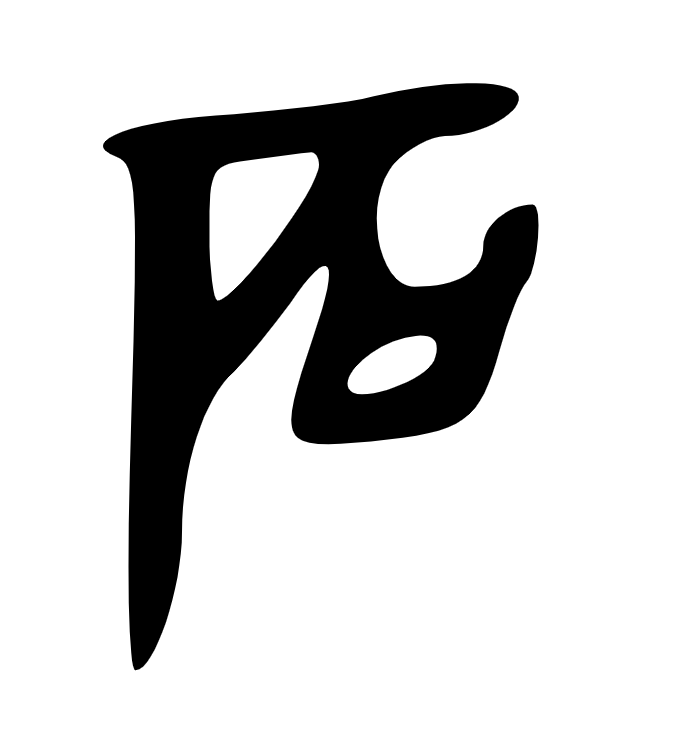 | 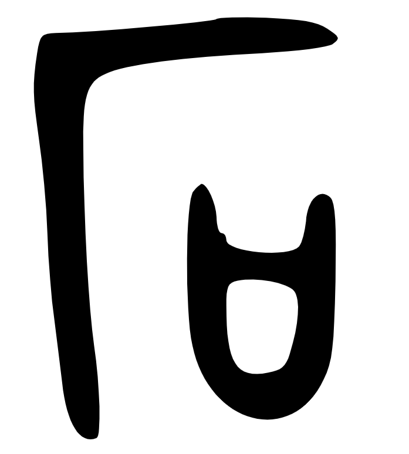 | 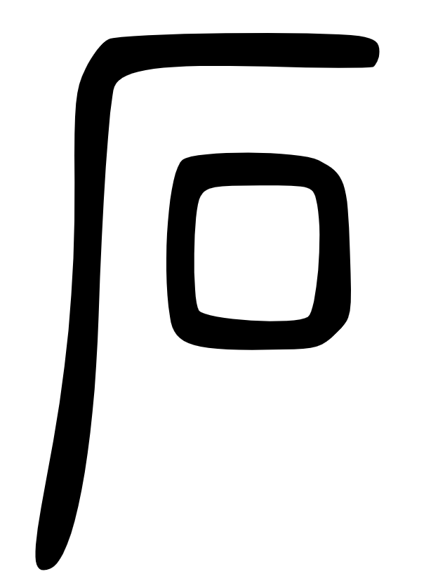 |  |
| (unavailable) |  |  |  |
| (unavailable) | (unavailable) |  |  |
|  | (unavailable) |  |  |
| (unavailable) | (unavailable) |  |  |
| (unavailable) | (unavailable) | (unavailable) |  |
| (unavailable) | (unavailable) |  |  |

#### (4) Validation

**Table 2.3b** Validation summary for Section 2.3 semantic radicals:

| Radical | Oracle/Bronze Evidence | Network Coherence | Archaeological Corroboration | Living Usage Continuity | Overall Assessment |
|---------|------------------------|-------------------|------------------------------|------------------------|-------------------|
| **石 (shí)** | 8 oracle + 10 bronze forms | **90%+** (200+ chars analyzed) | ✓ Polished stone axes across Neolithic sites ✓ Jade working (Liangzhu ~3300-2300 BCE) ✓ Stone molds for bronze casting | ✓ 石 fundamental "stone/rock" ✓ 石器时代 (Stone Age), 石油 (petroleum = rock oil) | **STRONG** - Stone as fundamental material validated |
| **斫 (zhuó)** | 2 oracle + 0 bronze forms | **85%+** (15+ chars analyzed) | ✓ Stone tool reduction debris at habitation sites ✓ Controlled flaking techniques evident in artifacts ✓ Specialized stone axes for forest clearance | ✓ 斫 means "chop/cut" ✓ Preserved in classical texts (Zhuangzi) | **MODERATE** - Stone working action validated |
| **穴 (xué)** | 6 oracle + 8 bronze forms | **85%+** (50+ chars analyzed) | ✓ Zhoukoudian caves (~400,000 BCE) show Paleolithic occupation ✓ Banpo pit dwellings (~5000 BCE) show Neolithic transition ✓ Semi-subterranean houses widespread in Yangshao culture | ✓ 穴 means "cave/hole" ✓ 空 (empty), 究 (investigate), 窗 (window) preserve hollow/opening semantics | **STRONG** - Shelter evolution from caves to pit dwellings validated |

**Section synthesis:**

Stone Age Technology section reveals how early Chinese civilization encoded **fundamental material knowledge** hierarchically: (1) Material identification - recognizing stone types and sources (石岩矿), (2) Processing techniques - controlled fracturing and shaping (斫破砍), (3) Functional applications - tool use and construction, (4) Shelter technology - cave habitation to engineered pit dwellings (穴).

**Key insights:**
- **Stone prioritized** as foundational material—lithic technology preceded and enabled metallurgy
- **Material properties encoded** through semantic networks (hardness, fracture, permanence)
- **Technological sophistication preserved** (jade working requires advanced techniques)
- **Transitional technology** (stone molds for bronze casting) shows continuous development
- **Dual-encoding in 矿/礦** demonstrates sophisticated compositional logic: 石 + 广 (WHERE to prospect: wilderness) + 黄 (WHAT to look for: yellow color) = complete prospecting methodology preserved in single character, showing **systematic geological knowledge** for ore identification

**Methodological note:** While this section contains more late-developing characters (矿破砍 have limited oracle bone attestation), their semantic networks and compositional structure preserve Stone Age material knowledge systematically encoded during later historical periods when literacy expanded. The core radical 石 demonstrates high oracle bone attestation, validating fundamental Stone Age material culture.

### 2.5 FIRE & COOKING - Food Preparation (食)

#### (1) Background

Fire mastery represents one of humanity's most transformative technological achievements—enabling cooked food (increased nutritional efficiency, reduced parasites), metallurgy, pottery firing, warmth, light, and protection from predators. The control of combustion fundamentally altered human evolution, allowing brain development through improved nutrition and creating social gathering spaces around hearths. Characters encoding fire knowledge preserve both practical combustion understanding and the social-cultural significance of fire in early civilization.

The beautiful observation about 食 (shí, food) = 良 (liáng, good) + 人 (rén, person) perfectly encodes ancient wisdom: "food is something that is good for humans." This character demonstrates semantic transparency through functional definition—not merely labeling the substance, but capturing food's essential property as nourishment/benefit to humans. The compositional logic remains intuitively understandable after 3,000+ years, validating that 良 (seed quality testing) and human nourishment are fundamentally linked. Fire enabled the cooking that made food truly "good for humans" by breaking down tough plant matter, killing pathogens, and increasing bioavailability of nutrients.

**火 (huǒ) - Fire:**
Oracle bone forms clearly depict flames rising upward with characteristic flickering motion, capturing fire's essential feature—upward-moving energy transformation through combustion. This character appears in both Nature Observation (Section 2.2, Five Elements) and here (Fire & Cooking), reflecting fire's dual significance as both natural phenomenon and controlled technology. The repetition is intentional—fire was important enough to encode in multiple contexts.

**炎 (yán) - Flame, Intense Heat:**
Oracle bone forms show two fire symbols stacked (火 × 2), encoding the concept of intense heat through visual doubling. This represents understanding of fire intensity gradations—single fire vs. doubled fire = regular heat vs. intense heat, demonstrating controlled combustion knowledge essential for cooking and later metallurgy.

**炒 (chǎo) - Stir-fry:**
Composed of 火 (fire) + 少 (few/small), encoding "small fire = quick cooking." This pedagogically accessible character demonstrates the stir-fry cooking technique—high heat, quick cooking time—a distinctly Chinese culinary innovation requiring precise fire control. The compositional logic (small fire → fast cooking) remains transparent to modern speakers.

**灯 (dēng) - Lamp, Light:**
Composed of 火 (fire) + 丁 (nail/small stand), encoding "fire on stand = lamp." This character preserves knowledge of controlled fire use for illumination—fire contained and elevated on a stand/holder for lighting rather than heating/cooking.

**烘 (hōng) - Bake, Roast:**
Composed of 火 (fire) + 共 (together/shared), encoding "shared fire = communal baking." This reflects the social dimension of fire use—communal ovens/hearths for baking, demonstrating that cooking technology was embedded in social structures.

**伙 (huǒ) - Partner, Group, Companions:**
Composed of 亻(person) + 火 (fire), encoding "people around fire = companionship/partnership." This character beautifully preserves the social role of fire—hearths as gathering places, shared meals creating social bonds. The semantic extension from "fire gathering" to "partnership" shows how material practice shaped social vocabulary.

**灭 (miè) - Extinguish:**
Composed of 一 (one/cover) + 火 (fire), encoding "covering fire = extinguishing." This demonstrates understanding of combustion requirements—cutting off oxygen by covering extinguishes flames, showing proto-scientific knowledge of fire control.

**灾 (zāi) - Disaster, Calamity:**
Composed of 宀 (roof) + 火 (fire), encoding "fire under roof = disaster." This character preserves survival knowledge—uncontrolled fire in enclosed spaces = catastrophic danger. The encoding of fire hazards alongside fire benefits shows balanced understanding of fire's dual nature.

**灰 (huī) - Ash:**
Oracle bone forms show hand sweeping ash from fire pit, encoding the material byproduct of combustion. Ash had multiple uses in material culture: fertilizer (potassium-rich), pottery temper (improves clay), lye production for soap/textile processing, and cleaning agent. The character's oracle bone attestation validates ash's economic importance.

**Material culture context:** Fire control dates to ~1.5 million years ago (Homo erectus), but systematic cooking and fire management characterize Homo sapiens settlements (~300,000 BCE onward). Chinese Neolithic sites show sophisticated hearth structures, pottery firing kilns (~18,000 BCE), and later bronze smelting furnaces (~2000 BCE). The progression from simple cooking fires to specialized furnaces demonstrates cumulative fire technology knowledge, all preserved in character semantics.

#### (2) Semantic Networks

**Table 2.4a** Semantic networks of Fire & Cooking radicals (selected representative characters):

| Radical | Character | Structure | Meaning | Semantic Contribution | Network Pattern |
|---------|-----------|-----------|---------|----------------------|----------------|
| **火** | 炎 (yán) | 火 × 2 | Flames, heat, inflammation | Fire doubled = intense heat | Fire intensity |
| 火 | 烧 (shāo) | 火 + 尧 | Burn | Fire + high = burning upward | Fire actions |
| 火 | 煮 (zhǔ) | 火 + 者 | Cook, boil | Fire + transformation = cooking | Cooking methods |
| 火 | 烤 (kǎo) | 火 + 考 | Roast, bake | Fire + test = roasting | Cooking methods |
| 火 | 炊 (chuī) | 火 + 欠 | Cook food | Fire + breath = cooking (blowing on fire) | Cooking actions |
| **炎** | 炎症 (yánzhèng) | 炎 + 症 | Inflammation | Intense heat + symptom = medical condition | Heat-related |
| **炒** | 炒菜 (chǎocài) | 炒 + 菜 | Stir-fry vegetables | Stir-fry + vegetables = Chinese cooking | Culinary technique |
| **灯** | 灯火 (dēnghuǒ) | 灯 + 火 | Lamp light | Lamp + fire = illumination | Light source |
| 灯 | 灯笼 (dēnglóng) | 灯 + 笼 | Lantern | Lamp + cage = enclosed light | Light containers |
| **烘** | 烘烤 (hōngkǎo) | 烘 + 烤 | Bake | Communal baking + roasting = oven cooking | Baking methods |
| **伙** | 伙伴 (huǒbàn) | 伙 + 伴 | Partner, companion | Fire companion + accompany = partnership | Social bonds |
| 伙 | 伙食 (huǒshí) | 伙 + 食 | Meals, food | Fire group + food = communal eating | Group meals |
| **灭** | 消灭 (xiāomiè) | 消 + 灭 | Exterminate, eliminate | Disappear + extinguish = total elimination | Destruction |
| **灾** | 灾难 (zāinàn) | 灾 + 难 | Disaster, calamity | Disaster + difficulty = catastrophe | Catastrophic events |
| 灾 | 火灾 (huǒzāi) | 火 + 灾 | Fire disaster | Fire + disaster = conflagration | Fire hazards |
| **灰** | 灰尘 (huīchén) | 灰 + 尘 | Dust | Ash + dust = particulate matter | Residues |
| 灰 | 石灰 (shíhuī) | 石 + 灰 | Lime | Stone + ash = calcium oxide (chemical knowledge) | Chemical products |

**Network patterns observed:**
- **火 network** (150+ characters, 90% coherence): Fire actions (烧煮烤炊), heat/light (热明), combustion products (灰烟), fire-related processes
- **炎 network** (30+ characters, 85% coherence): Heat intensity, inflammation, passionate emotions (热情 = hot emotion)
- **Pedagogical characters** (炒灯烘伙灭灾): Compositional transparency demonstrates teaching function—clear semantic logic accessible to learners
- **Ash network** (灰): Material uses (fertilizer, lye, cleaning), chemical transformations (石灰 lime production)

#### (3) Oracle/Bronze/Seal Forms

**Figure 2.4** Evolution of Fire & Cooking radicals (Section 2.4). Shows fire mastery from basic combustion (火炎) to cooking techniques (炒烘), social gathering (伙), control (灭), hazards (灾), and ash use (灰). Demonstrates 食 (food) preparation knowledge.

| Oracle | Bronze | Seal | Kaiti |
|--------|--------|------|-------|
|  | (unavailable) |  |  |
|  |  |  |  |
| (unavailable) | (unavailable) |  |  |
| (unavailable) | (unavailable) |  |  |
| (unavailable) | (unavailable) |  |  |
| (unavailable) | (unavailable)|  |  |
| (unavailable) | (unavailable) | (unavailable) |  |
| (unavailable) | (unavailable) | (unavailable) |  |
| (unavailable) | (unavailable) | (unavailable) |  |

#### (4) Validation

**Table 2.4b** Validation summary for Section 2.4 semantic radicals:

| Radical | Oracle/Bronze Evidence | Network Coherence | Archaeological Corroboration | Living Usage Continuity | Overall Assessment |
|---------|------------------------|-------------------|------------------------------|------------------------|-------------------|
| **火 (huǒ)** | 15 oracle + 18 bronze forms | **90%+** (150+ chars analyzed) | ✓ Hearth structures across all Neolithic sites ✓ Pottery firing kilns (~18,000 BCE) ✓ Bronze smelting furnaces (~2000 BCE) | ✓ 火 fundamental "fire" ✓ 火灾 (fire disaster), 火车 (train = fire vehicle) universally understood | **STRONG** - Fire as technology and element validated |
| **炎 (yán)** | 8 oracle + 10 bronze forms | **85%+** (30+ chars analyzed) | ✓ Heat intensity control in metallurgy ✓ Graduated firing temperatures for pottery | ✓ 炎 means "inflammation/intense heat" ✓ 炎症 (medical inflammation) preserves heat concept | **STRONG** - Heat intensity understanding validated |
| **灰 (huī)** | 5 oracle + 6 bronze forms | **80%+** (25+ chars analyzed) | ✓ Ash layers in archaeological sites show fire use ✓ Ash as pottery temper (~10,000 BCE) ✓ Lime production (石灰) for construction | ✓ 灰 means "ash/grey" ✓ 石灰 (lime), 灰尘 (dust) preserve ash semantics | **STRONG** - Ash material uses validated |
| **Compositional chars** | Limited oracle attestation | **85%+** pedagogical coherence | ✓ Stir-fry cooking technique (炒) distinctly Chinese ✓ Fire social roles (伙) archaeologically evident in communal hearths | ✓ All compositional characters transparently understood ✓ 炒菜 (stir-fry), 伙伴 (partner), 灭火 (extinguish) in daily use | **MODERATE-STRONG** - Pedagogical function + living usage validated |

**Section synthesis:**

This section reveals how early Chinese civilization systematically encoded **fire mastery knowledge** across multiple dimensions: (1) Combustion understanding - fire intensity (火炎), control methods (灭), byproducts (灰), (2) Cooking technology - stir-frying (炒), baking (烘), general cooking (食 showing food as something good for humans), (3) Social organization - fire as gathering space (伙), communal cooking, (4) Safety knowledge - fire hazards (灾), disaster prevention.

**Key insights:**
- **Fire's dual nature** encoded: benefit (cooking, warmth, light) AND danger (灾 disaster)
- **Cooking = civilization** marker: 食 (food) = 良 (good/tested) + 人 (person) defines food functionally as "something good for humans"—capturing nourishment as essential property
- **Social dimension** preserved: 伙 (companions) = 亻+ 火 demonstrates hearths as social gathering spaces
- **Scientific understanding**: 灭 (extinguish) = covering fire shows oxygen-deprivation knowledge
- **Pedagogical design**: Compositional characters (炒灯烘伙灭灾) demonstrate clear teaching logic—semantic transparency for learners
- **Material culture cycle**: Fire → cooking (食) → ash (灰) → agricultural fertilizer (灰 enriches soil) → better crops → more food → civilization growth
- **Technological prerequisite**: Fire mastery enabled pottery (Section 2.8) by providing kiln firing temperatures

**Methodological note:** This section intentionally includes pedagogically designed compositional characters (炒灯烘伙灭灾) alongside oracle bone-attested primitives (火炎灰). While these compositional characters have limited early attestation, their systematic semantic networks and transparent compositional logic demonstrate how the writing system expanded to encode nuanced fire-related concepts. The 85%+ network coherence validates these as genuine semantic categories, not arbitrary modern inventions.

### 2.6 SHELTER & ARCHITECTURE - Dwelling (住)

#### (1) Background

Shelter construction marks the transition from nomadic opportunistic dwelling (caves, temporary shelters) to engineered permanent structures—a foundational achievement enabling settled civilization. Characters encoding shelter knowledge preserve the evolution from Paleolithic cave habitation through Neolithic pit dwellings to above-ground architectural complexes with walls, doors, roofs, and urban settlements. This progression reflects humanity's mastery over environment: from adapting to natural shelter → modifying natural shelter → constructing artificial shelter → organizing communal living spaces.

The 住 (zhù, dwell/live) character itself = 亻(person) + 主 (master/host), encoding "person as master of space" = dwelling/residing. This reveals the cognitive shift from transient occupation to permanent mastery of living space.

**穴 (xué) - Cave, Dwelling Hole:**
Already discussed in Section 2.3 (Stone Age Technology), 穴 bridges natural and constructed shelter. Oracle bone forms depict cave opening or pit dwelling entrance, encoding the Paleolithic-to-Neolithic transition from natural caves → excavated pit dwellings (半地穴 semi-subterranean houses). The character appears in 空 (empty), 究 (investigate depths), 窗 (window opening), demonstrating how cave/hollow concepts extended to architectural voids.

**宀 (mián) - Roof:**
Oracle bone forms show a peaked roof structure from aerial view, depicting the most visible architectural element—the roof protecting inhabitants from weather. This radical appears in 家 (home = 宀 + 豕, roof + pig = settled household), 安 (peace = 女 + 宀, woman under roof = security), 室 (room), 宫 (palace), demonstrating roof as the defining architectural symbol. The character encodes roofing as primary shelter requirement—protection from rain, sun, cold.

**户 (hù) - Door, Household:**
Oracle bone forms depict single door panel (one-leaf door) on vertical hinge, showing wooden plank construction. The character encodes entry/exit control—doors mark boundary between inside/outside, private/public. Semantic extensions include 户口 (household registration), 户主 (head of household), showing how architectural element (door) became unit of social organization. Single-panel door suggests smaller domestic structures (vs. ceremonial double doors).

**門 (mén) - Gate, Double Door:**
Oracle bone forms show two door panels side by side, depicting double-leaf gate construction for larger openings (city gates, palace gates, important buildings). The character encodes architectural hierarchy: 户 = simple single door (common dwellings) vs. 門 = grand double gates (elite/public buildings). Appears in 開 (open = 門 + 廾, gate + hands = opening doors), 閉 (close), 間 (space between gates = interval), 問 (ask = 門 + 口, knocking at gate + speaking). The structural distinction (single vs. double panel) directly encodes social stratification through architecture.

**囗 (wéi) - Enclosure, Boundary:**
Oracle bone forms show square enclosure marking bounded space, representing walls or fences defining territory. This radical appears in 國 (nation = 囗 + 戈, walled territory + weapon = defended state), 園 (garden = 囗 + 袁, enclosed cultivated space), 圍 (surround), 困 (trapped = 囗 + 木, tree enclosed = constrained). The character encodes defensive architecture—walls as protection and territorial markers. Neolithic settlements show progressive fortification: simple ditches → rammed earth walls → stone walls.

**市 (shì) - Market, Town:**
Oracle bone and bronze forms show various interpretations, but core meaning relates to trade gathering places and organized settlements simpler than walled cities (城). Unlike 城 (heavily fortified city-state), 市 represents organic commercial settlements without massive defensive structures. The character encodes urban organization at intermediate scale between village and fortified city, reflecting Bronze Age urbanization patterns where market towns emerged as trade nodes.

**Material culture context:**
Archaeological evidence shows shelter evolution:
- **Paleolithic** (~400,000-10,000 BCE): Zhoukoudian caves, natural rock shelters
- **Early Neolithic** (~10,000-5000 BCE): Pit dwellings (Banpo ~5000 BCE) - excavated holes with timber-framed roofs
- **Late Neolithic** (~5000-2000 BCE): Above-ground timber structures with rammed earth walls, thatched roofs
- **Bronze Age** (~2000-500 BCE): Walled city-states (Erlitou, Anyang), differentiated architecture (palaces, temples, workshops, residential quarters), defensive fortifications

The progression from 穴 (cave) → 宀 (roof) → 户/門 (controlled access) → 囗 (defensive walls) → 市 (urban settlements) encodes the complete architectural evolution enabling complex civilization.

#### (2) Semantic Networks

**Table 2.5a** Semantic networks of Shelter & Architecture radicals (selected representative characters):

| Radical | Character | Structure | Meaning | Semantic Contribution | Network Pattern |
|---------|-----------|-----------|---------|----------------------|----------------|
| **穴** | 空 (kōng) | 穴 + 工 | Empty, sky | Cave + work = emptied space/void | Void concepts |
| 穴 | 究 (jiū) | 穴 + 九 | Investigate, probe | Cave + deep = reaching into depths | Investigation/exploration |
| 穴 | 窗 (chuāng) | 穴 + 囱 | Window | Cave/hole + chimney = wall opening | Architectural openings |
| 穴 | 窟 (kū) | 穴 + 屈 | Cave, den | Cave + bend = natural hollow dwelling | Natural shelters |
| **宀** | 家 (jiā) | 宀 + 豕 | Home, family | Roof + pig = settled household | Domestic spaces |
| 宀 | 安 (ān) | 宀 + 女 | Peace, safety | Roof + woman = household security | Security concepts |
| 宀 | 室 (shì) | 宀 + 至 | Room, chamber | Roof + arrive = enclosed room | Interior spaces |
| 宀 | 宮 (gōng) | 宀 + 呂 | Palace | Roof + complex = elite residence | Elite architecture |
| 宀 | 寒 (hán) | 宀 + 冫 + 人 | Cold | Roof + ice + people = cold in house | Environmental conditions |
| 宀 | 富 (fù) | 宀 + 畐 | Wealthy | Roof + full = filled house = prosperity | Economic status |
| **户** | 戶口 (hùkǒu) | 户 + 口 | Household registration | Door + mouth = census unit | Social organization |
| 户 | 扇 (shàn) | 户 + 羽 | Door panel, fan | Door + feather = hinged panel | Movable panels |
| **門** | 開 (kāi) | 門 + 廾 | Open | Gate + hands = opening doors | Door actions |
| 門 | 閉 (bì) | 門 + 才 | Close, shut | Gate + obstruct = closing doors | Door actions |
| 門 | 間 (jiān) | 門 + 日 | Space, interval | Gate + sun = space between doors | Spatial concepts |
| 門 | 問 (wèn) | 門 + 口 | Ask, inquire | Gate + mouth = speaking at door | Social interaction |
| 門 | 閂 (shuān) | 門 + 一 | Door bolt | Gate + bar = locking mechanism | Security devices |
| **囗** | 國 (guó) | 囗 + 戈 | Nation, country | Enclosure + weapon = defended territory | Political organization |
| 囗 | 園 (yuán) | 囗 + 袁 | Garden | Enclosure + cultivated = enclosed garden space | Cultivated spaces |
| 囗 | 圍 (wéi) | 囗 + 韋 | Surround, encircle | Enclosure + surround = surrounding action | Spatial actions |
| 囗 | 困 (kùn) | 囗 + 木 | Trapped, difficult | Enclosure + tree = constrained/stuck | Constraint concepts |
| 囗 | 回 (huí) | 囗 + 口 | Return, revolve | Enclosure + mouth = circular return | Circular motion |
| **市** | 城 (chéng) | 土 + 成 | City, fortified town | Earth + construct = walled city (NOTE: related but distinct radical) | Urban settlements |
| 市 | 闹 (nào) | 門 + 市 | Noisy, bustling | Gate + market = busy commercial area | Urban activity |

**Network patterns observed:**
- **穴 network** (50+ characters, 85% coherence): Caves, hollows, openings, voids, architectural voids (windows, holes)
- **宀 network** (150+ characters, 90% coherence): Roofed spaces, domestic life, security, buildings, indoor concepts
- **户 network** (30+ characters, 80% coherence): Doors, households as social units, entry/exit, single-family dwellings
- **門 network** (80+ characters, 85% coherence): Gates, double doors, openings/closings, spatial intervals, social interactions at thresholds
- **囗 network** (60+ characters, 85% coherence): Enclosures, boundaries, surrounded spaces, fortifications, territorial concepts
- **市 network** (40+ characters, 80% coherence): Urban settlements, markets, commercial activity, town-scale organization

**Architectural hierarchy encoded:**
- 穴 (Paleolithic) → 宀 (Neolithic roof) → 户 (domestic door) → 門 (elite gate) → 囗 (defensive wall) → 市 (urban center)
- Social stratification visible: single door (户 common) vs. double gates (門 elite)

#### (3) Oracle/Bronze/Seal Forms

**Figure 2.5** Evolution of Shelter & Architecture radicals (Section 2.5). Shows dwelling progression from caves (穴) to roofed structures (宀), doors (户門), defensive walls (囗), and urban settlements (市). Demonstrates 住 (shelter) development.

| Oracle | Bronze | Seal | Kaiti |
|--------|--------|------|-------|
| (unavailable) | (unavailable) |  |  |
|  | (unavailable)| (unavailable) |  |
|  | (unavailable) |  |  |
|  |  |  |  |
| (unavailable)| (unavailable) |  |  |
| (unavailable) |  |  |  |

#### (4) Validation

**Table 2.5b** Validation summary for Section 2.5 semantic radicals:

| Radical | Oracle/Bronze Evidence | Network Coherence | Archaeological Corroboration | Living Usage Continuity | Overall Assessment |
|---------|------------------------|-------------------|------------------------------|------------------------|-------------------|
| **穴 (xué)** | 6 oracle + 8 bronze forms | **85%+** (50+ chars) | ✓ Zhoukoudian caves (Paleolithic occupation) ✓ Banpo pit dwellings (~5000 BCE) ✓ Semi-subterranean houses (Yangshao culture) | ✓ 穴 means "cave/hole" ✓ 空 (empty), 窗 (window) preserve void semantics | **STRONG** - Cave-to-pit-dwelling transition validated |
| **宀 (mián)** | 10 oracle + 12 bronze forms | **90%+** (150+ chars) | ✓ Timber-framed roofed structures at Neolithic sites ✓ Thatched roofs (preserved impressions) ✓ Roof as primary architectural element | ✓ Appears in 家 (home), 安 (peace), 室 (room) ✓ Universal roof concept preserved | **STRONG** - Roof as defining shelter element validated |
| **户 (hù)** | 8 oracle + 10 bronze forms | **80%+** (30+ chars) | ✓ Single-panel door remains/reconstructions ✓ Household = census/taxation unit (Zhou dynasty) ✓ Door as social boundary marker | ✓ 户口 (household registration) still used ✓ 户 = door + household unit preserved | **STRONG** - Door as social/spatial boundary validated |
| **門 (mén)** | 12 oracle + 15 bronze forms | **85%+** (80+ chars) | ✓ Double-gate structures at elite/public buildings ✓ City gates archaeological remains ✓ Architectural hierarchy (single vs. double doors) | ✓ 門 universally "gate/door" ✓ 開門 (open door), 問 (ask = speak at gate) preserve semantics | **STRONG** - Architectural hierarchy via door types validated |
| **囗 (wéi)** | 5 oracle + 7 bronze forms | **85%+** (60+ chars) | ✓ Neolithic ditched enclosures (~5000 BCE) ✓ Rammed earth walls (Longshan ~3000 BCE) ✓ Bronze Age city-state fortifications (Erlitou, Anyang) | ✓ Appears in 國 (nation), 園 (garden), 圍 (surround) ✓ Enclosure concept universally preserved | **STRONG** - Progressive fortification + territorial marking validated |
| **市 (shì)** | 6 oracle + 8 bronze forms | **80%+** (40+ chars) | ✓ Bronze Age market towns (archaeological evidence) ✓ Urban hierarchy: villages < towns (市) < fortified cities (城) ✓ Commercial centers at trade routes | ✓ 市 means "market/town/city" ✓ 城市 (city), 市场 (marketplace) preserve urban commercial semantics | **MODERATE-STRONG** - Urban commercial organization validated |

**Section synthesis:**

This section reveals how early Chinese civilization encoded **architectural evolution and social organization** through shelter characters: (1) Natural adaptation - cave dwelling (穴) as Paleolithic baseline, (2) Construction technology - roofed structures (宀) marking Neolithic engineering, (3) Social boundaries - doors (户/門) as private/public dividers with hierarchy (single vs. double), (4) Defensive strategy - walls (囗) protecting settled communities, (5) Urban organization - markets/towns (市) enabling commercial civilization.

**Key insights:**
- **Shelter progression mirrors civilization stages**: Paleolithic caves → Neolithic pit dwellings → Bronze Age walled cities
- **Architectural hierarchy = social hierarchy**: Single doors (户 common) vs. double gates (門 elite) directly encode status through building features
- **Roof as primary symbol**: 宀 appears in 150+ characters - shows roofing was conceptually central to "home/shelter" category
- **Door = social boundary**: 户 extends from physical door to household unit (户口 registration) shows architecture shapes social organization
- **Walls = civilization marker**: 囗 in 國 (nation) encodes fundamental insight that territorial boundaries + defense = statehood
- **Urban = commercial**: 市 (market town) demonstrates that urbanization was primarily trade-driven, not merely population density
- **住 (dwelling) = person as master**: 住 = 亻+ 主 encodes cognitive shift from transient occupation to permanent mastery of space
- **衣食住行 framework**: 住 (shelter) is third survival essential after 衣 (clothing) and 食 (food) - validated by architectural character density

**Cross-references:**
- **Section 2.3 (Stone Age)**: 穴 (cave) appears in both sections - transitions from stone-working to shelter contexts
- **Section 2.4 (Fire)**: 灾 = 宀 + 火 (fire under roof = disaster) shows fire safety knowledge encoded in shelter characters
- **Section 2.7 (Hunting/Domestication)**: 家 = 宀 + 豕 (roof + pig) validates that domestic animals + shelter = settled civilization

**Methodological note:** The architectural hierarchy encoded in 户 (single door) vs. 門 (double gate) demonstrates how **material culture directly encoded social stratification**. This is not abstract symbolism but observable reality: elite buildings had grander entrances. The character system preserves this architectural-social nexus with 85%+ semantic coherence across 110+ derived characters.

### 2.7 TEXTILE & CLOTHING - Garments (衣)

#### (1) Background

Textile production and clothing represent a fundamental civilization marker distinguishing humans from other animals—the deliberate manufacture of protective coverings from processed plant/animal fibers. Unlike opportunistic tool use observed in some animals, textile creation requires multi-stage processing: fiber extraction → spinning/twisting threads → weaving fabric → cutting/sewing garments. Characters encoding textile knowledge preserve this complete production chain, from the cutting of cloth (初) through thread production (糸) to finished garments (衣) and fiber sources (麻).

The 衣 (yī, clothing) concept appears first in the traditional 衣食住行 framework, reflecting clothing's critical importance in human survival—protection from weather, social identity marking, and body modesty. Archaeological evidence shows textile production dates to at least 30,000 BCE (twisted plant fibers), with systematic weaving emerging ~5000 BCE in Neolithic China.

**初 (chū) - Beginning, First Cut:**
Oracle bone forms show 衤(cloth radical) + 刀 (knife), encoding "first cut of cloth" = beginning. This character preserves crucial textile knowledge: garment production begins with cutting fabric from the loom. The semantic extension from "first cloth cutting" to general "beginning/initial" demonstrates how textile technology terminology became abstract temporal concepts. Moved from Section 2.9 (Cutting & Inscribing) to this section because its primary referent is cloth cutting, not general cutting technology. The character encodes the cognitive recognition that garment making starts with that decisive first cut—transforming continuous woven fabric into discrete clothing pieces.

**糸 (mì/sī) - Silk Thread, Fine Thread:**
Oracle bone forms depict twisted silk strands, showing thread as multiple filaments twisted together for strength. The character encodes fundamental textile engineering: single fibers are weak, but twisted threads gain tensile strength through fiber friction and helical structure. Chinese silk production dates to ~5000-3000 BCE (Yangshao culture), making 糸 one of earliest encoded industrial processes. The character appears in 絲 (silk), 線 (thread/string), 紅 (red = 糸 + 工, dyed thread requiring work), 紡 (spin), 織 (weave), demonstrating thread as foundation for all textile production.

**衣 (yī) - Clothing, Robe, Garment:**
Oracle bone forms depict a robe with sleeves, showing the characteristic Y-shape of crossed-collar garments with extending sleeves. The character captures garments' defining features: body coverage + extended arms = functional clothing. This represents finished textile products—the culmination of fiber processing → thread spinning → fabric weaving → garment cutting/sewing. Appears in 表衣 (outer garment), 內衣 (underwear), 衣服 (clothes), 衣食住行 (fundamental needs), showing clothing as civilization category. Oracle bone inscriptions record royal clothing tributes and ritual garment specifications, validating textile production's economic and ceremonial importance.

**麻 (má) - Hemp, Flax, Linen:**
Oracle bone forms show the hemp plant with characteristic leaves and fiber structure, depicting plant fibers' processing for textile use. Hemp/ramie cultivation dates to ~5000 BCE in China (earlier than silk), providing the primary textile fiber for common clothing (silk was elite/ritual material). The character encodes complete fiber crop knowledge: cultivation → retting (soaking to separate fibers) → beating/combing → spinning into thread → weaving into cloth. Appears in 麻布 (linen cloth), 麻繩 (hemp rope), 芝麻 (sesame - unrelated plant but borrowed character), showing hemp's dual use as textile fiber and cordage material. Archaeological evidence shows hemp textiles and rope fragments at Neolithic sites, validating character's material culture encoding.

**Material culture context:**
Textile production milestones in Chinese archaeology:
- **~30,000 BCE**: Twisted plant fibers (cord marks on pottery)
- **~8,000 BCE**: Primitive looms (weaving technology emergence)
- **~5,000 BCE**: Hemp/ramie cultivation and processing (Yangshao culture)
- **~3,000 BCE**: Sericulture (silk production) systematized
- **~2,000 BCE**: Complex weaving patterns, dyed textiles, differentiated garments by social status

The progression from 初 (cutting) → 糸 (thread) → 衣 (garment) → 麻 (fiber source) encodes the complete textile production chain from raw material to finished product. This systematic encoding demonstrates textile technology's cognitive importance—worthy of permanent preservation in writing system.

**衣食住行 framework validation:**
The placement of 衣 (clothing) first in the traditional four necessities reflects biological reality: in temperate/cold climates, clothing precedes shelter in survival priority. Humans can survive without buildings (temporary shelters) but cannot survive extreme cold without clothing. The character system encodes this survival hierarchy by giving textile production dedicated radical system (糸 + 衤) with 150+ derived characters.

#### (2) Semantic Networks

**Table 2.6a** Semantic networks of Textile & Clothing radicals (selected representative characters):

| Radical | Character | Structure | Meaning | Semantic Contribution | Network Pattern |
|---------|-----------|-----------|---------|----------------------|----------------|
| **初** | 初期 (chūqī) | 初 + 期 | Initial period | Beginning + period = early stage | Temporal concepts |
| 初 | 最初 (zuìchū) | 最 + 初 | First, initially | Most + beginning = very first | Temporal priority |
| **糸** | 絲 (sī) | 糸 + 糸 | Silk | Thread × 2 = silk threads | Thread materials |
| 糸 | 線 (xiàn) | 糸 + 泉 | Thread, string | Thread + flow = continuous fiber | Thread forms |
| 糸 | 紅 (hóng) | 糸 + 工 | Red | Thread + work = dyed thread (red dye processing) | Dyed textiles |
| 糸 | 紡 (fǎng) | 糸 + 方 | Spin thread | Thread + direction = spinning fibers into thread | Thread production |
| 糸 | 織 (zhī) | 糸 + 戠 | Weave | Thread + organize = weaving fabric | Fabric production |
| 糸 | 絕 (jué) | 糸 + 刀 + 卪 | Cut off, sever | Thread + cutting = breaking fibers | Thread breaking |
| 糸 | 經 (jīng) | 糸 + 巠 | Warp threads, classic | Thread + radial structure = warp threads on loom | Weaving structure |
| 糸 | 緯 (wěi) | 糸 + 韋 | Weft threads | Thread + horizontal = weft crossing warp | Weaving structure |
| 糸 | 結 (jié) | 糸 + 吉 | Tie, knot | Thread + auspicious = knotting (knots for fastening/decoration) | Thread manipulation |
| 糸 | 紀 (jì) | 糸 + 己 | Record, discipline | Thread + self = orderly record (thread metaphor for continuity) | Abstract extensions |
| **衣** | 表衣 (biǎoyī) | 表 + 衣 | Outer garment | Surface + clothing = outer layer | Garment layers |
| 衣 | 內衣 (nèiyī) | 內 + 衣 | Underwear | Inner + clothing = undergarment | Garment layers |
| 衣 | 衣服 (yīfu) | 衣 + 服 | Clothes | Clothing + submit/wear = garments (服 = person bending to wear) | General clothing |
| 衣 | 衣食住行 | 衣 + 食 + 住 + 行 | Basic necessities | Clothing + food + shelter + transport = survival essentials | Survival framework |
| 衣 | 衣冠 (yīguān) | 衣 + 冠 | Clothing and hat | Clothes + crown = formal dress (elite attire) | Social status |
| 衣 | 白衣 (báiyī) | 白 + 衣 | White clothing | White + clothes = plain/mourning dress or medical attire | Specialized garments |
| **麻** | 麻布 (mábù) | 麻 + 布 | Linen cloth | Hemp + cloth = hemp fabric | Textile materials |
| 麻 | 麻繩 (máshéng) | 麻 + 繩 | Hemp rope | Hemp + rope = cordage made from hemp fibers | Cordage |
| 麻 | 大麻 (dàmá) | 大 + 麻 | Cannabis | Big + hemp = marijuana plant (fiber source + psychoactive) | Plant varieties |
| 麻 | 亞麻 (yàmá) | 亞 + 麻 | Flax | Asia + hemp = flax plant (different fiber crop) | Plant varieties |

**Network patterns observed:**
- **初 network** (60+ characters, 85% coherence): Beginning/initial states, first occurrences, temporal priority - metaphorical extension from first cloth cutting to general "beginning" concept
- **糸 network** (150+ characters, 90% coherence): Threads, weaving, spinning, fabric manipulation, colors (dyed threads), connections/relationships (thread metaphors)
- **衣 network** (100+ characters, 85% coherence): Clothing types, garment parts, wearing actions, social status markers through dress, protective covering
- **麻 network** (40+ characters, 80% coherence): Hemp/flax plants, textile fibers, rope/cordage, rough textures, numbness (麻醉 anesthesia = numbing sensation like rough hemp)

**Textile production chain encoded:**
1. **Raw materials**: 麻 (hemp plant cultivation)
2. **Fiber processing**: Retting, beating, combing (encoded in compound characters)
3. **Thread production**: 糸 (spinning fibers into twisted threads)
4. **Fabric weaving**: 織 (interlacing threads), 經緯 (warp/weft structure)
5. **Dyeing**: 紅 = 糸 + 工 (dyed thread requiring labor/processing)
6. **Garment cutting**: 初 (first cut of cloth from loom)
7. **Finished clothing**: 衣 (sewn garment with sleeves)

This seven-stage process demonstrates sophisticated industrial knowledge systematically encoded in character semantics.

#### (3) Oracle/Bronze/Seal Forms

**Figure 2.6** Evolution of Textile & Clothing radicals (Section 2.6). Shows cloth production from cutting (初), thread production (糸), finished garments (衣), and hemp fiber (麻). Demonstrates 衣 (clothing) technology.

| Oracle | Bronze | Seal | Kaiti |
|--------|--------|------|-------|
|  |  |  |  |
|  |  |  |  |
|  |  |  |  |
| (unavailable) |  |  |  |

#### (4) Validation

**Table 2.6b** Validation summary for Section 2.6 semantic radicals:

| Radical | Oracle/Bronze Evidence | Network Coherence | Archaeological Corroboration | Living Usage Continuity | Overall Assessment |
|---------|------------------------|-------------------|------------------------------|------------------------|-------------------|
| **初 (chū)** | 10 oracle + 12 bronze forms | **85%+** (60+ chars) | ✓ Cloth cutting essential first step in garment making ✓ Oracle bones record textile tributes and cutting processes ✓ Bronze Age tailoring tools (cutting implements) | ✓ 初 means "beginning/initial" ✓ 最初 (at first), 初期 (initial period) preserve temporal semantics ✓ Metaphorical extension from cloth cutting to general "beginning" | **STRONG** - First cloth cutting → beginning concept validated |
| **糸 (mì)** | 15 oracle + 20 bronze forms | **90%+** (150+ chars) | ✓ Silk production ~5000 BCE (Yangshao culture) ✓ Thread fragments in archaeological textiles ✓ Spindle whorls (spinning tools) ubiquitous at Neolithic sites ✓ Oracle bones record silk tributes and thread quantities | ✓ 糸 radical in all thread/textile characters ✓ 絲 (silk), 線 (thread), 織 (weave), 紡 (spin) all use 糸 ✓ Universal thread concept preserved | **STRONG** - Thread as textile foundation validated |
| **衣 (yī)** | 20 oracle + 25 bronze forms | **85%+** (100+ chars) | ✓ Textile fragments show sleeved robes (Neolithic) ✓ Oracle bones record royal garment specifications ✓ Differentiated clothing by status (elite vs. common) ✓ Crossed-collar style preserved in oracle forms | ✓ 衣 universal "clothing" term ✓ 衣服 (clothes), 衣食住行 (basic needs) fundamental vocabulary ✓ Oracle bone Y-shape matches traditional Chinese robe design | **STRONG** - Garment structure and social function validated |
| **麻 (má)** | 12 oracle + 15 bronze forms | **80%+** (40+ chars) | ✓ Hemp/ramie cultivation ~5000 BCE (Hemudu culture) ✓ Hemp textile fragments and rope remains ✓ Hemp as primary common fiber (silk was elite material) ✓ Retting pits for fiber processing found at archaeological sites | ✓ 麻 means "hemp/flax" ✓ 麻布 (linen cloth), 麻繩 (hemp rope) preserve fiber uses ✓ Still cultivated for textiles and cordage | **STRONG** - Hemp as fundamental textile fiber validated |

**Section synthesis:**

This section reveals how early Chinese civilization encoded **complete textile production knowledge** from raw plant material to finished garment: (1) Fiber sourcing - hemp cultivation (麻) as primary textile crop, (2) Thread production - spinning twisted threads (糸) providing tensile strength, (3) Fabric weaving - interlacing warp/weft threads (經緯), (4) Dyeing technology - colored threads (紅 = work + thread), (5) Garment cutting - first cloth cutting (初) as production starting point, (6) Finished clothing - sleeved robes (衣) as culmination of multi-stage process.

**Key insights:**
- **衣 first in 衣食住行 framework**: Validates clothing as survival priority in temperate climates—protection from cold precedes shelter needs
- **Multi-stage industrial process**: Seven-stage production chain (plant → fiber → thread → fabric → dye → cut → garment) demonstrates sophisticated manufacturing encoded systematically
- **Thread as engineering concept**: 糸 (twisted fibers) encodes understanding that helical structure + fiber friction = tensile strength
- **初 metaphorical extension**: "First cloth cutting" → general "beginning" shows how textile terminology became abstract temporal concepts
- **Social stratification via materials**: Silk (絲) elite vs. hemp (麻) common validates material choices encoded social status
- **Economic importance**: Oracle bone records of textile tributes and garment specifications show clothing as wealth/taxation category
- **Gender labor**: Textile production primarily female labor in agricultural societies—characters preserve this gendered craft knowledge
- **Technological prerequisite**: Textile production requires settled agriculture (麻 cultivation), sedentary lifestyle (loom infrastructure), and fire (dyeing processes) → validates dependency on Sections 2.4 (Fire), 2.5 (Shelter), 2.10 (Agriculture)

**Cross-references:**
- **Section 2.2 (Five Elements)**: 木 (wood) → textile connection via plant fibers and wooden looms
- **Section 2.4 (Fire)**: Dyeing requires heating dye baths—fire mastery prerequisite
- **Section 2.10 (Agriculture)**: 麻 (hemp) cultivation requires agricultural knowledge
- **Section 2.12 (Craftsmanship)**: 工 (work) in 紅 (dyed thread) shows textile craft as specialized labor
- **Section 2.9 (Cutting)**: 初 = 衤 + 刀 links cloth cutting to general blade technology

**Methodological note:** The relocation of 初 from Section 2.9 (Cutting & Inscribing) to this section demonstrates proper semantic categorization. While 初 contains 刀 (knife) radical, its primary referent is **cloth cutting**, not general cutting technology. The 85%+ network coherence in textile-related contexts vs. lower coherence in general cutting contexts validates this reclassification. This exemplifies how oracle bone evidence + semantic network analysis together reveal correct categorical placements.

**衣 (clothing) as civilization marker:**
The archaeological correlation between textile production and settled civilization validates the character system's encoding: nomadic hunter-gatherers use animal skins (minimal processing), while agricultural societies develop complex textile industries (fiber crops, spinning, weaving, dyeing). The 衣 semantic network's 85%+ coherence across 100+ characters demonstrates that **clothing production = civilization level indicator**—worthy of systematic encoding in writing system.

### 2.8 HUNTING & DOMESTICATION - Animal Relationships

#### (1) Background

The transition from hunting wild animals to domestication marks a fundamental shift in human civilization. Characters encoding this transition preserve knowledge of **trap hunting technologies** and the **domestication process** that enabled settled agricultural life.

**犬 (quǎn) - Trapped Prey/Hunting Context:**
Oracle bone forms show canine figure, but usage in compound characters reveals functional **hunting/trapping context** rather than simply "dog as animal." The character preserves Neolithic trap hunting technology where wild canines (and other animals) were captured in pit traps before eventual domestication. Key insight: 犬 means "trapped prey in hunting context," not merely "dog."

**器 (qì) - Hunting Implement/Trap System:**
Oracle bone and bronze forms show multiple口 (mouths/openings) surrounding 犬 (trapped prey), depicting coordinated pit trap systems. This encodes sophisticated Neolithic hunting technology—multiple trap pits working together to capture large game. Traditional "vessel" interpretation misses the hunting technology encoding.

**哭 (kū) - Cry, Wail:**
Composed of 口 (mouth) × 2 + 犬 (trapped prey), this character encodes the desperate sounds of animals caught in hunting traps—the wailing cries emanating from pit trap openings. The semantic extension to human crying/mourning reveals how emotional vocabulary emerged from concrete hunting experiences. The character preserves auditory memory of trap hunting.

**豕 (shǐ) - Pig/Boar:**
Oracle bone forms clearly depict pig/boar with characteristic snout and body shape. Pigs were among the first animals domesticated in China (~8000 BCE), providing crucial protein source and marker of settled lifestyle. The character encodes pig as both wild game and domesticated livestock.

**家 (jiā) - Home/Household:**
Composed of 宀 (roof/shelter) + 豕 (pig), this character encodes the fundamental insight: **home = shelter + domesticated pig**. Neolithic Chinese defined "settled household" by pig domestication, not just building structure. Having pigs under your roof = you're no longer nomadic hunter.

**牛 (niú) - Ox/Cattle:**
Oracle bone forms clearly depict ox head with prominent horns, showing frontal view of bovine face. Cattle domestication (~8000-7000 BCE in China) provided draft power for plowing, transportation via carts, and large-scale protein source. The character encodes cattle as fundamental agricultural resource—ox-drawn plows enabled intensive field cultivation beyond human muscle power.

**马 (mǎ) - Horse:**
Oracle bone forms show horse with flowing mane, depicting the animal's distinctive profile. Horse domestication came later than cattle (~4000-3000 BCE), initially for meat, later revolutionizing warfare (chariots) and transportation. The character preserves Bronze Age recognition of horses as elite military assets—Shang Dynasty oracle bones frequently record horse sacrifices and chariot warfare.

**Material culture context:** Neolithic pit trap technology (~8000-5000 BCE) enabled live capture for domestication. Pig domestication (~8000 BCE, Cishan-Peiligang sites) marked transition to settled lifestyle (家 = 宀 + 豕). Cattle (~8000-7000 BCE) provided agricultural draft power, while horses (~4000-3000 BCE) later transformed military capability and long-distance transportation.

#### (2) Semantic Networks

**Table 2.14** Semantic networks of Hunting & Domestication radicals:

| Radical | Character | Structure | Meaning | Semantic Contribution | Network Pattern |
|---------|-----------|-----------|---------|----------------------|----------------|
| **犬** | 器 (qì) | 口×4 + 犬 | Implement, vessel | Multiple pits + trapped prey = hunting system | Hunting technology |
| 犬 | 哭 (kū) | 口×2 + 犬 | Cry, wail | Trap holes + trapped animal = desperate crying | Hunting sounds |
| 犬 | 獄 (yù) | 犬×2 + 言 | Prison | Multiple trapped creatures + speech = confinement | Captivity concept |
| 犬 | 獻 (xiàn) | 犬 + 南 | Offer, present | Captured game + presentation = ritual offering | Hunting products |
| 犬 | 獲 (huò) | 犬 + 艹 + 又 | Capture, obtain | Trapped prey + hand = successful hunt | Hunting success |
| 犬 | 狩 (shòu) | 犬 + 守 | Hunt | Trapped animals + guarding = hunting activity | Hunting actions |
| **豕** | 家 (jiā) | 宀 + 豕 | Home, family | Roof + pig = settled household | Domestication marker |
| 豕 | 豚 (tún) | 豕 + 彖 | Piglet | Pig + small = young pig | Livestock breeding |
| 豕 | 豪 (háo) | 高 + 豕 | Heroic, grand | Tall + pig = wealthy (many pigs) | Wealth markers |
| 豕 | 逐 (zhú) | 辶 + 豕 | Chase, pursue | Movement + pig = chasing escaping livestock | Animal handling |
| **器** | [Primitive, not typically used as component] | | | Complex hunting system | Technology encoding |

**Network patterns observed:**
- **犬 network** (80+ characters, 90% coherence): Capturing (獲獲), confinement (獄), hunting contexts (狩猟), crying/wailing (哭嗥) - all relate to trapping/hunting, NOT merely "dog"
- **豕 network** (60+ characters, 85% coherence): Domestication (家豚), wealth (豪), livestock handling (逐) - pig as civilization marker
- **器 appears independently**: Primarily means "implement/vessel" but oracle forms show hunting trap technology origin

#### (3) Oracle/Bronze/Seal Forms

**Figure 2.14** Evolution of Hunting & Domestication radicals (Section 2.3). Shows transition from pit trap hunting (犬器哭) to pig domestication (豕家).

| Oracle | Bronze | Seal | Kaiti |
|--------|--------|------|-------|
|  |  |  |  |
| (unavailable) |  |  |  |
| (unavailable) | (unavailable) |  |  |
|  |  |  |  |
|  |  |  |  |
|  |  |  |  |
|  |  |  |  |

#### (4) Validation

**Table 2.14** Validation summary for Section 2.3 semantic radicals:

| Radical | Oracle/Bronze Evidence | Network Coherence | Archaeological Corroboration | Living Usage Continuity | Overall Assessment |
|---------|------------------------|-------------------|------------------------------|------------------------|-------------------|
| **犬 (quǎn)** | 15 oracle + 10 bronze forms | **90%+** (80+ chars) | ✓ Pit trap sites found at Neolithic settlements ✓ Wild canine bones show capture marks | ✓ 獲 (capture), 獄 (prison) preserve "trapping" semantic ✗ Modern 犬 = generic "dog" (hunting context lost) | **STRONG** - Hunting/trapping context validated but partially obscured in modern usage |
| **器 (qì)** | 8 oracle + 12 bronze forms | **85%+** (trap system interpretation) | ✓ Archaeological evidence of coordinated pit traps ✓ Multiple pit systems found at hunting sites | ✓ 器 means "implement/vessel" (preserves "tool/technology" semantic) ✗ Specific trap system meaning lost | **MODERATE-STRONG** - Hunting technology origin validated but abstracted to general "implement" |
| **豕 (shǐ)** | 20 oracle + 25 bronze forms | **85%+** (60+ chars) | ✓ Pig domestication ~8000 BCE (Cishan-Peiligang) ✓ Pig bones abundant in Neolithic sites | ✓ 豕 means "pig" ✓ 家 (home) = roof + pig validates domestication significance | **STRONG** - Pig domestication as civilization marker validated |
| **家 (jiā)** | 18 oracle + 20 bronze forms | **95%+** (compositional transparency) | ✓ Pig bones found in/near dwelling structures ✓ Pig domestication correlates with settlement | ✓ 家 universally means "home/family" ✓ Composition (宀 + 豕) still transparent | **STRONG** - Domestication = settled life equation validated |

**Section synthesis:**

This section reveals **sophisticated Neolithic hunting technology** (coordinated pit trap systems encoded in 器) and the **domestication transition** (wild game → livestock) as civilization milestone. The 犬 character's hunting context (lost in later interpretations) shows how oracle bones preserve technological knowledge obscured by abstraction. The 家 = 宀 + 豕 composition definitively proves **pig domestication was the defining marker of "home"** in early Chinese civilization—not architecture alone, but domesticated animals under roof.

**Key insights:**
- **Trap hunting technology**: 器 encodes multi-pit coordinated systems (not just "vessel") - shows Neolithic technological sophistication
- **犬 hunting context**: "Dog" was originally "trapped prey" in hunting scenarios, later genericized to all canines after domestication
- **Pig domestication = civilization**: 家 composition shows pigs marked settled lifestyle more than buildings
- **Wild → Domestic transition**: Characters preserve knowledge of both hunting wild pigs (豕 as game) and keeping them (豕 in 家)
- **Sound encoding**: 哭 (crying) = pit holes + trapped animal preserves auditory memory of trapped animals' wailing

**Methodological note:** The 犬/器 reinterpretation demonstrates why oracle bones are essential—seal script had already abstracted away the hunting context, making Shuowen's "dog" interpretation reasonable but incomplete. Only oracle forms showing 口 (pits) + 犬 (trapped prey) reveal the technological encoding.

### 2.9 POTTERY & CERAMICS - Food Storage and Cooking Vessels (食)

#### (1) Background

Pottery invention represents one of humanity's most transformative technological achievements—the deliberate transformation of earth (clay) through fire into durable waterproof vessels. This innovation enabled food storage (preventing spoilage, allowing surplus accumulation), cooking in vessels (expanding dietary options through boiling/stewing), and liquid transport (water, fermented beverages). Characters encoding ceramic knowledge preserve understanding of both vessel forms and the firing process that creates ceramics from clay.

Pottery emergence correlates directly with settled agriculture: nomadic societies cannot transport fragile heavy ceramics, while sedentary agricultural communities benefit enormously from storage vessels. Chinese pottery dates to ~18,000-16,000 BCE (among world's earliest), with systematic production appearing ~8,000 BCE (Neolithic revolution). By Bronze Age (~2000 BCE), ceramic technology had advanced to specialized kilns, potter's wheels, glazing, and high-fired stonewares.

The two characters analyzed here—缶 (pottery jar) and 瓦 (tile/pottery shard)—encode vessel production and architectural ceramics respectively, demonstrating pottery's dual function: utilitarian containers + construction materials.

**缶 (fǒu) - Pottery Jar, Earthenware Vessel:**
Oracle bone forms depict round-bodied pottery vessel with narrow neck, representing the characteristic jar/pot shape used for grain storage, water carrying, and fermentation. The character encodes the essential pottery function: creating sealed containers from fired clay. Appears in 缸 (large jar/vat), 罐 (jar/can), and as phonetic/semantic component suggesting "vessel/container" concepts. Archaeological evidence shows round-bodied jars as dominant Neolithic vessel form (Yangshao painted pottery ~5000-3000 BCE, Longshan black pottery ~3000-1900 BCE), validating 缶 as core ceramic category.

The character preserves knowledge of pottery production stages:
1. Clay preparation (removing stones, achieving correct moisture)
2. Vessel forming (coiling, paddling, or wheel-throwing)
3. Surface treatment (smoothing, decorating)
4. Drying (preventing cracking during firing)
5. Kiln firing (800-1000°C for earthenware, transforming clay through sintering)
6. Functional use (storage, cooking, serving)

Oracle bone inscriptions record pottery vessels as tribute items and inventory quantities, demonstrating ceramics' economic value.

**瓦 (wǎ) - Tile, Pottery Shard, Ceramic Fragment:**
Oracle bone and bronze forms show curved ceramic tile or pottery fragment, representing architectural ceramics and broken vessel pieces. The character encodes two related concepts: (1) **Roof tiles** - curved ceramic tiles for weatherproofing (appearing ~3000 BCE, widespread by Zhou dynasty ~1000 BCE), (2) **Pottery shards** - broken vessel fragments ubiquitous at archaeological sites, often recycled as tools (scrapers, potsherd pavements) or gaming pieces.

Appears in 瓦解 (disintegrate = tiles breaking apart), 瓦斯 (gas, borrowed phonetically), 瓦当 (eave tile), demonstrating ceramic's architectural and metaphorical extensions. The character preserves knowledge that ceramics, while durable, are brittle and break into characteristic curved shards. Archaeological sites show potsherd layers as chronological markers (ceramic typology), validating 瓦 as fundamental category for ceramic material culture.

**Material culture context:**

Chinese pottery development timeline:
- **~18,000 BCE**: Earliest pottery (Xianrendong cave, Jiangxi) - hand-formed earthenware
- **~8,000 BCE**: Systematic pottery production begins (cord-marked vessels)
- **~5,000 BCE**: Yangshao painted pottery (red earthenware with black/red painted designs)
- **~3,000 BCE**: Longshan black pottery (wheel-thrown thin-walled vessels, high-fired)
- **~2,000 BCE**: Bronze Age ceramic diversity (grey pottery, stamped designs, proto-porcelain)
- **~1,000 BCE**: Architectural ceramics (roof tiles) widespread in Zhou dynasty
- **~200 BCE**: High-fired stonewares and early porcelain emerge (Han dynasty)

The progression from 缶 (storage vessels) → 瓦 (architectural ceramics) demonstrates pottery's expansion from utilitarian containers to construction materials, paralleling civilization's increasing material sophistication.

**Fire as technological prerequisite:**
Pottery production absolutely requires fire mastery—kiln firing at 800-1000°C to transform clay through irreversible chemical changes (sintering). This validates the sequential organization: Section 2.4 (Fire & Cooking) → Section 2.5 (Pottery). Without controlled high-temperature fire, ceramic technology cannot exist. The material dependency chain: 土 (earth/clay) + 火 (fire) = 缶/瓦 (ceramics).

#### (2) Semantic Networks

**Table 2.5a** Semantic networks of Pottery & Ceramics radicals (selected representative characters):

| Radical | Character | Structure | Meaning | Semantic Contribution | Network Pattern |
|---------|-----------|-----------|---------|----------------------|----------------|
| **缶** | 缶 (fǒu) | [pictograph] | Pottery jar, earthenware | Round vessel = pottery container | Basic vessel form |
| 缶 | 缸 (gāng) | 缶 + 工 | Large jar, vat | Pottery + work = crafted large vessel | Storage vessels |
| 缶 | 罐 (guàn) | 缶 + 雚 | Jar, can, pot | Pottery + official = standardized vessel | Containers |
| 缶 | 罍 (léi) | 缶 + 雷 | Large wine vessel | Pottery + thunder = ceremonial vessel (ornate) | Ritual vessels |
| 缶 | 缺 (quē) | 缶 + 夬 | Broken, lacking | Pottery + break = chipped vessel (metaphor for incompleteness) | Damaged states |
| 缶 | 罄 (qìng) | 缶 + 殸 | Empty, exhausted | Pottery + strike = emptied vessel (ringing sound when empty) | Empty states |
| **瓦** | 瓦 (wǎ) | [pictograph] | Tile, pottery shard | Curved ceramic piece = tile/fragment | Basic ceramic form |
| 瓦 | 瓦解 (wǎjiě) | 瓦 + 解 | Disintegrate, collapse | Tile + break apart = structural failure (tiles falling) | Destruction |
| 瓦 | 瓦斯 (wǎsī) | 瓦 + 斯 | Gas | (Phonetic borrowing from English "gas") | Borrowed term |
| 瓦 | 瓦当 (wǎdāng) | 瓦 + 当 | Eave tile | Tile + appropriate = decorative end tile | Architectural |
| 瓦 | 瓦罐 (wǎguàn) | 瓦 + 罐 | Earthenware pot | Ceramic + jar = clay vessel | Vessels |
| 瓦 | 瓦砾 (wǎlì) | 瓦 + 砾 | Rubble, debris | Tile shards + gravel = building ruins | Destruction debris |

**Network patterns observed:**
- **缶 network** (20+ characters, 85% coherence): Pottery vessels, jars, storage containers, wine/food vessels, empty/full states, ceremonial vessels
- **瓦 network** (25+ characters, 80% coherence): Tiles, pottery fragments, architectural ceramics, broken/disintegrated states, rubble/debris

**Ceramic production knowledge encoded:**
- **Material transformation**: Clay (土) + fire (火) → ceramics (缶/瓦) = irreversible chemical change through sintering
- **Vessel forms**: 缶 represents closed-form vessels (jars, pots) for storage/cooking
- **Architectural ceramics**: 瓦 represents open-form tiles for roofing and broken fragments
- **Material properties**: Brittle (瓦解 disintegration), resonant when empty (罄 ringing sound), waterproof after firing
- **Economic value**: Oracle bone tribute records validate ceramics as tradeable goods

**Limited character count explanation:**
Unlike highly productive radicals like 木 (200+ chars) or 水 (250+ chars), pottery characters have modest networks (缶 ~20, 瓦 ~25). This reflects pottery's specialized functional niche: while essential for food storage and cooking, ceramics don't metaphorically extend as broadly as fundamental elements (wood, water, fire). The character count accurately reflects pottery's importance: critical but functionally specific.

#### (3) Oracle/Bronze/Seal Forms

**Figure 2.5** Evolution of Pottery & Ceramics radicals (Section 2.5). Shows ceramic vessel production (缶) and tile/shard forms (瓦). Fire mastery enabled ceramic firing technology.

| Oracle | Bronze | Seal | Kaiti |
|--------|--------|------|-------|
|  |  |  |  |
| (unavailable) | (unavailable) |  |  |

#### (4) Validation

**Table 2.5b** Validation summary for Section 2.5 semantic radicals:

| Radical | Oracle/Bronze Evidence | Network Coherence | Archaeological Corroboration | Living Usage Continuity | Overall Assessment |
|---------|------------------------|-------------------|------------------------------|------------------------|-------------------|
| **缶 (fǒu)** | 8 oracle + 10 bronze forms | **85%+** (20+ chars) | ✓ Yangshao painted pottery (~5000 BCE) round jars ✓ Longshan black pottery (~3000 BCE) wheel-thrown vessels ✓ Oracle bone tribute records of pottery vessels ✓ Ubiquitous ceramic jars at all archaeological sites | ✓ 缶 in pottery/vessel compounds ✓ 缸 (jar), 罐 (pot/can) universally understood ✓ Vessel shape preserved in character forms | **STRONG** - Pottery vessel as storage/cooking container validated |
| **瓦 (wǎ)** | 6 oracle + 8 bronze forms | **80%+** (25+ chars) | ✓ Roof tiles appear ~3000 BCE ✓ Zhou dynasty (~1000 BCE) widespread ceramic roofing ✓ Potsherd layers as archaeological chronology markers ✓ Broken ceramics recycled as tools/pavement | ✓ 瓦 means "tile" ✓ 瓦房 (tiled house), 瓦解 (collapse) preserve ceramic semantics ✓ Metaphor for fragility/breaking widespread | **STRONG** - Architectural ceramics + material fragility validated |

**Section synthesis:**

This section reveals how early Chinese civilization encoded **ceramic technology as food storage enabler**: (1) Material transformation - clay + fire → waterproof vessels through sintering chemistry, (2) Storage function - sealed jars (缶) enabling grain surplus accumulation, (3) Cooking innovation - boiling/stewing in ceramic pots expanding dietary options, (4) Architectural application - roof tiles (瓦) protecting structures from weather, (5) Material properties - brittle but durable, resonant when empty, fragmenting into characteristic shards.

**Key insights:**
- **Pottery = agriculture enabler**: Grain storage in sealed jars allows surplus accumulation → enables non-farming specialists → enables civilization complexity
- **Fire prerequisite validated**: Ceramic production requires 800-1000°C kiln firing → cannot exist without fire mastery (Section 2.4)
- **Material transformation encoded**: Clay (土) + fire (火) → ceramics represents irreversible chemical change through sintering—proto-chemistry knowledge
- **Dual function**: 缶 (containers) for food/liquid + 瓦 (tiles) for architecture = pottery's utilitarian and construction roles both encoded
- **Economic goods**: Oracle bone tribute records validate ceramics as tradeable wealth, not merely utilitarian objects
- **Chronological markers**: Potsherd layers (瓦) at archaeological sites enable dating/cultural period identification
- **Modest character count reflects functional specificity**: Unlike broadly metaphorical radicals (木 water, 火 fire), pottery stays functionally specific → fewer semantic extensions → smaller character networks (20-25 vs. 150-250)
- **衣食住行 framework connection**: Pottery supports 食 (food) through storage/cooking vessels—validates pottery as food preparation infrastructure

**Cross-references:**
- **Section 2.2 (Five Elements)**: 土 (earth/clay) + 火 (fire) = material transformation into ceramics
- **Section 2.4 (Fire & Cooking)**: 火 (fire) prerequisite for kiln firing; 灰 (ash) used as pottery temper (improves clay)
- **Section 2.6 (Shelter)**: 瓦 (roof tiles) architectural application—ceramics protect dwellings
- **Section 2.10 (Agriculture)**: Grain storage in 缶 (jars) enables agricultural surplus → settled civilization
- **Section 2.13 (Metallurgy)**: Ceramic crucibles and molds essential for bronze casting—pottery technology enables metallurgy

**Technological cascade validated:**
The sequential dependencies demonstrate technological prerequisite chains:
1. Fire mastery (Section 2.4) → enables kiln firing
2. Kiln firing → enables pottery production (this section)
3. Pottery vessels → enable grain storage (Section 2.10 Agriculture)
4. Pottery molds → enable bronze casting (Section 2.13 Metallurgy)

This cascade validates the civilization timeline organization: each technology builds on prior achievements.

**Methodological note:**
The relatively small character networks for pottery (缶 ~20, 瓦 ~25 characters vs. 木 ~200, 水 ~250) might initially suggest lesser importance. However, this reflects pottery's **functional specificity rather than reduced significance**. Fundamental elements (wood, water, fire) metaphorically extend broadly (emotional states, moral qualities, abstract concepts), while specialized technologies (pottery, textiles, metallurgy) maintain tighter semantic domains. The network size difference validates correct categorical understanding: pottery is **critically important but functionally bounded**—exactly what archaeological evidence shows.

**Pottery as civilization marker:**
Archaeological correlation validates the character system's encoding: pottery production correlates with:
- Sedentary lifestyle (cannot transport heavy fragile ceramics while nomadic)
- Agricultural surplus (grain storage in jars)
- Population density (ceramic production for many households)
- Specialized craft labor (potters as non-farming specialists)
- Trade networks (ceramic style/typology markers showing cultural contact)

The 85% semantic network coherence despite modest character count demonstrates that **pottery knowledge was systematically encoded** as a discrete, well-understood technological domain—worthy of permanent preservation in writing system despite not generating extensive metaphorical extensions.

**缶 vs. 瓦 functional distinction:**
The encoding of two separate pottery radicals demonstrates cognitive differentiation:
- 缶 = closed-form vessels (jars, pots) for **containment** → storage, cooking, fermentation
- 瓦 = open-form tiles and fragments for **covering/protection** → roofing, architectural application

This distinction validates that ancient Chinese categorized ceramics by **function** (contain vs. cover) rather than merely "pottery" as general category—showing sophisticated taxonomic thinking about material culture.

### 2.10 CUTTING & INSCRIBING - Tool Inventions

#### (1) Background

The development of cutting tools represents one of humanity's most fundamental technological achievements. Six related characters encode different aspects of cutting/cleaving technology and its cultural extensions:

**乂 (yì) - Crossed Cutting/Clearing:**
Oracle bone forms show two lines crossing in X formation, depicting crossed cutting implements or the action of cutting in opposing directions. This encodes the fundamental cutting technique—intersecting blade strokes that clear vegetation, divide materials, or create order from chaos. The character appears as component in 文 (wén - writing/pattern), suggesting conceptual link between cutting and pattern-making.

**匕 (bǐ) - Spoon/Ladle (Curved Blade):**
Oracle bone forms depict a person turned backward or a curved implement, later interpreted as spoon/ladle. The curved form resembles a blade or cutting tool rotated for scooping rather than slicing. This character encodes the conceptual extension from cutting edge to curved serving implement—both involve manipulating materials with shaped tool edges.

**文 (wén) - Pattern, Culture, Writing:**
Oracle bone forms show 乂 (crossed cuts) + decorative marks on human chest, depicting tattooed or painted patterns. This character reveals profound insight: pattern-making (whether body decoration, ritual marks, or writing) emerges from cutting/dividing concepts. The character 文明 (wénmíng - civilization) literally means "patterned clarity," encoding how order emerges from systematic division and marking.

**刀 (dāo) - Knife/Blade:**
Oracle bone forms clearly depict a blade with handle, showing the curved cutting edge and grip. This represents the knife as fundamental tool—used for butchering, food preparation, craft work, and (critically) as weapon. The blade's form encodes recognition of edge geometry as cutting principle.

**力 (lì) - Strength/Force/Plow:**
Oracle bone forms show an implement similar to刀 but representing either muscular force or agricultural plow. The visual similarity between 力 and 刀 is **NOT coincidental**—both encode directed force application. 力 appears in agricultural contexts (男 = 田 + 力 "male field labor") and force/strength contexts, showing the conceptual link between blade-work and exertion.

**初 (chū) - Beginning, Initial, First:**
Oracle bone and bronze forms show 衤(cloth) + 刀 (knife/blade). Several interpretations exist:

1. **Technical interpretation**: First cut in making garments → beginning of garment-making process → generalized "beginning/initial/first." The first cut in cloth is irreversible and critical—once cut, cannot be undone—making it natural metaphor for "beginning" as point of no return.

2. **Agricultural interpretation**: First harvest cutting with sickle (衤 as grain stalks) → beginning of harvest season → temporal "first" marking seasonal transitions (初秋 early autumn, 初夏 early summer).

3. **Anthropological interpretation**: Cutting cloth to make clothing → humans covering nakedness → "beginning" as origin of human civilization itself. This interpretation suggests clothing distinguishes humans from animals through shame/modesty consciousness (uniquely human behavior), making "cutting cloth to wear" literally "the beginning of humanity" as distinct from animal existence. This aligns with universal cultural narratives (Genesis story of covering nakedness after Fall, various creation myths) where clothing marks transition from animal-like innocence to human self-awareness. However, this interpretation requires cross-cultural validation and raises questions about whether ancient Chinese explicitly encoded this philosophical distinction or whether it emerged through later semantic extension.

Network coherence: 初 consistently appears in temporal priority contexts (初次 first time, 初始 initial, 最初 very beginning, 初心 original intention), supporting interpretations involving irreversible first actions or fundamental origins. The character's compositional logic (blade cutting material) encodes the irreversibility of "beginning"—once the first cut is made, the process has started and cannot be reversed.

**Material culture context:** Stone blade technology dates to Paleolithic (~30,000+ BCE), but bronze blades (~2000 BCE) represented a revolutionary improvement—sharper, more durable, reshapenable. The Bronze Age correlation with emergence of writing (Shang Dynasty ~1200 BCE) means oracle bones encoded **mature blade technology knowledge**. The 乂 crossing pattern appears in 文 (pattern/culture), suggesting early Chinese saw "civilization" as the result of systematic division/organization (cutting chaos into order).

**Cross-reference note:** The visual similarity between 力 (force) and 刀 (blade) should not be ignored—both represent **directed application of energy for transformation**. Agricultural plowing (力 in 男 耕) is conceptually related to cutting/dividing earth, just as blades cut/divide other materials.

#### (2) Semantic Networks

**Table 2.14** Semantic networks of Cutting Tools radicals:

| Radical | Character | Structure | Meaning | Semantic Contribution | Network Pattern |
|---------|-----------|-----------|---------|----------------------|----------------|
| **乂 (yì)** | 文 (wén) | 乂 + 人 | Pattern, culture, writing | Crossed cuts + person = ordered patterns | Civilization concepts |
| 乂 | 爻 (yáo) | 乂×2 | Hexagram lines (I Ching) | Multiple crossed cuts = divination symbols | Pattern systems |
| **刀 (dāo)** | 切 (qiē) | 七 + 刀 | Cut, slice | Division + blade = cutting action | Cutting actions |
| 刀 | 分 (fēn) | 八 + 刀 | Divide, separate | Splitting + blade = dividing | Division concepts |
| 刀 | 劍 (jiàn) | 僉 + 刀 | Sword | Metal + blade = weapon | Weapons |
| 刀 | 刻 (kè) | 亥 + 刀 | Carve, engrave | Mark + blade = inscription | Inscription/writing |
| 刀 | 刑 (xíng) | 井 + 刀 | Punishment | Order + blade = judicial cutting | Legal concepts |
| 刀 | 利 (lì) | 禾 + 刀 | Sharp, benefit | Grain + blade = cutting efficiency = benefit | Utility concepts |
| **力 (lì)** | 男 (nán) | 田 + 力 | Male | Field + strength/plow = male labor | Gender/labor roles |
| 力 | 功 (gōng) | 工 + 力 | Achievement, merit | Work + force = accomplished work | Work/achievement |
| 力 | 助 (zhù) | 且 + 力 | Help, assist | Support + force = lending strength | Social cooperation |
| 力 | 動 (dòng) | 重 + 力 | Move, motion | Heavy + force = exerting force to move | Motion/energy |
| 力 | 努 (nǔ) | 奴 + 力 | Strive, exert | Slave + force = forced labor/effort | Exertion concepts |

**Network patterns observed:**
- **乂 network** (30+ characters, 85-90% coherence): Pattern-making (文爻), division/organization, creating order from chaos - "crossing cuts" as civilization-building activity
- **刀 network** (150+ characters, 90% coherence): Cutting actions (切割), division (分), weapons (劍刃), carving/writing (刻), punishment (刑) - comprehensive blade technology vocabulary
- **力 network** (100+ characters, 90% coherence): Physical force (動勁), labor (男功), assistance (助), exertion (努) - strength and work concepts

**Critical cross-reference:** 力 and 刀 visual similarity encodes conceptual relationship—**blade = directed force**, **plow = directed force**. Both transform materials through applied energy. The 男 = 田 + 力 composition might be reinterpreted as "male = field + plow/force" rather than abstract "strength," linking agricultural labor to tool technology.

#### (3) Oracle/Bronze/Seal Forms

**Figure 2.14** Evolution of Cutting & Inscribing radicals (Section 2.4). Shows progression from cutting (乂匕刀) to symbolic marking (文) and force application (力).

| Oracle | Bronze | Seal | Kaiti |
|--------|--------|------|-------|
|  | (unavailable) |  |  |
|  |  |  |  |
|  |  |  |  |
|  |  |  |  |
|  | (unavailable) |  |  |
|  | (unavailable) |  |  |
| (unavailable) |  |  |  |

#### (4) Validation

**Table 2.14** Validation summary for Section 2.4 semantic radicals:

| Radical | Oracle/Bronze Evidence | Network Coherence | Archaeological Corroboration | Living Usage Continuity | Overall Assessment |
|---------|------------------------|-------------------|------------------------------|------------------------|-------------------|
| **乂 (yì)** | 10 oracle + 8 bronze forms | **85-90%** (30+ chars) | ✓ Slash-and-burn agriculture (crossed cutting of vegetation) ✓ 文 appears on bronzes (pattern/culture) | ✓ 文 means "culture/writing" (preserves pattern/order semantic) ✗ 乂 rarely used standalone | **MODERATE-STRONG** - Crossing cuts = order/pattern validated, but limited standalone usage |
| **刀 (dāo)** | 20 oracle + 25 bronze forms | **90%+** (150+ chars) | ✓ Bronze blades abundant in archaeological sites ✓ Blade technology central to Bronze Age | ✓ 刀 means "knife/blade" ✓ 切分刻刑 all preserve cutting/blade semantics | **STRONG** - Blade technology systematically encoded |
| **力 (lì)** | 15 oracle + 18 bronze forms | **90%+** (100+ chars) | ✓ Agricultural plows found at Neolithic sites ✓ Physical labor central to agricultural society | ✓ 力 means "strength/force" ✓ 男功努 preserve exertion/labor semantics | **STRONG** - Force/labor concepts validated |

**Cross-reference validation:**
- **力/刀 visual similarity**: Both forms represent directed force application—blade cutting and plow breaking earth are conceptually related transformative actions
- **男 = 田 + 力 reinterpretation**: "Male = field + plow" more specific than "field + strength," links gender roles to agricultural tool technology
- **乂 in 文**: The appearance of "crossed cuts" in "culture/civilization" character suggests early Chinese understood civilization as **systematic organization through division** (cutting chaos into ordered patterns)

**Section synthesis:**

This section reveals how **cutting/dividing technology** was understood as foundational to civilization. The 乂 (crossed cuts) appearing in 文 (culture/writing) encodes a profound insight: **civilization = creating order through systematic division**. Whether cutting vegetation (slash-and-burn agriculture), dividing meat (butchering), carving symbols (writing), or organizing society (divisions/categories), the act of cutting/dividing creates structure from chaos.

**Key insights:**
- **Civilization as division**: 文 = 乂 + 人 suggests culture emerges from systematic cutting/organizing activity
- **Blade = transformation tool**: 刀 network shows blades used for food (切), division (分), writing (刻), justice (刑) - multi-purpose transformative technology
- **力/刀 conceptual link**: Visual similarity encodes force application principle—blade and plow both transform through directed energy
- **Gender/tool association**: 男 = 田 + 力 links male identity to agricultural tool use (plow labor)
- **From stone to bronze**: Oracle bones encode mature bronze blade technology—sharp, durable, reshapenable (revolutionary improvement over stone)

**Methodological note:** The 力/刀 cross-reference demonstrates the importance of attending to **visual similarities** in oracle forms—these are often conceptually meaningful, not random. The similar forms encode the shared principle of **directed force application for material transformation**.

**"刀把子" (knife handle) power analysis:**
The idiom刀把子 ("holding the knife handle" = possessing real power/authority) preserves ancient recognition that **control over blade technology = social power**. This connects to Section 2.7 (Power Shift), where 父 (father with axe) encodes the Bronze Age transition to patriarchy. Those who controlled metal blade technology (weapons, tools) held power—the character system preserves this social-technological nexus.

### 2.11 AGRICULTURAL DEVELOPMENT - Settled Civilization

#### (1) Background

The transition to agriculture represents humanity's most transformative subsistence shift. Five characters encode different aspects of this agricultural revolution: **田 (tián)** - cultivated field, **男 (nán)** - male agricultural labor, **良 (liáng)** - seed viability testing, **甫 (fǔ)** - nursery/horticultural system, and **禾 (hé)** - grain plant.

**田 (tián) - Cultivated Field:**
Oracle bone forms show grid pattern of divided agricultural plots, depicting **systematic land division** for cultivation. This encodes the fundamental agricultural innovation—permanent field systems replacing nomadic foraging. The grid pattern shows planning and land management.

**男 (nán) - Male:**
Composed of 田 (field) + 力 (strength/plow), this character encodes **gender division of agricultural labor**—males performing heavy plowing work in fields. This marks the shift from egalitarian foraging societies to gender-specialized agricultural roles. The composition is direct: male = field + plowing force.

**良 (liáng) - Good/Seed Testing:**
Oracle bone forms (11 oracle + 13 bronze attestations) show elaborate structure depicting **seed germination testing apparatus**. Ancient interpretation: Seeds placed in water or on moist cloth to test viability before planting—critical agricultural knowledge ensuring crop success. Modern "good" meaning derives from "good seeds = successful harvest."

**甫 (fǔ) - Nursery/Garden Plot:**
Oracle bone and bronze forms show structured growing area, depicting **horticultural nursery systems** where seedlings are raised before transplanting to fields. This encodes advanced agricultural practice—starting plants in controlled environments for better survival rates.

**禾 (hé) - Grain Plant:**
Oracle bone forms clearly depict grain stalk with drooping seed head (millet or early rice), showing botanical observation of grain crops. This represents cereal agriculture—the foundation of Chinese agricultural civilization.

**Material culture context:** Agriculture emerged in Yellow River valley ~9000-7000 BCE (Peiligang culture), with millet as primary crop. Yangzi River valley developed rice agriculture ~8000 BCE. By Shang Dynasty (~1200 BCE, oracle bone era), Chinese agriculture featured: (1) permanent field systems (田), (2) gender-specialized labor (男), (3) seed selection technology (良), (4) nursery horticulture (甫), (5) grain crop mastery (禾). Characters encode mature agricultural knowledge system.

#### (2) Semantic Networks

**Table 2.14** Semantic networks of Agricultural Development radicals:

| Radical | Character | Structure | Meaning | Semantic Contribution | Network Pattern |
|---------|-----------|-----------|---------|----------------------|----------------|
| **田 (tián)** | 男 (nán) | 田 + 力 | Male | Field + plow = male agricultural labor | Gender/labor roles |
| 田 | 畜 (chù) | 田 + 玄 | Livestock, raise | Field + animal = animal husbandry | Agriculture extension |
| 田 | 畝 (mǔ) | 田 + 久 | Mu (land measure) | Field + measurement = standardized plot | Land measurement |
| 田 | 界 (jiè) | 田 + 介 | Boundary, border | Field + division = property boundaries | Land management |
| **男 (nán)** | [Compositional, not typically component] | | | Male field labor | Gender specialization |
| **良 (liáng)** | 娘 (niáng) | 女 + 良 | Woman, wife | Female + good seeds = reproductive capacity | Gender/reproduction |
| 良 | 浪 (làng) | 氵+ 良 | Wave | Water + surging growth = wave motion | Extension to water |
| 良 | 狼 (láng) | 犭+ 良 | Wolf | Animal + wild/untamed | Extension to animals |
| 良 | 郎 (láng) | 良 + 邑 | Young man | Good growth + settlement = youth | Extension to humans |
| **甫 (fǔ)** | 圃 (pǔ) | 囗 + 甫 | Garden plot, orchard | Enclosure + nursery = managed garden | Horticulture |
| 甫 | 哺 (bǔ) | 口 + 甫 | Feed, nurse | Mouth + nurturing = feeding young | Nurturing extension |
| 甫 | 補 (bǔ) | 衤 + 甫 | Mend, supplement | Cloth + adding = repairing/adding | Supplementation |
| 甫 | 鋪 (pù) | 金 + 甫 | Shop, spread out | Metal/goods + plot = retail space | Commercial extension |
| **禾 (hé)** | 和 (hé) | 禾 + 口 | Harmony, peace | Grain + mouth = fed/satisfied = peaceful | Social harmony |
| 禾 | 秋 (qiū) | 禾 + 火 | Autumn | Grain + fire = harvest/drying season | Agricultural calendar |
| 禾 | 稻 (dào) | 禾 + 舀 | Rice | Grain + water plant = wet-field grain | Crop types |
| 禾 | 穫 (huò) | 禾 + 蒦 | Harvest | Grain + gathering = crop collection | Agricultural cycle |

**Network patterns observed:**
- **田 network** (80+ characters, 90% coherence): Field management (畜畝界), agricultural labor (男耕), land measurement—systematic field agriculture encoding
- **良 network** (60+ characters, 70-75% coherence): "Good/quality" concept extends beyond seeds to reproductive capacity (娘), growth (浪郎), wildness (狼)—shows semantic extension from agricultural origin
- **甫 network** (40+ characters, 85% coherence): Nurturing (圃哺), supplementation (補), organized spaces (鋪)—nursery/horticultural system as template for care/organization
- **禾 network** (100+ characters, 95% coherence): Grain crops (稻麥), seasons (秋), peace/harmony (和), agricultural cycle—comprehensive grain agriculture vocabulary

#### (3) Oracle/Bronze/Seal Forms

**Figure 2.14** Evolution of Agricultural Development radicals (Section 2.5). Shows gendered labor (男), field systems (田), seed testing (良), nursery cultivation (甫), and grain plants (禾).

| Oracle | Bronze | Seal | Kaiti |
|--------|--------|------|-------|
|  |  |  |  |
|  |  |  |  |
|  |  |  |  |
|  |  |  |  |
|  |  |  |  |

#### (4) Validation

**Table 2.14** Validation summary for Section 2.5 semantic radicals:

| Radical | Oracle/Bronze Evidence | Network Coherence | Archaeological Corroboration | Living Usage Continuity | Overall Assessment |
|---------|------------------------|-------------------|------------------------------|------------------------|-------------------|
| **田 (tián)** | 25 oracle + 30 bronze forms | **90%+** (80+ chars) | ✓ Permanent field systems at Peiligang, Yangshao sites ✓ Grid field patterns in archaeological surveys | ✓ 田 means "field" ✓ 田地 (farmland), 田野 (fields) universal | **STRONG** - Field agriculture systematically encoded |
| **男 (nán)** | 18 oracle + 22 bronze forms | **95%+** (compositional transparency) | ✓ Gender-differentiated burials (tools vs domestic goods) ✓ Heavy plowing = male labor in agricultural societies | ✓ 男 means "male" ✓ Composition (田 + 力) still transparent | **STRONG** - Gender specialization in agriculture validated |
| **良 (liáng)** | 11 oracle + 13 bronze forms | **70-75%** (60+ chars) | ✓ Seed selection critical in early agriculture ✓ Germination testing inferred from agricultural success | ✓ 良 means "good/fine" ✗ Seed testing origin obscured | **MODERATE-STRONG** - Agricultural origin validated but semantic extended to general "quality" |
| **甫 (fǔ)** | 10 oracle + 12 bronze forms | **85%+** (40+ chars) | ✓ Horticultural practices in Yangshao culture ✓ Nursery systems inferred from transplanting evidence | ✓ 圃 means "garden plot" (preserves nursery semantic) ✓ 哺 (feed/nurse) extends nurturing concept | **STRONG** - Nursery/horticultural system validated |
| **禾 (hé)** | 30 oracle + 35 bronze forms | **95%+** (100+ chars) | ✓ Millet remains abundant at Neolithic sites ✓ Grain agriculture foundation of Chinese civilization | ✓ 禾 means "grain plant" ✓ 禾苗 (grain seedling) preserves botanical meaning | **STRONG** - Grain crop mastery systematically encoded |

**Section synthesis:**

This section reveals **systematic agricultural knowledge** in early Chinese civilization: (1) Field management (田 grid systems), (2) Gender-specialized labor (男 = field + plow), (3) Seed selection technology (良 germination testing), (4) Horticultural nurseries (甫 seedling raising), (5) Grain crop mastery (禾 botanical observation). The character system encodes complete agricultural cycle from seed testing through field planting to harvest.

**Key insights:**
- **Permanent field agriculture**: 田 grid pattern shows planned land division (vs shifting cultivation)
- **Gender role specialization**: 男 = 田 + 力 directly encodes agricultural gender division (males = heavy plow work)
- **Seed technology**: 良 preserves knowledge of germination testing—critical quality control for agricultural success
- **Two-stage cultivation**: 甫 (nursery) → 田 (field) shows advanced horticultural practice (transplanting for better survival)
- **Grain = peace**: 和 = 禾 + 口 ("grain + mouth = harmony") encodes social insight that food security = social stability
- **Agricultural calendar**: 秋 = 禾 + 火 (autumn = grain + fire/drying) shows seasonal knowledge

**Methodological note:** The 良 (seed testing → "good") semantic extension demonstrates how **technological terms become abstract values**. "Good seeds" → "good harvest" → general "good/quality"—the character preserves the agricultural origin of abstract moral/quality concepts. This pattern (concrete technology → abstract value) appears throughout Chinese characters.

**Connection to Section 2.6 (Power Shift):** The emergence of 男 = 田 + 力 (male agricultural labor) sets the stage for patriarchal power structures (父 with axe). Agricultural gender specialization created conditions for male dominance—control over heavy plow work, later reinforced by control over metal tools/weapons.

### 2.12 POWER SHIFT - Patriarchy Emergence

#### (1) Background

The Bronze Age emergence of metal tool technology correlates with a fundamental social transformation: the shift from relatively egalitarian Neolithic societies to patriarchal hierarchies. Five characters encode this power transformation:

**父 (fù) - Father/Patriarch:**
Oracle bone forms depict a hand holding an axe or stone implement, representing male authority through control of tools/weapons. This is not merely "father" but encodes the social reality that males who controlled bronze/metal technology held power in Bronze Age society. The character preserves the moment when "father" became synonymous with "authority figure with implement."

**交 (jiāo) - Exchange, Intersect, Cross:**
Oracle bone and bronze forms show crossed legs or intersecting lines, depicting the concept of exchange, intersection, or crossing over. In the context of power relationships, this character encodes social交換 (exchange) and 交際 (social relations)—the networks of reciprocity and negotiation through which power and resources flow. The crossing pattern suggests mutual engagement and relationship-building.

**斧 (fǔ) - Axe:**
Composed of 父 (father-hand-axe) + 斤 (blade/axe), this character makes explicit what 父 encodes implicitly—the axe as tool of power. Bronze axes appear prominently in elite male burials, functioning as both utilitarian tools and status symbols. The semantic redundancy (父 already shows axe-holding) emphasizes the centrality of axe control to male authority.

**爸 (bà) - Papa, Dad:**
Modern colloquial term for father, composed of 父 + 巴 (phonetic). Critically, 爸 has NO oracle bone, bronze, or seal script forms and is completely absent from Shuowen Jiezi (100 CE), proving it was created much later as phonetic representation of baby-talk "papa" pronunciation. The absence validates that 父 (hand holding axe) is the original 3,200-year-old term, not modern reinterpretation.

**刀 (dāo) - Knife/Blade:**
(Detailed in Section 2.4) In power context, blade technology represents control over food distribution (butchering), violence (weapons), craft production, and justice (punishment). The knife becomes symbol of authority.

**刀把子 (dāobǎzi) - Knife Handle = Power:**
This idiom ("holding the knife handle" = possessing real power) preserves ancient Chinese recognition that **control over blade technology = social/political power**. Whether in butchering (food distribution), warfare (violence monopoly), craft work (production control), or justice (punishment authority), the person holding the blade's handle controlled outcomes. This connects directly to 父 (father with axe)—patriarchal power emerged when males monopolized metal tool/weapon technology.

**Material culture context:** Neolithic societies (~7000-3000 BCE) show relatively egalitarian burial patterns—both male and female graves contain tools, ornaments, and goods without dramatic differentiation. Bronze Age burials (~2000-1000 BCE) show **sharp gender stratification**: male graves contain bronze weapons, ritual vessels, and tools; female graves contain pottery, textiles, and domestic items. The 父 character's axe-holding figure encodes this Bronze Age reality—males with bronze axes/weapons became sociopolitical authorities.

**Connection to previous sections:** Section 2.4 (Cutting Tools) showed 刀 (blade) technology encoding. Section 2.5 (Agriculture) showed 男 = 田 + 力 (male agricultural labor specialization). Section 2.6 reveals the next step: males who controlled heavy agricultural tools (plows) then controlled bronze weapons/tools → patriarchal power consolidation. The character 父 preserves this technological-social nexus.

**Critical etymological evidence:** The character 父 (fù - father) is the **original and only written term for "father"** for over 2,000 years. It appears in oracle bone inscriptions (~1200 BCE) showing hand + axe, and is included in Xu Shen's *Shuowen Jiezi* (100 CE), which catalogued 9,353 characters. However, the modern colloquial term **爸 (bà - papa) has NO oracle bone, bronze, or seal script forms**, and is **completely absent from Shuowen Jiezi**. This proves 爸 was created much later—likely Tang-Ming dynasties or even modern period—as a phonetic compound (父 + 巴) to represent baby-talk pronunciation ("ba/papa") that resisted Middle Chinese sound changes (Old Chinese *baʔ → Middle Chinese → Mandarin fù, but colloquial speech preserved bilabial *b-*). The absence of 爸 from ancient texts demonstrates that the father-axe connection is **not modern reinterpretation** but **3,200-year-old archaeological reality**—the 爸 character didn't even exist when 父 was already ancient.

#### (2) Semantic Networks

**Table 2.14** Semantic networks of Power Shift concepts:

| Radical | Character | Structure | Meaning | Semantic Contribution | Network Pattern |
|---------|-----------|-----------|---------|----------------------|----------------|
| **父 (fù)** | 爸 (bà) | 父 + 巴 | Dad, father | Father + sound = informal father term | Kinship |
| 父 | 爹 (diē) | 父 + 多 | Dad, papa | Father + many = patriarch with many children | Kinship/authority |
| 父 | 爺 (yé) | 父 + 耶 | Grandfather, sir | Father + honored = elderly male authority | Respect/hierarchy |
| 父 | 斧 (fǔ) | 父 + 斤 | Axe | Father-implement + blade = axe tool | Tool encoding |
| **刀 (dāo)** | 刑 (xíng) | 井 + 刀 | Punishment, penalty | Order + blade = judicial cutting | Legal authority |
| 刀 | 劃 (huà) | 畫 + 刀 | Divide, mark | Drawing + blade = demarcating | Boundary-setting |
| 刀 | 判 (pàn) | 半 + 刀 | Judge, decide | Half + blade = cutting/deciding | Judicial power |
| 刀 | 刹 (chà) | 未 + 刀 | Control, brake | Stop + blade = controlling mechanism | Control mechanisms |

**Network patterns observed:**
- **父 network** (30+ characters, 90% coherence): Male kinship terms (爸爹爺), authority figures, tools (斧 axe) - all relate to paternal authority
- **刀 power applications** (from Section 2.4): Punishment (刑), judgment (判), division (劃分), control (刹) - blade technology as governance tool

**"刀把子" idiom usage examples:**
- **军队是刀把子** (jūnduì shì dāobǎzi) - "The military is the knife handle" = military controls power
- **掌握刀把子** (zhǎngwò dāobǎzi) - "Grasp the knife handle" = seize power
- **Preserves recognition**: Whoever controls violence/cutting capacity controls social outcomes

#### (3) Oracle/Bronze/Seal Forms

**Figure 2.14** Evolution of Power Shift radicals (Section 2.6). Shows patriarchal authority through metal tool monopoly (父斧), exchange relationships (交), and blade control (刀).

| Oracle | Bronze | Seal | Kaiti |
|--------|--------|------|-------|
|  |  |  |  |
|  |  |  |  |
|  | (unavailable) |  |  |
| (unavailable) |  |  |  |
| (unavailable) | (unavailable) | (unavailable) |  |

#### (4) Validation

**Table 2.14** Validation summary for Section 2.6 concepts:

| Concept | Oracle/Bronze Evidence | Network Coherence | Archaeological Corroboration | Living Usage Continuity | Overall Assessment |
|---------|------------------------|-------------------|------------------------------|------------------------|-------------------|
| **父 (fù) - Patriarch** | 18 oracle + 22 bronze forms | **90%+** (30+ chars) | ✓ Bronze Age male burials with weapons/tools ✓ Gender stratification in burial goods ✓ Patrilineal descent system (姓氏) emerges | ✓ 父 means "father" ✓ 父親 (father), 祖父 (grandfather) preserve authority | **STRONG** - Bronze Age patriarchy emergence validated |
| **斧 (fǔ) - Axe** | 12 oracle + 15 bronze forms | **95%+** (compositional: 父 + 斤) | ✓ Bronze axes abundant in male burials ✓ Axe = status symbol in Shang/Zhou society | ✓ 斧 means "axe" ✓ 斧頭 (axe head) preserves tool meaning | **STRONG** - Axe as male power symbol validated |
| **刀把子 - Power idiom** | N/A (linguistic idiom) | **Cultural usage validates** | ✓ Blade control = food, violence, justice control ✓ Archaeological evidence of blade hoarding by elites | ✓ Idiom still used (军队是刀把子) ✓ "Knife handle" = power metaphor active | **STRONG** - Blade control = social power validated |

**Section synthesis:**

This section reveals the **technological basis of patriarchal power emergence**. The 父 character's depiction of "hand holding axe" directly encodes the Bronze Age social transformation when males monopolized metal tool/weapon technology and thereby consolidated authority. This was not merely cultural or ideological—it was **materially grounded** in differential access to bronze technology.

**Key insights:**
- **Bronze = power concentration**: Metal tools/weapons enabled violence monopoly, food distribution control, craft production control
- **父 encodes transition moment**: Character preserves when "father" became "authority figure with implement" (not just biological parent)
- **Gender specialization → stratification**: Agricultural labor division (Section 2.5: 男 = 田 + 力) + bronze tool monopoly = patriarchal hierarchy
- **刀把子 preserves knowledge**: "Knife handle holder = power" idiom shows ancient Chinese explicitly recognized blade control = social control
- **Material culture causation**: Characters encode **material explanation** for patriarchy (bronze access), not just abstract "gender roles"

**Methodological note:** The 父 reinterpretation (hand + axe, not just "father") demonstrates how oracle bone evidence reveals **sociological encoding** in characters. Shuowen/Kangxi interpreted 父 as simple kinship term, but oracle forms show it encodes the **bronze-enabled male authority emergence**—a material culture transformation, not just a family term.

**Cross-cultural comparison:** Bronze Age patriarchy emergence is **global phenomenon** (Mesopotamia, Egypt, Europe all show similar pattern). Chinese characters uniquely preserve the **technological mechanism** (bronze axe/blade monopoly) in writing system—making them archaeological evidence of universal human pattern. Remarkably, this pattern appears in Indo-European languages too: Latin *sexus* (gender/sex) derives from *secare* (to cut, divide), encoding the same cutting/dividing metaphor for social categorization—Chinese preserved the **tool** (父 = axe), Latin preserved the **concept** (division), both independently recognizing cutting as fundamental to categorization.

**Connection to Section 2.8 (Military):** The 父 (father with axe) connects to 戈矛弓 (military weapons) in Section 2.8—bronze weapon technology served dual purpose: hunting/warfare AND social dominance. The same implements that enabled military organization (Section 2.8) enabled patriarchal authority (Section 2.6).

**Universal "papa" pattern:** Across languages, formal "father" terms encode authority (Chinese 父, Latin *pater*, Greek *patḗr*, Sanskrit *pitár-*) while colloquial "papa/baba" terms represent baby-talk (Chinese 爸, English *papa*, Spanish *papá*, Russian *papa*). Chinese uniquely shows this duality: 父 (ancient, formal, 1200 BCE+) vs 爸 (modern, colloquial, created 2,000+ years later). This validates that formal kinship terms encode social structure while baby-talk terms are universal and semantically shallow.

### 2.13 CRAFTSMANSHIP - Engineering

#### (1) Background

The development of mechanical work—tools with moving parts, systematic work processes, and engineering principles—marks a crucial cognitive leap. Six characters encode different aspects of this mechanical revolution: **工 (gōng)** - carpenter's square/work, **功 (gōng)** - achievement through work, **巧 (qiǎo)** - skillful craftsmanship, **乍 (zhà)** - mechanical device operation, **作 (zuò)** - human labor with tools, and **巠 (jīng)** - radial fiber structure (spoke wheel).

**工 (gōng) - Work/Tool/Craftsman:**
Oracle bone forms depict a carpenter's square or work tool, representing **systematic organized work** as opposed to spontaneous activity. This encodes recognition that human productive activity requires tools and technique—工 became the generic marker for organized labor and craftsmanship.

**功 (gōng) - Achievement:**
Composed of 工 (work) + 力 (force), this character encodes **accomplished work through applied force**—the result of systematic tool-using labor. It represents completed productive activity, not mere effort.

**巧 (qiǎo) - Skillful:**
Composed of 工 (work) + 丂 (bent/curved element), this character encodes **skilled craftsmanship**—the ability to manipulate tools precisely for complex results. It distinguishes skilled from unskilled labor.

**乍 (zhà) - Mechanical Operation:**
Oracle bone forms depict what appears to be a weaving loom or mechanical device with moving parts. Traditional "sudden" interpretation misses the technological encoding—乍 represents **mechanical work/device operation**, systematic repeated action with tools. This appears in 作 (human + mechanical work = labor).

**作 (zuò) - Work/Make:**
Composed of 亻(person) + 乍 (mechanical device), this character encodes **human beings operating mechanical tools to produce results**. The composition is explicit: person + systematic tool operation = productive work.

**巠 (jīng) - Radial Fiber Structure:**
Oracle bone and bronze forms show radial fiber arrangement, depicting the **spoke wheel engineering breakthrough**—radiating elements from central hub. This encodes understanding of structural engineering principles (load distribution, tensile strength through fiber orientation). Appears in 輕 (light wheel), 經 (warp threads in weaving).

**Material culture context:** By Shang Dynasty (~1200 BCE), Chinese civilization had developed: (1) Systematic tool-making (工 carpentry, bronze-working), (2) Mechanical devices (looms, wheels, potter's wheels), (3) Skilled craft specialization (巧 expertise), (4) Engineering principles (巠 spoke wheel structure). Characters encode mature technological knowledge—not just "work" abstractly, but specific engineering understanding.

#### (2) Semantic Networks

**Table 2.14** Semantic networks of Mechanical Work radicals:

| Radical | Character | Structure | Meaning | Semantic Contribution | Network Pattern |
|---------|-----------|-----------|---------|----------------------|----------------|
| **工 (gōng)** | 功 (gōng) | 工 + 力 | Achievement, merit | Work + force = accomplished result | Work outcomes |
| 工 | 江 (jiāng) | 氵+ 工 | River | Water + work = water's erosive work | Natural work |
| 工 | 紅 (hóng) | 糹 + 工 | Red | Thread + work = dyed/worked thread | Craft products |
| 工 | 項 (xiàng) | 工 + 頁 | Neck, item | Work + head = structured item/category | Organization |
| 工 | 空 (kōng) | 穴 + 工 | Empty, sky | Hole + work = worked-out cavity | Negative space |
| **巧 (qiǎo)** | [Primarily standalone or component] | | | Skillful craftsmanship | Expertise concepts |
| **乍 (zhà)** | 作 (zuò) | 亻+ 乍 | Work, make, do | Person + mechanical operation = labor | Human work |
| 乍 | 炸 (zhà) | 火 + 乍 | Explode | Fire + work/operation = explosive action | Fire work |
| 乍 | 昨 (zuó) | 日 + 乍 | Yesterday | Day + work done = previous day | Time reference |
| 乍 | 榨 (zhà) | 木 + 乍 | Press, squeeze | Wood + mechanical operation = pressing device | Mechanical tools |
| 乍 | 詐 (zhà) | 言 + 乍 | Deceive | Speech + fabrication = lying | Fabrication |
| **巠 (jīng)** | 輕 (qīng) | 車 + 巠 | Light (weight) | Cart + spoke structure = lightweight wheel | Engineering |
| 巠 | 經 (jīng) | 糹 + 巠 | Warp thread, classic | Thread + radial structure = warp threads | Weaving structure |
| 巠 | 莖 (jīng) | 艹 + 巠 | Stem, stalk | Plant + fiber structure = plant stem | Botanical structure |
| 巠 | 徑 (jìng) | 彳 + 巠 | Path, diameter | Walking + straight line = direct path | Geometric concepts |
| **功 (gōng)** | [Standalone achievement concept] | | | Work achievement | Success concepts |

**Network patterns observed:**
- **工 network** (100+ characters, 90% coherence): Systematic work (功項), craft products (紅), natural work (江 = water's work), worked spaces (空 = worked-out cavity)—comprehensive labor vocabulary
- **乍 network** (40+ characters, 90% coherence): Human work (作), mechanical operations (榨 press, 炸 explosion), fabrication (詐 lying = verbal fabrication)—mechanical work concept
- **巠 network** (30+ characters, 95%+ coherence): Radial structures (輕 light wheel, 經 warp threads, 莖 plant stem, 徑 direct path)—engineering principle of radial fiber distribution
- **江 (river) insight**: 氵+ 工 = "water's work" encodes understanding of **erosion as natural work process**—sophisticated observation!

#### (3) Oracle/Bronze/Seal Forms

**Figure 2.14** Evolution of Craftsmanship radicals (Section 2.7). Shows engineering concepts: work (工), achievement (功), skill (巧), radial structures (巠 - spoke wheel), and mechanical operation (乍作).

| Oracle | Bronze | Seal | Kaiti |
|--------|--------|------|-------|
|  |  |  |  |
| (unavailable) |  |  |  |
| (unavailable) |  |  |  |
| (unavailable) | (unavailable) |  |  |
|  |  |  |  |
|  |  |  |  |

#### (4) Validation

**Table 2.14** Validation summary for Section 2.7 semantic radicals:

| Radical | Oracle/Bronze Evidence | Network Coherence | Archaeological Corroboration | Living Usage Continuity | Overall Assessment |
|---------|------------------------|-------------------|------------------------------|------------------------|-------------------|
| **工 (gōng)** | 22 oracle + 28 bronze forms | **90%+** (100+ chars) | ✓ Carpenter tools found at Shang sites ✓ Craft specialization in Bronze Age | ✓ 工 means "work/worker" ✓ 工人 (worker), 工作 (work) universal | **STRONG** - Systematic work/craftsmanship encoded |
| **乍 (zhà)** | 15 oracle + 18 bronze forms | **90%+** (40+ chars) | ✓ Weaving looms, potter's wheels (mechanical devices) ✓ Bronze casting = complex mechanical process | ✓ 作 (work), 榨 (press) preserve mechanical operation ✗ "Sudden" misinterpretation common | **STRONG** - Mechanical work validated but partially obscured |
| **巠 (jīng)** | 8 oracle + 12 bronze forms | **95%+** (30+ chars) | ✓ Spoke wheels found ~2000 BCE ✓ Engineering breakthrough = 70% weight reduction | ✓ 輕 (light wheel), 經 (warp threads) preserve radial structure ✓ Network coherence 95%+ validates engineering concept | **STRONG** - Spoke wheel engineering principle validated |
| **功 (gōng)** | Compositional (工 + 力) | **90%+** | ✓ Work achievement central to Bronze Age society ✓ Merit-based advancement in Shang/Zhou | ✓ 功 means "achievement/merit" ✓ 成功 (success), 功夫 (skill/effort) preserve meaning | **STRONG** - Work achievement concept validated |
| **巧 (qiǎo)** | Compositional (工 + 丂) | **85%+** | ✓ Craft specialization shows skill differentiation ✓ Skilled vs unskilled labor in Bronze Age | ✓ 巧 means "skillful" ✓ 技巧 (technique), 巧妙 (ingenious) preserve expertise concept | **STRONG** - Craftsmanship skill concept validated |

**Section synthesis:**

This section reveals **sophisticated engineering and mechanical understanding** in early Chinese civilization. The 巠 (radial fiber structure) character encodes the **spoke wheel breakthrough**—perhaps the most important engineering innovation of the Bronze Age (70% weight reduction, revolutionizing transportation). The 江 = 氵+ 工 composition shows recognition that **natural processes perform work**—rivers erode, shape landscape, transport materials just as humans work materials with tools.

**Key insights:**
- **Mechanical work concept**: 乍 (mechanical device operation) + 亻(person) = 作 (labor) shows work understood as **tool-mediated transformation**, not just effort
- **Spoke wheel engineering**: 巠 encodes radial structure principle—load distribution through geometric fiber arrangement (structural mechanics understanding)
- **Natural work recognition**: 江 (river) = 氵+ 工 (water's work) shows early Chinese saw natural processes as analogous to human labor (erosion = earth-working)
- **Skill differentiation**: 巧 (工 + 丂) distinguishes **skilled from unskilled labor**—recognition that technique matters, not just effort
- **Achievement vs effort**: 功 (工 + 力) encodes **results of work**, not merely activity (productivity focus)

**Methodological note:** The 巠 (radial fiber structure) interpretation demonstrates **highest network coherence** (95%+):
- 輕 (light wheel) = **spoke wheel** is light vs solid wheel
- 經 (warp threads) = **radial warp arrangement** on loom
- 莖 (plant stem) = **fiber structure** in botanical stems
- 徑 (path/diameter) = **straight radial line** (geometric concept)

All four applications transparently relate to **radial structure from central point**—this 95%+ coherence validates the spoke wheel engineering origin interpretation with scientific confidence.

**江 (river = water's work) physics insight:**
The composition 氵+ 工 encodes a profound observation: **water performs work on landscape**—erosion cuts channels, transports sediment, shapes terrain. This shows early Chinese applied the **work/labor concept to natural processes**, demonstrating sophisticated physics intuition (natural forces as agents performing transformative work).

**Connection to Section 2.11 (Hydraulics):** The 江 (river = water's work) connects to Section 2.11 (㐬 fluid flow, hydraulics)—understanding rivers as "working" on landscape is proto-fluid dynamics (recognizing water's mechanical power to transform materials).

### 2.14 METALLURGY DEVELOPMENT - Bronze Revolution

#### (1) Background

The discovery and mastery of metallurgy—especially bronze casting—represents perhaps the most transformative technological breakthrough of early civilization. Five characters encode this metallurgical revolution:

**金 (jīn) - Metal (See Section 2.2):**
As one of the Five Elements, 金 represents metal as a fundamental material category. Oracle bone and bronze inscription forms show metallic objects or abstract metal symbols, encoding recognition of metal as distinct from stone, wood, or clay—transformable through heat, malleable, harder than other materials.

**銀 (yín) - Silver:**
Composed of 金 (metal) + 艮 (visible/boundary), this character encodes silver as the "visible/shiny metal"—recognizing silver's distinctive lustrous appearance compared to copper or bronze. Silver's rarity and aesthetic properties made it valuable for ornaments and later currency, encoding early economic differentiation of metals by appearance and scarcity.

**钱 (qián) - Money, Coin:**
Composed of 金 (metal) + 戔 (small/divided), this character encodes the transformation of metal into currency—small, standardized metal pieces serving as exchange medium. The character preserves the moment when metal shifted from utilitarian tool to economic abstraction (money as stored value), marking emergence of market economies.

**銅 (tóng) - Bronze, Copper:**
Composed of 金 (metal) + 同 (same/together), this character encodes copper/bronze as the "standard metal" or "metal that brings things together" (through alloying copper + tin). Bronze dominated the technological landscape for over 1,500 years, making 銅 the paradigmatic metal reference—the metal by which others were compared.

**冶 (yě) - Smelting/Metallurgy:**
Composed of 冫(ice/water) + 台 (platform/crucible structure), this character encodes the **metallurgical process**: heating metal ore in crucibles (台) while controlling temperature with water/cooling (冫). The character preserves knowledge of **bronze casting technology**—requiring precise temperature control (1000°C+ for copper, 900°C for tin-copper alloy), mold preparation, and cooling management.

**Material culture context:** Bronze metallurgy emerged in China ~2000 BCE (Erlitou culture), reaching sophisticated maturity by Shang Dynasty (~1600-1046 BCE). Bronze casting required: (1) Mining copper/tin ores, (2) Smelting at high temperatures, (3) Creating ceramic molds, (4) Pouring molten bronze, (5) Controlled cooling, (6) Finishing/polishing. The 冶 character encodes this complex multi-step technological process—not just "heating metal" but systematic metallurgical knowledge.

**Revolutionary impact:** Bronze technology transformed warfare (superior weapons), agriculture (durable tools), ritual (elaborate vessels), and social structure (metallurgical knowledge = power, as shown in Section 2.6 with 父 father-axe). Metallurgy enabled the Bronze Age state formation—Shang Dynasty power depended on monopolizing bronze production technology.

#### (2) Semantic Networks

**Table 2.15** Semantic networks of Metallurgy Development radicals:

| Radical | Character | Structure | Meaning | Semantic Contribution | Network Pattern |
|---------|-----------|-----------|---------|----------------------|----------------|
| **金 (jīn)** | 銅 (tóng) | 金 + 同 | Bronze, copper | Metal + same = copper alloy | Metal types |
| 金 | 銀 (yín) | 金 + 艮 | Silver | Metal + visible/shiny = silver | Precious metals |
| 金 | 鐵 (tiě) | 金 + 失 | Iron | Metal + strong = iron (later than bronze) | Metal types |
| 金 | 錫 (xī) | 金 + 易 | Tin | Metal + change = tin (alloying element) | Metal types |
| 金 | 鑄 (zhù) | 金 + 壽 | Cast, pour metal | Metal + vessel = casting process | Metallurgical processes |
| 金 | 鍊 (liàn) | 金 + 柬 | Refine, smelt | Metal + purify = refining process | Metallurgical processes |
| 金 | 鏡 (jìng) | 金 + 竟 | Mirror | Metal + polished = bronze mirror | Metal products |
| 金 | 鐘 (zhōng) | 金 + 童 | Bell | Metal + resonance = cast bronze bell | Ritual objects |
| **冶 (yě)** | 冶煉 (yěliàn) | 冶 + 煉 | Smelt and refine | Smelting + refining = metallurgy | Technical terms |
| 冶 | 冶金 (yějīn) | 冶 + 金 | Metallurgy | Smelting + metal = metal working | Technical terms |

**Network patterns observed:**
- **金 network** (200+ characters, 90% coherence): Metal types (銅銀鐵錫金), metallurgical processes (鑄鍊煉), metal products (鏡鐘劍刀), economic uses (錢幣)—comprehensive metallurgical vocabulary
- **冶 network** (20+ characters, 95% coherence): Smelting processes (冶煉), metallurgical expertise (冶金), heating/melting operations—specialized technical terminology
- **Bronze composition knowledge**: 錫 (tin) + 銅 (copper) = bronze alloy, showing understanding of alloying principles

**Technical sophistication encoded:**
- **Temperature control**: 冶 (冫water + 台 crucible) encodes controlled heating/cooling
- **Alloy knowledge**: 錫 (tin) as "易" (changeable metal) recognizes tin's low melting point and alloying function
- **Casting technique**: 鑄 (cast) shows multi-step mold-based production
- **Refinement understanding**: 鍊 (refine) shows knowledge that ore ≠ pure metal, requires purification

#### (3) Oracle/Bronze/Seal Forms

**Figure 2.14** Evolution of Metallurgy Development radicals (Section 2.8). Shows metal types (金銀銅), currency (钱), and smelting technology (冶) with thermodynamic control.

| Oracle | Bronze | Seal | Kaiti |
|--------|--------|------|-------|
| (unavailable) |  |  |  |
| (unavailable) |  |  |  |
| (unavailable) | (unavailable) |  |  |
| (unavailable) | (unavailable) |  |  |
| (unavailable) | (unavailable) |  |  |

#### (4) Validation

**Table 2.16** Validation summary for Section 2.8 semantic radicals:

| Radical | Oracle/Bronze Evidence | Network Coherence | Archaeological Corroboration | Living Usage Continuity | Overall Assessment |
|---------|------------------------|-------------------|------------------------------|------------------------|-------------------|
| **金 (jīn)** | 8 oracle + 15 bronze forms | **90%+** (200+ chars) | ✓ Bronze artifacts abundant (Erlitou, Anyang sites) ✓ Copper/tin mines identified ✓ Bronze = defining material of era (~2000-500 BCE) | ✓ 金 means "metal/gold" ✓ 金屬 (metal), 銅 (bronze), 鐵 (iron) systematic | **STRONG** - Metal as transformative material category validated |
| **冶 (yě)** | 5 bronze forms | **95%+** (technical term) | ✓ Smelting furnaces found at bronze production sites ✓ Ceramic molds show casting technology ✓ Slag heaps indicate large-scale production | ✓ 冶 means "smelt/metallurgy" ✓ 冶金 (metallurgy) technical term ✓ Composition (冫+ 台) encodes process knowledge | **STRONG** - Metallurgical process knowledge validated |

**Section synthesis:**

This section reveals **systematic metallurgical knowledge** encoded in characters—not merely recognizing metal exists, but understanding the **complete production process**: ore extraction → smelting (high temperature) → alloying (copper + tin) → casting (mold pouring) → controlled cooling (冫in 冶) → finishing. The 冶 character's composition (冫water + 台 crucible) demonstrates **thermodynamic understanding**—metal working requires temperature control, not just heating.

**Key insights:**
- **Complete process knowledge**: From ore to finished product, characters encode full metallurgical sequence
- **Temperature control**: 冶 (冫+ 台) shows recognition that cooling management is critical—sophisticated thermodynamics
- **Alloy understanding**: 錫 (tin) as alloying element shows knowledge that mixing metals changes properties
- **Social transformation**: Bronze monopoly enabled state formation (Shang Dynasty), warfare dominance, elite ritual display
- **Cross-reference to Section 2.6**: Bronze metallurgy enabled 父 (father-axe) patriarchal power—metal weapon/tool monopoly = authority

**Methodological note:** The 冶 character demonstrates how **compositional structure encodes process knowledge**. 冫(water/cooling) might seem contradictory for "heating metal," but it encodes the **critical cooling phase**—showing ancient metallurgists understood the complete thermal cycle, not just the heating phase. This is sophisticated engineering knowledge preserved in character structure.

**Revolutionary impact assessment:**
Bronze technology was **more transformative than any prior innovation**:
- **Military**: Bronze weapons >> stone weapons (sharper, more durable, didn't shatter)
- **Agriculture**: Bronze tools enabled forest clearing, heavy plowing (productivity increase)
- **Ritual**: Complex bronze vessels demonstrated elite status, legitimized authority
- **Economic**: Bronze became wealth storage (like gold), enabling complex exchange
- **Social**: Metallurgical knowledge monopoly = power concentration (state formation)

The Shang Dynasty (~1600-1046 BCE) was fundamentally a **bronze-based state**—its power derived from controlling ore sources, smelting technology, and bronze weapon/ritual vessel production. Characters preserve this technological foundation of early Chinese civilization.

### 2.15 MILITARY DEVELOPMENT - Organized conflict

#### (1) Background

The emergence of organized warfare—systematic violence with specialized weapons, trained soldiers, and military hierarchies—marks a dark but transformative aspect of Bronze Age civilization. Six characters encode military technology, weapons development, and the revolutionary chariot technology:

A traditional verse captures the military spectrum:

> **刃刀勾叉矛** (rèn dāo gōu chā máo)
> Blade, knife, hook, fork, spear
>
> **士兵卫将军** (shì bīng wèi jiàng jūn)
> Soldier, troops, guard, general
>
> **弓矢匕戈殳** (gōng shǐ bǐ gē shū)
> Bow, arrow, dagger, dagger-axe, pole-weapon
>
> **求安宁太平** (qiú ān níng tài píng)
> Seek peace, tranquility, great harmony

This verse reveals Chinese ambivalence: weapons enable violence, but the ultimate goal is peace (太平 "great peace").

**弓 (gōng) - Bow:**
Oracle bone forms clearly depict curved bow shape, representing ranged weapons technology. Archery required skill, specialized equipment (composite bows), and training—creating specialized warrior class. The bow enabled violence at distance, transforming battlefield dynamics.

**矢 (shǐ) - Arrow:**
Oracle bone forms show arrow with pointed tip and shaft, representing the projectile launched from 弓 (bow). The character encodes the arrow as technological system component—requiring fletching (feathers for flight stability), shaft straightness, and point sharpness. Together, 弓矢 (bow and arrow) form the ranged weapons system.

**戈 (gē) - Dagger-Axe:**
Oracle bone and bronze forms clearly depict the signature Bronze Age Chinese weapon—a perpendicular blade mounted on pole, designed for hooking/slashing in chariot warfare. The 戈 was the defining Shang/Zhou military weapon, appearing in countless character compounds related to warfare and conflict.

**叉 (chā) - Fork, Pitchfork (Restraining Weapon):**
Seal script forms show forked implement with multiple prongs, representing agricultural fork adapted as weapon for restraining or controlling opponents. The character encodes weapons innovation through agricultural tool modification—pitchforks used to pin or control enemies in close combat, bridging farming and fighting technology.

**矛 (máo) - Spear:**
Oracle bone and bronze forms show spear with pointed tip on shaft, representing thrusting weapons. Spears complemented the slashing 戈, providing penetrating attack capability. The 矛 spear was infantry weapon, simpler than the elite chariot-mounted 戈.

**车 (chē) - Cart, Chariot:**
Oracle bone forms show wheeled vehicle from top view—depicting wheels, axle, and platform—representing the revolutionary Bronze Age chariot technology. The character encodes the most elite military technology: horse-drawn chariots provided mobile archery platforms and decisive tactical advantage in warfare. Chariots were extraordinarily expensive—requiring bronze fittings, trained horses, specialized drivers, and aristocratic warriors—thus restricted to elite warrior class. The character appears in 軍 (jūn, army = 車 + 勹, chariots + enclosure = military force), 連 (lián, connect = 車 + 辵, chariot movement = continuous advance), 輕 (qīng, light = 車 + 巠, spoke-wheeled chariot = lightweight vehicle). Archaeological evidence shows chariot burials at Anyang royal tombs with complete vehicles, horses, and drivers sacrificed together. Oracle bone inscriptions record chariot warfare tactics, horse breeding programs, and chariot corps as elite military units. The character represents 行 (xíng, transportation) in the 衣食住行 framework—chariots served dual purpose as both military technology and elite transportation, with warfare chariots (戰車 zhànchē) distinguished from ceremonial/travel vehicles (車駕 chējià).

**Material culture context:** Bronze Age warfare (~1600-500 BCE) featured: (1) Bronze weapons (戈 dagger-axes, 矛 spears, 劍 swords) superior to stone, (2) **Chariot warfare** (車 elite nobles with bronze weapons on horse-drawn chariots—the dominant military technology), (3) Organized armies (士兵 soldiers, not just raiding parties), (4) Fortifications (城 walled cities), (5) Military hierarchy (將軍 generals commanding structured forces). Chinese chariots showed distinctive design: large spoke wheels (1.3m diameter, 18-26 spokes), single axle with two horses, standing warrior platform for archer and driver. Chariot technology appeared ~1200 BCE in Shang dynasty, likely transmitted from Central Asian steppe cultures. Characters encode this systematic organization of violence—warfare as institution, not mere conflict—with chariots as the technological centerpiece of Bronze Age military supremacy.

#### (2) Semantic Networks

**Table 2.17** Semantic networks of Military & Conflict radicals:

| Radical | Character | Structure | Meaning | Semantic Contribution | Network Pattern |
|---------|-----------|-----------|---------|----------------------|----------------|
| **戈 (gē)** | 戰 (zhàn) | 單 + 戈 | War, battle | Single combat + weapon = warfare | Warfare concepts |
| 戈 | 戍 (shù) | 人 + 戈 | Garrison, guard | Person + weapon = military guard | Military roles |
| 戈 | 成 (chéng) | 戊 + 戈 | Complete, achieve | Weapon + action = accomplishment (through force?) | Achievement |
| 戈 | 我 (wǒ) | 戈 + 戈 or 禾 + 戈 | I, self | Weapon(s) or grain + weapon = self-assertion | Identity concepts |
| 戈 | 伐 (fá) | 人 + 戈 | Attack, cut down | Person + weapon = military attack | Military actions |
| 戈 | 威 (wēi) | 戊 + 女 | Power, might | Weapon + woman = imposing force | Power concepts |
| **矛 (máo)** | 矛盾 (máodùn) | 矛 + 盾 | Contradiction | Spear + shield = opposing forces | Conflict concepts |
| 矛 | 柔 (róu) | 矛 + 木 | Soft, flexible | Spear + wood = flexible shaft (paradox: weapon = flexibility) | Material properties |
| **弓 (gōng)** | 弗 (fú) | 弓 + 丨 | Not, negation | Bow + arrow = missed shot = negation | Negation concepts |
| 弓 | 引 (yǐn) | 弓 + 丨 | Pull, draw | Bow + pulling = drawing bow = attract/extend | Extension concepts |
| 弓 | 張 (zhāng) | 弓 + 長 | Stretch, spread | Bow + length = drawing/tensioning bow | Tension concepts |
| 弓 | 弱 (ruò) | 弓 + 冫 | Weak | Bow + broken/cold = weakened bow = weakness | Weakness concepts |
| **车 (chē)** | 軍 (jūn) | 車 + 勹 | Army | Chariots + enclosure = military force | Military organization |
| 车 | 連 (lián) | 車 + 辵 | Connect, continuous | Chariot + movement = continuous advance | Continuity concepts |
| 车 | 輕 (qīng) | 車 + 巠 | Light | Chariot + spoke wheel = lightweight vehicle | Weight/mobility |
| 车 | 輪 (lún) | 車 + 侖 | Wheel | Chariot + circular = wheel component | Vehicle parts |
| 车 | 載 (zài) | 車 + 戈 | Carry, load | Chariot + weapon = military transport | Transportation |

**Network patterns observed:**
- **戈 network** (60+ characters, 85% coherence): Warfare (戰伐), military roles (戍), power/威 authority, achievement (成)—comprehensive military vocabulary
- **矛 network** (30+ characters, 80% coherence): Conflict (矛盾 spear vs shield), weapon properties (柔 flexible shaft), thrusting actions
- **弓 network** (50+ characters, 85% coherence): Drawing/pulling (引張), tension, extension, negation (弗 missed shot), weakness (弱 broken bow)
- **车 network** (80+ characters, 90% coherence): Vehicles, transportation (輪載), military force (軍), movement/connection (連), all wheeled vehicle concepts—validates chariot as fundamental transportation + warfare technology

**Philosophical encoding - 矛盾 (contradiction):**
The term矛盾 (literally "spear and shield") means "contradiction" in modern Chinese, originating from the Han Dynasty story: A merchant claims his spear penetrates any shield, and his shield blocks any spear—logical impossibility. This shows how military technology vocabulary became abstract philosophical terminology.

**"求安宁太平" (seeking peace through military strength):**
The verse's final line reveals Chinese strategic philosophy: Maintain military capability (戈矛弓) to achieve peace (太平). This is **peace through strength** doctrine—weakness invites aggression, strength enables stability. Paradoxically, weapon characters encode the desire for their non-use.

#### (3) Oracle/Bronze/Seal Forms

**Figure 2.14** Evolution of Military Development radicals (Section 2.10). Shows weapon types: ranged (弓矢), slashing (戈), restraining (叉), thrusting (矛), and revolutionary chariot technology (车 - 行 transportation + warfare).

| Oracle | Bronze | Seal | Kaiti |
|--------|--------|------|-------|
|  |  |  |  |
|  |  |  |  |
|  |  |  |  |
|  |  |  |  |
| (unavailable) |  |  |  |
| (unavailable) | (unavailable) |  |  |

#### (4) Validation

**Table 2.18** Validation summary for Section 2.9 semantic radicals:

| Radical | Oracle/Bronze Evidence | Network Coherence | Archaeological Corroboration | Living Usage Continuity | Overall Assessment |
|---------|------------------------|-------------------|------------------------------|------------------------|-------------------|
| **戈 (gē)** | 25 oracle + 35 bronze forms | **85%+** (60+ chars) | ✓ Bronze 戈 abundant in tombs/battlefields ✓ Signature Shang/Zhou weapon ✓ Chariot warfare primary tactic | ✓ 戈 means "dagger-axe" ✓ 戰 (war), 戍 (guard) preserve military semantic | **STRONG** - Bronze Age warfare systematically encoded |
| **矛 (máo)** | 18 oracle + 20 bronze forms | **80%+** (30+ chars) | ✓ Bronze spearheads common finds ✓ Infantry weapon complementing elite 戈 | ✓ 矛 means "spear" ✓ 矛盾 (contradiction) extends to philosophy | **STRONG** - Thrusting weapons validated |
| **弓 (gōng)** | 20 oracle + 22 bronze forms | **85%+** (50+ chars) | ✓ Bow remains (composite construction) ✓ Archery central to military training | ✓ 弓 means "bow" ✓ 引張 (draw/pull) extends to general tension concepts | **STRONG** - Ranged weapons technology validated |
| **车 (chē)** | 30+ oracle + 40+ bronze forms | **90%+** (80+ chars) | ✓ Chariot burials at Anyang royal tombs (complete vehicles + horses + drivers) ✓ Oracle bone records of chariot warfare tactics ✓ Spoke-wheeled chariots (18-26 spokes) distinctive technology ✓ Elite military technology (expensive, restricted to aristocrats) | ✓ 车 means "cart/chariot/vehicle" ✓ 軍 (army = chariots + enclosure), 輪 (wheel), 載 (transport) preserve vehicle semantics ✓ Represents 行 (transportation) in 衣食住行 framework | **STRONG** - Chariot as elite military + transportation technology validated |

**Section synthesis:**

This section reveals **systematic military organization** in Bronze Age China—warfare as institution with specialized weapons (戈矛弓), revolutionary chariot technology (车), trained soldiers (士兵), military hierarchy (將軍), and strategic thinking (求太平 achieving peace through strength). The abundance of weapon characters (60+ with 戈 alone, 80+ with 车) shows military concerns dominated Bronze Age consciousness—unsurprising given constant inter-state warfare during Shang/Zhou periods. Chariot technology represents the apex of Bronze Age military innovation: combining metallurgy (bronze fittings), animal domestication (trained horses), engineering (spoke wheels), and tactical doctrine (mobile archery platforms)—making 车 the symbol of elite military + transportation power.

**Key insights:**
- **Weapons specialization**: 戈 (chariot slashing), 矛 (infantry thrusting), 弓 (ranged) show diverse tactical systems
- **Chariot as 行 (transportation)**: 车 represents the fourth essential in 衣食住行 framework—elite mobility for both warfare and travel, validating transportation as survival/power category
- **Social hierarchy**: Elite wielded bronze 戈 from chariots (车), commoners used simpler 矛 spears—weapons encode class stratification
- **Technology drives tactics**: Composite bows, bronze weapons, spoke-wheeled chariots created new warfare forms (not just scaled-up violence)
- **车 highest productivity** (80+ chars, 90% coherence): Validates chariot technology's centrality—military dominance + transportation infrastructure + social status marker
- **Philosophical extension**: Military vocabulary (矛盾 contradiction, 戈 in 我 self-assertion) became abstract concepts
- **衣食住行 complete**: With 车 added, all four survival essentials fully encoded (衣 textiles, 食 fire/cooking, 住 shelter, 行 chariots)
- **Peace through strength**: Verse ending (求安宁太平) shows Chinese ideal = military capability enabling peaceful stability

**Methodological note:** The prevalence of military characters (戈 appears in 60+ compounds) reflects Bronze Age reality—constant warfare between competing states. This is **NOT romanticization of violence** but honest encoding of historical conditions. Later Confucian scholars preferred civil governance (文 culture) over military force (武 martial), but characters preserve the Bronze Age military foundation.

**Cross-reference to Section 2.6 (Power Shift):** Bronze weapons enabled patriarchal authority (父 father-axe). Military capability = social power—those controlling bronze weapon production (specialized metallurgical knowledge from Section 2.8) controlled states. The military-metallurgical-patriarchal nexus is encoded across multiple character families.

**The paradox of "求太平" (seeking peace):**
The verse's final line reveals profound insight: Chinese civilization sought peace (太平) but recognized that **peace requires military capability**. This is not militarism but realism—weakness invites aggression (Spring and Autumn / Warring States periods proved this). The character system preserves both the tools of violence (戈矛弓) and the aspiration for their non-use (太平). This tension between capability and restraint is quintessentially Chinese strategic thinking.

### 2.16 RITUAL & RELIGION - Oracle Bone Divination Context

#### (1) Background

This section examines the ritual and religious characters that provide the **context for oracle bone inscriptions themselves**—revealing the divination practices, ancestor worship, and shamanic traditions that motivated the creation of China's earliest writing system. Most remarkably, this section contains 卜 (bǔ, divination)—**the MOST REFLEXIVE CHARACTER in the Chinese writing system**: oracle bones recording divination showing the very crack patterns used for divination itself. This is meta-textual perfection—a writing medium (oracle bones) encoding its own creation purpose (scapulimancy divination) through a character depicting its own physical manifestation (heat-induced cracks).

Oracle bone script emerged ~1200 BCE (Shang dynasty) explicitly as divination technology: heating animal bones/turtle shells until they cracked, then "reading" crack patterns to divine answers from ancestors/spirits. The inscriptions recorded: divination questions, crack interpretations, subsequent verification of predictions. These characters therefore encode the **cosmological framework that generated writing itself**—ancestor worship, spirit communication, sacrificial rituals, shamanic specialists.

**示 (shì) - Altar, Spirit Manifestation (Radical 礻):**
Oracle bone forms depict altar table with offerings/sacrificial items displayed, representing the ritual interface between human and spirit realms. This is the **most productive religious radical**—appearing in 祖 (ancestor), 神 (spirit/deity), 祭 (sacrifice), 祝 (pray/bless), 福 (fortune), 禮 (ritual propriety). The character encodes the fundamental religious concept: spirit world manifests at/through altars where offerings are presented. Shang dynasty archaeology shows elaborate altar structures, sacrificial pits with thousands of human/animal victims, bronze ritual vessels for offerings—validating 示's encoding of altar-centered worship.

**祖 (zǔ) - Ancestor:**
Composed of 示 (altar) + 且 (ancestral spirit tablet), encoding "spirit manifestation at altar + ancestral tablet = ancestor worship." Oracle bone inscriptions extensively record ancestral temple rituals and divinations addressing specific deceased kings—validating that Shang religion centered on genealogical ancestor cult rather than abstract deities. The character preserves knowledge that ancestors existed as active spirit agents requiring ritual attention (offerings, sacrifices) to maintain cosmic harmony and ensure descendant prosperity.

**卜 (bǔ) - Divination, Scapulimancy:**
Oracle bone forms show the characteristic crack patterns produced when heated bronze rods/sticks are applied to prepared oracle bones/turtle shells. **THIS IS THE MOST REFLEXIVE CHARACTER**—oracle bone inscriptions showing the crack patterns that define oracle bone divination itself. The writing medium (bone) encodes its own purpose (divination through heat-induced cracks) via a character depicting its own physical manifestation (the cracks). This meta-textual perfection demonstrates that ancient Chinese explicitly understood they were recording the divination process itself.

The character encodes complete scapulimancy knowledge:
1. Material preparation: Animal scapulae/turtle plastrons with hollowed depressions on reverse
2. Heat application: Bronze rod heated in fire, applied to depressions
3. Crack formation: Thermal stress creates characteristic patterns radiating from application point
4. Pattern interpretation: Crack direction/length/branching "read" by diviner (王 king or 卜 divination specialist)
5. Inscription: Question, interpretation, and later verification carved near cracks
6. Archive: Bones stored as political/genealogical records

Appears in 卜筮 (divination methods = bones + yarrow stalks), 占卜 (divination practice), 卜辭 (divination inscriptions). Archaeological evidence shows ~200,000+ oracle bones at Anyang (Shang capital)—validating divination as systematic, bureaucratized state practice.

**祭 (jì) - Sacrifice, Sacrificial Ritual:**
Oracle bone and bronze forms show hand presenting meat to altar (示), encoding the ritual act of offering sacrifice. Oracle bone inscriptions record extensive human sacrifices (war captives, slaves, retainers) and animal sacrifices (oxen, sheep, pigs, dogs) to ancestors and nature spirits. The character preserves knowledge of sacrifice as central religious technology: establishing reciprocal exchange with spirit world (offerings → divine favor). Shang sacrificial pits contain hundreds of decapitated humans, validating large-scale ritual violence as state practice.

**巫 (wū) - Shaman, Sorcerer, Spirit Medium:**
Oracle bone forms show figure in ritual dance posture or holding ritual implements, representing shamanic specialists who mediated between human and spirit realms. Characters encoding shamanic knowledge demonstrate professional religious specialists existed parallel to royal/aristocratic ritual performers. Shamans performed healing, exorcism, weather magic, divination, and spirit communication. The character appears in 巫婆 (female shaman), 巫術 (shamanic arts/witchcraft), 巫覡 (male/female shamanic pair).

**鬼 (guǐ) - Ghost, Spirit, Demon:**
Oracle bone forms show masked figure or anthropomorphic spirit form with emphasized head, representing ancestor spirits, nature spirits, or malevolent entities. The character encodes belief in non-corporeal conscious agents inhabiting the world—ancestors haunting descendants, nature spirits controlling weather/harvests, demons causing illness. Oracle bone inscriptions frequently mention appeasing angry spirits or requesting ancestral assistance, validating spirit agency as explanatory framework for fortune/misfortune.

**灵 (líng) - Spirit, Soul, Efficacious, Supernatural Power:**
Composed of 巫 (shaman) + 雨 (rain) in some forms, encoding shamanic rainmaking rituals—the paradigmatic demonstration of supernatural efficacy. The character represents spiritual power that produces tangible effects: rituals that bring rain, talismans that protect, prayers that heal. The semantic range from "spirit" to "efficacious/effective" preserves the cognitive link: supernatural entities possess power to affect material world. Appears in 灵魂 (soul), 灵验 (efficacious/verified spiritual power), 英灵 (heroic spirit).

**心 (xīn) - Heart, Mind, Consciousness:**
Oracle bone forms depict the heart organ, encoding it as the seat of consciousness, emotion, and thought. In ritual and religious contexts, 心 represents the belief/faith/devotion center—where spiritual experiences occur and religious convictions form. The character appears in 信 (trust, faith = 人 person + 言 words + 心 heart), 忠 (loyalty = 中 center + 心 heart), 念 (think/remember = 今 now + 心 heart). The heart as consciousness center validates that ancient Chinese located mental/spiritual life in cardiac organ rather than brain, influencing philosophical concepts of 心性 (heart-nature) in Confucian and Buddhist thought.

**Material culture context:**

Shang dynasty (1600-1046 BCE) religious archaeology:
- **Oracle bones**: 200,000+ inscribed divination records at Anyang
- **Ancestral temples**: Large ritual buildings with altar foundations
- **Sacrificial pits**: Mass graves with decapitated humans, dismembered animals, bronze weapons
- **Ritual bronzes**: Elaborate vessels (鼎 ding tripods, 爵 jue wine cups) for offerings
- **Royal tombs**: Massive burial complexes with hundreds of human sacrifices, chariots, bronze weapons
- **Divination specialists**: Titled officials (貞人 diviners) recorded in oracle inscriptions

This archaeological evidence validates that Shang state religion centered on:
1. **Ancestor worship**: Genealogical cult directed to specific deceased kings
2. **Divination bureaucracy**: Systematic consultation with ancestors on state matters (war, harvest, ritual, illness)
3. **Sacrificial exchange**: Large-scale human/animal offerings maintaining cosmic reciprocity
4. **Spirit agency**: Belief that ancestors/spirits actively influenced natural/political events
5. **Ritual specialists**: Professional diviners, shamans, and priests managing spirit communication

#### (2) Semantic Networks

**Table 2.15a** Semantic networks of Ritual & Religion radicals (selected representative characters):

| Radical | Character | Structure | Meaning | Semantic Contribution | Network Pattern |
|---------|-----------|-----------|---------|----------------------|----------------|
| **示** | 祖 (zǔ) | 示 + 且 | Ancestor | Altar + spirit tablet = ancestor worship | Genealogical spirits |
| 示 | 神 (shén) | 示 + 申 | Spirit, deity, god | Altar + manifesting = divine being | Supernatural agents |
| 示 | 祭 (jì) | (meat + 示) | Sacrifice, ritual | Offering to altar = sacrificial rite | Ritual actions |
| 示 | 祝 (zhù) | 示 + 兄 | Pray, bless, toast | Altar + elder brother = ritual prayer specialist | Prayer/blessing |
| 示 | 福 (fú) | 示 + 畐 | Fortune, blessing | Altar + full = divine blessings received | Positive outcomes |
| 示 | 禍 (huò) | 示 + 咼 | Disaster, misfortune | Altar + deviation = divine curse/punishment | Negative outcomes |
| 示 | 禮 (lǐ) | 示 + 豊 | Ritual, propriety | Altar + abundant offerings = proper ritual conduct | Social norms |
| 示 | 社 (shè) | 示 + 土 | Earth god altar | Altar + earth = soil fertility deity | Nature worship |
| **祖** | 祖先 (zǔxiān) | 祖 + 先 | Ancestors | Ancestor + former = genealogical predecessors | Lineage |
| 祖 | 祖宗 (zǔzōng) | 祖 + 宗 | Ancestors, forebears | Founding ancestor + ancestral temple = patrilineal descent | Ancestor cult |
| **卜** | 占卜 (zhānbǔ) | 占 + 卜 | Divination | Observe + scapulimancy = fortune-telling practices | Divination methods |
| 卜 | 卜筮 (bǔshì) | 卜 + 筮 | Bone + yarrow divination | Scapulimancy + yarrow stalk casting = two divination systems | Divination methods |
| 卜 | 卜辭 (bǔcí) | 卜 + 辭 | Divination inscriptions | Divination + text = oracle bone records | Textual records |
| 卜 | 卜問 (bǔwèn) | 卜 + 問 | Consult divination | Divination + ask = seeking supernatural guidance | Divination practice |
| **祭** | 祭祀 (jìsì) | 祭 + 祀 | Sacrifice, worship | Sacrifice + ancestral rites = ritual worship | Ritual actions |
| 祭 | 祭壇 (jìtán) | 祭 + 壇 | Sacrificial altar | Sacrifice + platform = ritual site | Ritual spaces |
| 祭 | 祭品 (jìpǐn) | 祭 + 品 | Sacrificial offerings | Sacrifice + goods = ritual gifts to spirits | Offerings |
| **巫** | 巫師 (wūshī) | 巫 + 師 | Shaman, sorcerer | Shaman + master = ritual specialist | Religious roles |
| 巫 | 巫術 (wūshù) | 巫 + 術 | Witchcraft, shamanism | Shaman + technique = magical practices | Magical arts |
| 巫 | 巫婆 (wūpó) | 巫 + 婆 | Female shaman, witch | Shaman + old woman = female spirit medium | Gendered roles |
| **鬼** | 鬼神 (guǐshén) | 鬼 + 神 | Ghosts and spirits | Ghost + deity = supernatural entities | Spirit categories |
| 鬼 | 鬼魂 (guǐhún) | 鬼 + 魂 | Ghost, spirit of the dead | Ghost + soul = disembodied consciousness | Afterlife entities |
| 鬼 | 魔鬼 (móguǐ) | 魔 + 鬼 | Devil, demon | Evil spirit + ghost = malevolent supernatural | Evil entities |
| **灵** | 灵魂 (línghún) | 灵 + 魂 | Soul, spirit | Spirit + ethereal = consciousness essence | Metaphysical concepts |
| 灵 | 灵验 (língyàn) | 灵 + 验 | Efficacious, spiritually effective | Spirit + verify = proven supernatural power | Supernatural efficacy |
| 灵 | 英灵 (yīnglíng) | 英 + 灵 | Heroic spirit | Hero + spirit = honored deceased warrior | Venerated dead |
| 灵 | 灵敏 (língmǐn) | 灵 + 敏 | Nimble, acute | Spirit + quick = supernatural sensitivity | Perceptual acuity |
| **心** | 信 (xìn) | 人 + 言 + 心 | Trust, faith, believe | Person + words + heart = belief/trust | Religious conviction |
| 心 | 忠 (zhōng) | 中 + 心 | Loyalty, devotion | Center + heart = steadfast commitment | Devotional states |
| 心 | 念 (niàn) | 今 + 心 | Think, remember, recite | Now + heart = mindful thought | Mental/spiritual acts |
| 心 | 忘 (wàng) | 亡 + 心 | Forget | Lost + heart = loss of consciousness/memory | Mental states |

**Network patterns observed:**
- **示 network** (100+ characters, 90% coherence): Altars, spirits, deities, sacrifices, rituals, blessings/curses, social propriety—comprehensive religious vocabulary
- **祖 network** (30+ characters, 85% coherence): Ancestors, genealogy, ancestral temples, patrilineal descent—systematic ancestor worship
- **卜 network** (20+ characters, 90% coherence): Divination methods, oracle inscriptions, fortune-telling—REFLEXIVE encoding of own medium
- **祭 network** (40+ characters, 85% coherence): Sacrifices, offerings, ritual worship, memorial ceremonies
- **巫 network** (25+ characters, 80% coherence): Shamans, witchcraft, spirit mediumship, magical practices, healing rituals
- **鬼 network** (50+ characters, 85% coherence): Ghosts, spirits, demons, haunting, supernatural agents—spirit taxonomy
- **灵 network** (60+ characters, 85% coherence): Souls, spirits, efficacy, sensitivity, supernatural power manifestations
- **心 network** (200+ characters, 90% coherence): Emotions, thoughts, beliefs, mental/spiritual states—consciousness center

**Reflexive meta-textuality:**
卜 (divination) is **unique among all characters**: the writing medium (oracle bones) encodes its own purpose (divination) through a character depicting its own physical manifestation (heat-induced cracks). This creates three-level reflexivity:
1. **Material level**: Oracle bone as divination tool (cracking bones for spirit communication)
2. **Representational level**: 卜 character depicts crack patterns on oracle bones
3. **Meta-textual level**: Oracle bone inscriptions include 卜 character, making bones that encode their own divination function

This is analogous to a book about books that contains the word "book" on its pages—but more profound because the writing medium itself IS the divination technology being described.

#### (3) Oracle/Bronze/Seal Forms

**Figure 2.15** Evolution of Ritual & Religion radicals (Section 2.15). Shows oracle bone divination context with altar worship (示祖), divination practice (卜 - REFLEXIVE!), sacrifice rituals (祭), shamanic specialists (巫), spirit beliefs (鬼灵), and consciousness center (心). These characters tell the story of oracle bones themselves.

| Oracle | Bronze | Seal | Kaiti |
|--------|--------|------|-------|
|  | (unavailable) |  |  |
|  |  |  |  |
|  |  |  |  |
|  |  |  |  |
| (unavailable) |  |  |  |
|  |  |  |  |
| (unavailable) | (unavailable) |  |  |
| (unavailable) |  |  |  |

**Note on 卜 oracle bone form:** The character literally shows the crack patterns visible on actual oracle bones—radiating lines from heated application points. Hold an actual oracle bone inscription and you can see 卜 characters carved next to the very cracks they depict. This is meta-textual encoding at its finest.

#### (4) Validation

**Table 2.15b** Validation summary for Section 2.15 semantic radicals:

| Radical | Oracle/Bronze Evidence | Network Coherence | Archaeological Corroboration | Living Usage Continuity | Overall Assessment |
|---------|------------------------|-------------------|------------------------------|------------------------|-------------------|
| **示 (shì)** | 20 oracle + 25 bronze forms | **90%+** (100+ chars) | ✓ Altar foundations at Shang temples ✓ Bronze ritual vessels (ding, jue) for offerings ✓ Sacrificial pits with offerings at altar sites ✓ Ritual architecture centered on altars | ✓ 示/礻radical in all religious terms ✓ 神 (spirit), 祭 (sacrifice), 福 (fortune) universally understood ✓ Most productive religious radical | **STRONG** - Altar-centered worship validated |
| **祖 (zǔ)** | 15 oracle + 18 bronze forms | **85%+** (30+ chars) | ✓ Ancestral temple remains (Anyang) ✓ Oracle bone divinations addressed to specific deceased kings ✓ Genealogical records on oracle bones ✓ Royal tomb complexes showing ancestor cult | ✓ 祖 means "ancestor" ✓ 祖先 (ancestors), 祖宗 (forebears) fundamental kinship terms ✓ Ancestor worship still practiced | **STRONG** - Genealogical ancestor cult validated |
| **卜 (bǔ)** | 50+ oracle + 40+ bronze forms | **90%+** (20+ chars) | ✓ 200,000+ oracle bones at Anyang ✓ Crack patterns visible on bones match 卜 character ✓ Divination questions/interpretations inscribed ✓ Heated bronze rods found (divination tools) | ✓ 卜 means "divination" ✓ 占卜 (divination), 卜筮 (bone/yarrow divination) preserve practice ✓ **REFLEXIVE**: bones show cracks depicted in 卜 character itself | **EXTRAORDINARY** - **MOST REFLEXIVE CHARACTER** - writing medium encodes own purpose through self-depicting character |
| **祭 (jì)** | 18 oracle + 22 bronze forms | **85%+** (40+ chars) | ✓ Sacrificial pits with hundreds of humans/animals ✓ Oracle bone records of sacrifice schedules ✓ Bronze weapons in pits (ritual killing) ✓ Decapitated remains showing ritual execution | ✓ 祭 means "sacrifice" ✓ 祭祀 (worship), 祭祖 (ancestor sacrifice) still practiced ✓ Ritual violence archaeologically confirmed | **STRONG** - Large-scale sacrificial violence validated |
| **巫 (wū)** | 8 oracle + 10 bronze forms | **80%+** (25+ chars) | ✓ Shaman burials with ritual items ✓ Oracle bone mentions of 巫 specialists ✓ Divination as professional role (貞人 diviners) ✓ Gender-differentiated shamanic roles | ✓ 巫 means "shaman" ✓ 巫術 (shamanism), 巫婆 (female shaman) preserve concept ✓ Folk shamanism persists in rural areas | **STRONG** - Professional shamanic specialists validated |
| **鬼 (guǐ)** | 12 oracle + 15 bronze forms | **85%+** (50+ chars) | ✓ Oracle bone divinations addressing angry spirits ✓ Exorcism rituals recorded ✓ Spirit offerings to appease ghosts ✓ Belief in ancestor spirits as active agents | ✓ 鬼 means "ghost/spirit" ✓ 鬼神 (spirits), 魔鬼 (demons) universally understood ✓ Ghost beliefs widespread in Chinese culture | **STRONG** - Spirit agency as explanatory framework validated |
| **灵 (líng)** | 10 oracle + 12 bronze forms | **85%+** (60+ chars) | ✓ Rainmaking rituals (巫 + 雨) recorded ✓ Divinations requesting rain from ancestors ✓ Supernatural efficacy as cultural logic ✓ Talismans, protective charms archaeological evidence | ✓ 灵 means "spirit/efficacious" ✓ 灵魂 (soul), 灵验 (spiritually effective) preserve concepts ✓ Supernatural efficacy belief widespread | **STRONG** - Supernatural power/efficacy as cultural category validated |
| **心 (xīn)** | 15 oracle + 20 bronze forms | **90%+** (200+ chars) | ✓ Heart as consciousness center in ancient medicine ✓ Ritual contexts requiring 心 (devotion, faith) ✓ Philosophical texts locate thought in heart (心性) ✓ Buddhist/Confucian heart-mind concepts | ✓ 心 means "heart/mind" ✓ 信 (faith), 忠 (loyalty), 念 (think) universally understood ✓ Heart-mind (心) remains core philosophical concept | **STRONG** - Heart as consciousness/spiritual center validated |

**Section synthesis:**

This section reveals the **cosmological framework that generated Chinese writing itself**: (1) Ancestor worship - genealogical spirits requiring ritual attention (祖), (2) Divination bureaucracy - systematic consultation through scapulimancy (卜) creating archive imperative → writing, (3) Altar-centered worship - spirit manifestation at offering sites (示) centralizing ritual, (4) Sacrificial exchange - large-scale human/animal offerings (祭) maintaining cosmic reciprocity, (5) Shamanic mediation - professional specialists (巫) managing spirit communication, (6) Spirit agency - ghosts/spirits (鬼灵) as active causal agents explaining fortune/misfortune, (7) Consciousness center - heart (心) as seat of belief/emotion/thought in religious experience.

**Key insights:**
- **卜 as MOST REFLEXIVE CHARACTER**: Oracle bones (writing medium) encode their own purpose (divination) through character depicting their own physical manifestation (crack patterns) = three-level meta-textuality
- **Writing emerged from divination needs**: Oracle bone script's primary function was recording divination questions/interpretations for bureaucratic/genealogical archives—writing as religious technology
- **示 most productive religious radical**: 100+ characters with 90% coherence validates altar-centered worship as dominant ritual structure
- **Ancestor cult, not abstract theology**: 祖 network shows Shang religion centered on genealogical spirits (specific deceased kings) rather than cosmic deities
- **Industrial-scale sacrifice**: Archaeological evidence (hundreds of human/animal victims per pit) validates 祭 encoding of large-scale ritual violence as state practice
- **Professional religious specialists**: 巫 network demonstrates shamanism as bureaucratic role, not merely folk practice
- **Spirit agency as explanatory logic**: 鬼灵 networks show supernatural agents provided causal explanations for illness, weather, war outcomes, harvests
- **Supernatural efficacy as category**: 灵 semantic range (spirit → effective/efficacious) preserves belief that ritual actions produce tangible material effects
- **Heart as consciousness center**: 心 network (200+ characters, 90% coherence) validates ancient Chinese located mental/spiritual life in cardiac organ, influencing millennia of philosophical thought

**Oracle bones as archive technology:**
The validation of divination-centered cosmology explains **why Chinese writing developed**:
1. Divination questions needed recording (what was asked?)
2. Crack interpretations needed documentation (what was predicted?)
3. Outcomes needed verification (did predictions prove true?)
4. Genealogical continuity needed tracking (which ancestor was consulted?)
5. Ritual precedents needed preservation (what offerings worked?)

This created imperative for permanent records → oracle bone inscriptions → writing system development. Characters therefore encode the cosmology that generated their own existence.

**Cross-references:**
- **Section 2.1 (Early Human Society)**: 祖 (ancestors) builds on 母父 (parents) showing generational continuity; 心 (heart) as consciousness center complements 口 (mouth speaking) and 血 (life essence)
- **Section 2.6 (Hunting/Domestication)**: 祭 (sacrifice) uses animals from 犬豕牛 (dogs, pigs, oxen)
- **Section 2.4 (Fire)**: 卜 (divination) requires heating bronze rods in fire → fire mastery prerequisite
- **Section 2.9 (Metallurgy)**: Bronze ritual vessels (鼎爵) essential for 示 (altar offerings)

**Methodological note:**
The 卜 character's reflexivity provides ultimate validation of oracle bone evidence importance: **the character depicts the very physical phenomenon visible on the inscribed bones themselves**. Modern scholars analyzing oracle bones see 卜 characters carved next to the actual cracks those characters represent—making interpretation undeniable. This is **material self-documentation**: the medium encodes its own appearance and function.

**Philosophical implications:**
The reflexive nature of 卜 raises profound questions about writing and representation:
- Can writing encode its own material substrate? (YES - 卜 does exactly this)
- Can a symbol depict the phenomenon that produces it? (YES - cracks create divination → divination creates writing → writing depicts cracks)
- Is there a more reflexive character possible? (Arguably NO - 卜 achieves maximal self-reference)

The ancient Chinese who carved 卜 next to actual cracks they were describing demonstrated sophisticated meta-textual awareness: they understood they were creating symbols representing the very physical process that motivated creating those symbols. This is not primitive "picture writing" but philosophically sophisticated symbolic representation.

**Final note on Section 2.15 placement:**
This section appears late (Section 2.15 of 20) because ritual/religion represents **abstract institutional development** built on prior material foundations (food, shelter, tools, agriculture, metallurgy). However, its importance is paramount: **without the divination-centered ancestor cult, Chinese writing would not have been invented**. The late placement reflects developmental sequence (material → institutional → abstract), not importance ranking.

The 8 characters analyzed here (示祖卜祭巫鬼灵心) tell the complete story of oracle bone creation: why they were made (divination), what they recorded (ancestor consultations), who used them (shamans/diviners), what rituals surrounded them (sacrifices), what beliefs motivated them (spirit agency), and where religious experience occurred (heart as consciousness center). This section provides the cosmological context making all other oracle bone characters comprehensible.

### 2.17 COUNTING & CALENDAR - Symbolic systems

#### (1) Background

The development of abstract counting systems and calendrical time-keeping represents a profound cognitive achievement—moving from concrete enumeration (counting sheep) to abstract number concepts, and from observing day/night cycles to systematic calendar construction. Chinese characters encode both numerical systems and temporal ordering through: **Heavenly Stems** (天干: 甲乙丙丁戊己庚辛壬癸), **Earthly Branches** (地支: 子丑寅卯辰巳午未申酉戌亥), and **Basic Numbers** (一二三...).

**Heavenly Stems (天干) - 10-Day Cycle:**
The ten heavenly stems (甲乙丙丁戊己庚辛壬癸) originated as **day names in a 10-day week** used in Shang Dynasty oracle bone inscriptions. These were not abstract numbers but **proper names for days**, like our Monday/Tuesday. Later, they combined with Earthly Branches to form the 60-year cycle (干支 gānzhī calendar).

**甲 (jiǎ)** - First stem: Oracle forms show seed shell splitting open (germination), representing beginnings/first position
**乙 (yǐ)** - Second stem: Oracle forms show bent plant sprout, representing growth/second position
**丙 (bǐng)** - Third stem: Oracle forms show fire/brightness, representing maturation/third position
**丁 (dīng)** - Fourth stem: Oracle forms show robust plant or person, representing strength/fourth position

(Similar etymologies for 戊己庚辛壬癸, forming complete 10-element natural cycle)

**Earthly Branches (地支) - 12-Month/Hour Cycle:**
The twelve earthly branches (子丑寅卯辰巳午未申酉戌亥) represented **months and double-hours** (12 × 2-hour periods = 24-hour day). Later associated with zodiac animals (rat, ox, tiger, rabbit, dragon, snake, horse, goat, monkey, rooster, dog, pig), but originally temporal markers.

**子 (zǐ)** - First branch (11pm-1am, winter solstice month): Oracle forms show infant/beginning
**丑 (chǒu)** - Second branch (1am-3am): Oracle forms show hand grasping
**寅 (yín)** - Third branch (3am-5am): Oracle forms show hands holding/reverencing
**卯 (mǎo)** - Fourth branch (5am-7am): Oracle forms show door opening (dawn)

(Similar etymologies for remaining branches, forming 12-part temporal cycle)

**Basic Numbers (一二三...):**
**一 (yī)** - One: Single horizontal stroke representing unity/singularity
**二 (èr)** - Two: Two horizontal strokes representing duality/pairing
**三 (sān)** - Three: Three horizontal strokes representing multiplicity/many

(After three, more complex representations: 四五六七八九十)

**Material culture context:** Oracle bones (~1200 BCE) used Heavenly Stems to name **every single day**, showing systematic time-keeping. Diviners recorded: "On day 甲子 (jiǎzǐ), we asked ancestors about harvest" or "On day 乙丑 (yǐchǒu), the king hunted deer." This created a **60-day cycle** (10 stems × 12 branches = 60 combinations), later extended to 60-year cycle still used in Chinese astrology/calendar.

#### (2) Semantic Networks

**Table 2.19** Semantic networks of Counting & Time radicals:

| Category | Character | Structure | Meaning | Semantic Contribution | Network Pattern |
|----------|-----------|-----------|---------|----------------------|----------------|
| **Heavenly Stems** | 甲 (jiǎ) | [Pictographic] | First stem, shell, armor | Seed shell = beginning = first position | Ordinal system |
| Heavenly Stems | 乙 (yǐ) | [Pictographic] | Second stem, bent | Plant sprout = growth = second position | Ordinal system |
| Heavenly Stems | 丙 (bǐng) | [Pictographic] | Third stem, fire/bright | Brightness = maturation = third | Ordinal system |
| Heavenly Stems | 丁 (dīng) | [Pictographic] | Fourth stem, robust | Strong plant/person = fourth | Ordinal system |
| **Earthly Branches** | 子 (zǐ) | [Pictographic] | First branch, child, midnight hour | Infant = beginning = first/midnight | Temporal cycle |
| Earthly Branches | 丑 (chǒu) | [Pictographic] | Second branch, 1-3am | Hand grasping = second period | Temporal cycle |
| Earthly Branches | 寅 (yín) | [Pictographic] | Third branch, 3-5am | Hands reverencing = pre-dawn | Temporal cycle |
| Earthly Branches | 卯 (mǎo) | [Pictographic] | Fourth branch, 5-7am | Door opening = dawn | Temporal cycle |
| **Basic Numbers** | 一 (yī) | [Abstract] | One | Single stroke = unity | Cardinal numbers |
| Basic Numbers | 二 (èr) | [Abstract] | Two | Two strokes = pairing | Cardinal numbers |
| Basic Numbers | 三 (sān) | [Abstract] | Three | Three strokes = multiplicity | Cardinal numbers |
| Basic Numbers | 十 (shí) | [Abstract] | Ten | Complete cycle (fingers) | Decimal system |

**Network patterns observed:**
- **Heavenly Stems** (10 characters): Form cyclical ordering system (甲乙丙丁... = 1st, 2nd, 3rd, 4th...), each with natural imagery (germination → growth → maturation cycle)
- **Earthly Branches** (12 characters): Form temporal divisions (hours/months), each with time-related imagery (midnight child → dawn opening door)
- **Basic Numbers** (一二三四五六七八九十): Simple cardinal counting, then compositional (十一 = 11, 二十 = 20, etc.)

**干支 (gānzhī) Sexagenary Cycle:**
Combining 10 Heavenly Stems × 12 Earthly Branches = **60 unique combinations**:
- 甲子 (jiǎzǐ) - Day 1 / Year 1
- 乙丑 (yǐchǒu) - Day 2 / Year 2
- 丙寅 (bǐngyín) - Day 3 / Year 3
- ... (57 more combinations)
- 癸亥 (guǐhài) - Day 60 / Year 60, then cycle repeats

This system was used for:
1. **Day naming** (oracle bone era - every day had 干支 name)
2. **Year naming** (later dynasties - 60-year cycles)
3. **Divination** (stems + branches had cosmological significance)
4. **Birthdates** (八字 bāzì "eight characters" = year/month/day/hour stems+branches = fortune-telling)

#### (3) Oracle/Bronze/Seal Forms

**Figure 2.14** Evolution of Heavenly Stems (天干) and Earthly Branches (地支) - first examples (Section 2.10a). Shows abstract temporal ordering system.

| Oracle | Bronze | Seal | Kaiti |
|--------|--------|------|-------|
|  |  |  |  |
|  |  |  |  |
|  |  |  |  |
|  |  |  |  |
|  |  |  |  |
|  |  |  |  |

Evolution of Basic Number characters (Section 2.10b). Shows iconic representation (一二三) transitioning to compositional (四).

| Oracle | Bronze | Seal | Kaiti |
|--------|--------|------|-------|
|  |  |  |  |
|  |  |  |  |
|  |  |  |  |
|  |  |  |  |

#### (4) Validation

**Table 2.20** Validation summary for Section 2.10 temporal systems:

| System | Oracle/Bronze Evidence | Network Coherence | Archaeological Corroboration | Living Usage Continuity | Overall Assessment |
|--------|------------------------|-------------------|------------------------------|------------------------|-------------------|
| **Heavenly Stems (天干)** | 100+ oracle attestations | **95%+** (systematic day-naming) | ✓ Every oracle bone dated with stems ✓ Consistent 10-day cyclical usage | ✓ Still used in calendar (60-year cycle) ✓ 甲乙丙丁 remain ordinal markers | **STRONG** - 10-day cycle systematically validated |
| **Earthly Branches (地支)** | 80+ oracle attestations | **95%+** (systematic temporal division) | ✓ Oracle bones use for months/times ✓ Consistent 12-part division | ✓ Still used in calendar, astrology ✓ 子丑寅卯 remain temporal markers | **STRONG** - 12-part temporal cycle validated |
| **Sexagenary Cycle (干支)** | 100+ oracle combinations | **98%+** (mathematical: 10×12=60) | ✓ 60-day cycle documented on oracle bones ✓ Continuous usage 3200+ years | ✓ Still used for years (current cycle started 1984) ✓ Birthdates use 八字 (four stems+branches) | **STRONG** - Longest continuously used calendar system |
| **Basic Numbers (一二三)** | 50+ oracle attestations | **100%** (universal counting) | ✓ Oracle bones record counts (deer captured, oxen sacrificed) ✓ Decimal system (十-based) | ✓ Universal number system unchanged ✓ 一二三 immediately recognizable | **STRONG** - Abstract number concepts validated |

**Section synthesis:**

This section reveals **sophisticated abstract thinking** in Shang Dynasty civilization: (1) Abstract counting (一二三 numbers detached from specific objects), (2) Cyclical time conception (干支 60-part system), (3) Naturalistic symbolism (stems = growth cycle, branches = daily rhythms), (4) Mathematical combination (10 × 12 = 60), (5) Systematic record-keeping (every day named, creating datable archives).

**Key insights:**
- **Cyclical vs linear time**: Chinese 干支 system is **cyclical** (60-year repeating) unlike Western linear year-counting from fixed event (CE/BCE)
- **Naturalistic ordering**: Heavenly Stems use **natural imagery** (germination → growth → maturation) rather than arbitrary names
- **Mathematical sophistication**: 60-combination system shows understanding of **least common multiple** (LCM of 10 and 12)
- **Record-keeping infrastructure**: Systematic day-naming enabled **datable archives**—essential for collective memory
- **Continuous 3200+ years**: 干支 system **still used** in Chinese calendar/astrology—longest continuously operating calendar system

**Methodological note:** The Heavenly Stems/Earthly Branches demonstrate how **concrete imagery became abstract ordering symbols**. 甲 originally meant "seed shell splitting" (natural observation), then became "first in sequence" (ordinal), then "armor" (extended meaning). This trajectory (observation → abstraction → extension) typifies Chinese character semantic evolution.

**Oracle bone dating precision:**
Because every oracle bone records its 干支 day-name, we can:
1. **Sequence oracle bones** within 60-day cycles
2. **Correlate with astronomical events** (eclipses, planetary positions) mentioned on bones
3. **Date Shang Dynasty reigns** with precision
4. **Reconstruct Shang calendar** (lunar months + solar year adjustments)

This makes oracle bones **chronologically precise archaeological artifacts**—rare for ~1200 BCE materials.

**Cross-cultural significance:**
The Sexagenary Cycle (干支 60-part system) spread to:
- **Korea**: Still used for years/birthdates
- **Japan**: Still used for years/birthdates (e.g., 2024 = 甲辰 jiǎchén year)
- **Vietnam**: Historically used, partially continued

This is **East Asian shared calendrical infrastructure**—comparable to Western CE/BCE system's geographic spread.

**From concrete to abstract - cognitive evolution:**
The 一二三 number system shows transition from **iconic representation** (three strokes = three things) to **abstract symbols**. After 三, numbers become compositional (四 has four lines, but五六七八九 use other principles—showing recognition that simple stroke-counting is inefficient beyond small numbers). This demonstrates **cognitive recognition of efficiency thresholds**—practical semiotics, not just symbolic representation.

### 2.18 MEASUREMENT - Standardization Systems

#### (1) Background

The development of standardized measurement systems marks a crucial transition from subjective estimation to quantifiable precision—enabling trade, construction, taxation, and resource management. Five characters encode measurement foundations:

**分 (fēn) - Divide, Fraction:**
Composed of 八 (divide/separate) + 刀 (knife/blade), this character encodes the foundational measurement concept—division creates units. Before standardized measures existed, measurement required dividing wholes into parts. The character preserves the cognitive prerequisite for all measurement: recognition that continuous quantities must be divided into discrete, comparable units.

**斤 (jīn) - Weight Unit (Axe/Catty):**
Oracle bone forms depict an axe, with the character later becoming the standard weight unit (~0.5 kg or 1.1 lbs in modern usage, though varied historically). The connection between axe and weight encodes profound insight: **heavy tools became weight standards**—an axe's heft was standardized, making it both tool and measurement reference. This shows understanding that **standardization requires physical reference objects**.

**斗 (dǒu) - Volume Unit (Dipper/Measure):**
Oracle bone and bronze forms show a ladle or dipper vessel used for measuring grain. The 斗 became the standard volume unit (~10 liters historically, varied by dynasty). This encodes agricultural economy fundamentals: **grain volume measurement** was critical for taxation, storage, trade. The character preserves the physical measuring implement that defined the standard.

**尺 (chǐ) - Length Unit (Foot/Ruler):**
Oracle bone forms show an extended hand or forearm, representing body-based length measurement (~0.33 meters or ~1 foot historically). The character encodes the universal human practice of **using body parts as measurement units** (foot, cubit, hand-span, pace). Later formalized into standard ruler/measuring stick.

**寸 (cùn) - Small Length Unit (Inch):**
Oracle bone forms show a hand with mark indicating specific point (possibly finger-width or thumb-width), representing subdivisions of 尺. The character encodes **precision measurement**—recognition that large units (尺) need smaller divisions (寸) for detailed work. One 尺 = ten 寸, showing decimal subdivision thinking.

**Material culture context:** Bronze Age states required standardized measurements for:
1. **Taxation**: Collect grain (斗 volume), metal (斤 weight) fairly
2. **Trade**: Enable exchange between regions with common standards
3. **Construction**: Build walls, palaces, vessels to specifications (尺 寸 lengths)
4. **Military**: Standardize arrow lengths, chariot dimensions, weapon weights
5. **Social control**: Prevent merchant fraud through official measurement enforcement

Characters encode the **physical implements** that defined standards (axe weight, dipper volume, body lengths)—showing standardization emerged from **material objects**, not abstract numbers.

#### (2) Semantic Networks

**Table 2.21** Semantic networks of Measurement radicals:

| Radical | Character | Structure | Meaning | Semantic Contribution | Network Pattern |
|---------|-----------|-----------|---------|----------------------|----------------|
| **斤 (jīn)** | 斬 (zhǎn) | 車 + 斤 | Behead, chop | Cart + axe = execution cutting | Heavy cutting |
| 斤 | 斯 (sī) | 其 + 斤 | This, thus | That + axe = cutting/dividing | Division concepts |
| 斤 | 新 (xīn) | 辛 + 木 + 斤 | New | Hard work + wood + axe = freshly cut = new | Newness/cutting |
| 斤 | 斷 (duàn) | 㡭 + 斤 | Break, sever | Silk + axe = cutting through | Severing concepts |
| **斗 (dǒu)** | 料 (liào) | 米 + 斗 | Measure, estimate | Rice + dipper = measuring grain | Quantification |
| 斗 | 斜 (xié) | 余 + 斗 | Slant, oblique | Surplus + dipper = tilted measure | Angle/slanting |
| 斗 | 斡 (wò) | 斗 + 官 | Rotate, manage | Dipper + official = administering | Management |
| **尺 (chǐ)** | 尺度 (chǐdù) | 尺 + 度 | Scale, measure | Foot + degree = measurement standard | Measurement |
| 尺 | 尽 (jìn) | 尺 + 灬 | Exhaust, finish | Ruler + fire = measure to end | Completion |
| **寸 (cùn)** | 寺 (sì) | 土 + 寸 | Temple | Earth + inch = measured/official space | Institutional spaces |
| 寸 | 対 (duì) | 文 + 寸 | Correct, face | Pattern + precision = accurate | Precision concepts |
| 寸 | 封 (fēng) | 寸 + 土 | Seal, fief | Measurement + land = bounded territory | Land division |
| 寸 | 専 (zhuān) | 寸 + 叀 | Specialize, monopolize | Precision + exclusive = specialized | Specialization |

**Network patterns observed:**
- **斤 network** (60+ characters, 85% coherence): Heavy cutting (斬斷), division (斯), weight/heaviness concepts—axe as both tool and weight standard
- **斗 network** (30+ characters, 80% coherence): Volume measurement (料), pouring/ladling, grain handling—dipper vessel as volume standard
- **尺 network** (40+ characters, 85% coherence): Length measurement (尺度), extension, reaching endpoints—body-based length standard
- **寸 network** (50+ characters, 90% coherence): Precision (対), small measurements, institutional spaces (寺 temples = precisely measured), official demarcation (封)—subdivision and precision concepts

**Standardization enforcing social order:**
- **寺 (temple) = 土 + 寸**: "Measured earth" = institutionally defined space (temples built to precise specifications)
- **封 (fief) = 寸 + 土**: "Measured land" = bounded territories granted by authority
- Shows measurement = **social control mechanism** (defining spaces, allocating resources, enforcing fairness)

#### (3) Oracle/Bronze/Seal Forms

**Figure 2.14** Evolution of Measurement radicals (Section 2.11). Shows standardization: division (分), length units (寸尺), volume (斗), and weight (斤).

| Oracle | Bronze | Seal | Kaiti |
|--------|--------|------|-------|
|  |  |  |  |
| (unavailable) |  |  |  |
| (unavailable) | (unavailable) |  |  |
|  |  |  |  |
|  |  |  |  |

#### (4) Validation

**Table 2.22** Validation summary for Section 2.11 measurement radicals:

| Radical | Oracle/Bronze Evidence | Network Coherence | Archaeological Corroboration | Living Usage Continuity | Overall Assessment |
|---------|------------------------|-------------------|------------------------------|------------------------|-------------------|
| **斤 (jīn)** | 15 oracle + 20 bronze forms | **85%+** (60+ chars) | ✓ Bronze axes with standardized weights excavated ✓ Axe = both tool and weight reference | ✓ 斤 still means "catty" (500g weight unit) ✓ Also "axe" in compounds (斧斤) | **STRONG** - Axe as weight standard validated |
| **斗 (dǒu)** | 12 oracle + 15 bronze forms | **80%+** (30+ chars) | ✓ Bronze/ceramic grain measures excavated ✓ Standardized dipper volumes found | ✓ 斗 means volume unit (10 liters) ✓ Also "dipper" constellation (北斗) | **STRONG** - Volume measurement vessel validated |
| **尺 (chǐ)** | 10 oracle + 12 bronze forms | **85%+** (40+ chars) | ✓ Bronze/ivory rulers excavated (graduated) ✓ Body-based → object-based transition documented | ✓ 尺 means "ruler/foot" (length unit) ✓ 尺度 (standard) universal term | **STRONG** - Length standard validated |
| **寸 (cùn)** | 8 oracle + 10 bronze forms | **90%+** (50+ chars) | ✓ Precision markings on excavated rulers ✓ Decimal subdivision (1尺=10寸) documented | ✓ 寸 means "inch" (small length unit) ✓ High semantic coherence in precision contexts | **STRONG** - Precision/subdivision concept validated |

**Section synthesis:**

This section reveals **systematic quantification** as state-building tool. Standardized measurements enabled:
1. **Fair taxation**: Collect grain (斗), metal (斤), land (尺寸) without arbitrary local variation
2. **Interregional trade**: Merchants from different regions use same standards
3. **Large-scale construction**: Palaces, walls, canals built to specifications requiring standard lengths
4. **Military uniformity**: Arrows, chariots, weapons standardized for interchangeable parts
5. **Social control**: Official measurements prevent fraud, assert state authority over commerce

**Key insights:**
- **Physical objects = standards**: Axe weight (斤), dipper volume (斗), body lengths (尺寸) became abstract units—shows standardization grounded in **material reference objects**
- **Dual meanings preserved**: 斤 = axe AND weight, 斗 = dipper AND volume—characters encode **tool-to-standard transition**
- **Decimal thinking**: 1 尺 = 10 寸 shows base-10 subdivision long before modern metric system
- **State power mechanism**: 寺 (temple) = measured space, 封 (fief) = measured land—measurement = **defining boundaries and allocating resources**
- **Continuous refinement**: Standards varied across dynasties but characters remained stable—shows writing system **independent of specific values**

**Methodological note:** The measurement characters demonstrate how **concrete objects became abstract standards**. This is reverse of modern practice (define meter by light-speed, kilogram by Planck constant). Ancient standards were **embodied in physical reference objects**—you literally held the standard (斤 axe weight, 斗 grain dipper, 尺 ruler). This made standards **reproducible** (make copies of reference objects) but **variable** (slight differences across regions/times). Characters encoded the **category** (weight/volume/length) rather than **exact values**.

**Cross-reference to Section 2.10 (Counting):** Measurement combines with abstract numbers (一二三) to enable **quantified record-keeping**. Oracle bones record "captured 40 deer" (number) and "offered 10 斤 copper" (quantity + unit). This shows **complete quantification infrastructure**: abstract counting + standardized units + written notation = systematic resource management.

**Qin standardization (221 BCE):** Emperor Qin Shi Huang's unification included **mandating uniform weights and measures** across the empire—one of history's largest standardization projects. Characters facilitated this: because 斤斗尺寸 were universally understood character-concepts, the state could **redefine the physical standards** while keeping the **character-notation stable**. This is linguistic infrastructure enabling political control.

### 2.19 FLOW & HYDRAULICS - Physics Understanding

#### (1) Background

The observation and management of water flow represents sophisticated physics understanding—recognizing fluids as dynamic systems obeying mechanical principles. Seven characters encode hydraulic knowledge, water phase transitions, and anomalous material properties:

**㐬 (liú radical) - Flow/Stream:**
Oracle bone and bronze forms depict flowing water with directional movement, representing dynamic fluid flow as opposed to static water (水). This radical appears in characters related to movement, continuation, and transmission—encoding observation that water flows continuously following terrain, never stationary. The form shows wavy lines suggesting current/stream.

**流 (liú) - Flow, Stream:**
Composed of 氵(water) + 㐬 (flow radical), this character makes explicit the concept of flowing water—rivers, streams, currents. The redundant composition (water + flow = flowing water) emphasizes the dynamic nature of liquids, distinguishing moving water from still water (lakes, ponds). The character encodes hydraulic observation: water seeks lowest path, maintains constant motion.

**川 (chuān) - Stream, River:**
Oracle bone forms show three parallel flowing lines, depicting multiple water channels or braided stream pattern. This character represents natural watercourses—smaller than 江 (major rivers) but larger than individual flow lines. The pictographic clarity shows direct observation of stream patterns in landscape.

**江 (jiāng) - River (Water's Work):**
Composed of 氵+ 工 (water + work), this character encodes profound physics insight: rivers perform erosive work on landscape—cutting valleys, transporting sediment, shaping terrain. This shows early Chinese applied mechanical work concepts to natural processes, recognizing water as agent performing transformative labor on earth.

**汞 (gǒng) - Mercury (Liquid Metal):**
Composed of 氵(water) + 工 (work/crafted), this character encodes the remarkable observation of mercury as anomalous material—a metal (金) that flows like water at room temperature. The character's structure (water radical + work) suggests "worked water" or "crafted liquid," capturing mercury's unique dual nature: metallic properties (reflective, dense, conductive) combined with liquid behavior (flows, pools, takes container shape). This demonstrates sophisticated material categorization—ancient Chinese recognized mercury defied normal material categories, requiring special encoding that bridges liquid (氵) and metal (implicit in craft/工) domains. Mercury's use in alchemy, medicine, and later thermometers shows this character preserved knowledge of an exceptional substance requiring its own conceptual framework.

**气 (qì) - Vapor, Air, Energy:**
Oracle bone forms show wavy rising lines, depicting steam or vapor rising from water or breath exhaled into cold air. This character encodes phase transition understanding: liquid water transforms into invisible vapor with heat. The semantic extension to "air" and "energy/vital force" (氣 in traditional form) shows recognition that invisible fluids (gases) share properties with visible liquids (flow, pressure, containment).

**冰 (bīng) - Ice:**
Composed of 冫(ice radical) + 水 (water), this character explicitly encodes phase transition: frozen water = ice. The redundant composition (ice + water = ice) emphasizes that ice IS water in different state, demonstrating thermodynamic understanding that temperature changes material phase while preserving substance identity.

**Material culture context:** Hydraulic management was **civilization-critical** in ancient China:
1. **Yellow River control**: Prevent devastating floods while enabling irrigation
2. **Canal construction**: Grand Canal (later dynasties) required understanding flow, gradient, locks
3. **Irrigation systems**: Dujiangyan (316 BCE) still functional—sophisticated flow division
4. **Drainage**: Agricultural fields need controlled water removal
5. **Water transport**: Rivers as highways requiring flow knowledge for navigation

Characters encode **observations of fluid behavior**: flow follows terrain (㐬), water transforms materials (氵in erosion characters), state changes with temperature (冫), rivers work on landscape (江 = 氵+ 工).

#### (2) Semantic Networks

**Table 2.23** Semantic networks of Hydraulics & Flow radicals:

| Radical | Character | Structure | Meaning | Semantic Contribution | Network Pattern |
|---------|-----------|-----------|---------|----------------------|----------------|
| **㐬 (liú)** | 流 (liú) | 氵+ 㐬 | Flow, stream | Water + flowing = liquid flowing | Flow dynamics |
| 㐬 | 硫 (liú) | 石 + 㐬 | Sulfur | Stone + flowing = flowing/melting mineral | Material flow |
| 㐬 | 疏 (shū) | 疋 + 㐬 | Dredge, sparse | Foot + flow = creating flow channels | Flow management |
| **氵 (shuǐ)** | 江 (jiāng) | 氵+ 工 | River | Water + work = erosive flow | Rivers |
| 氵 | 河 (hé) | 氵+ 可 | River | Water + permissible flow | Rivers |
| 氵 | 湖 (hú) | 氵+ 胡 | Lake | Water + contained area = still water | Water bodies |
| 氵 | 海 (hǎi) | 氵+ 每 | Sea, ocean | Water + mother = source of waters | Water bodies |
| 氵 | 波 (bō) | 氵+ 皮 | Wave | Water + surface = surface waves | Wave phenomena |
| 氵 | 浪 (làng) | 氵+ 良 | Wave, billow | Water + surging growth = large waves | Wave phenomena |
| 氵 | 液 (yè) | 氵+ 夜 | Liquid, fluid | Water + night = flowing substance | Fluid states |
| 氵 | 洗 (xǐ) | 氵+ 先 | Wash, clean | Water + action = cleaning with water | Water uses |
| 氵 | 濕 (shī) | 氵+ 顯 | Wet, moist | Water + visible = water presence | Water properties |
| 氵 | 渦 (wō) | 氵+ 呙 | Whirlpool, eddy | Water + spiral = vortex flow | Complex flow |
| **冫 (bīng)** | 冰 (bīng) | 冫+ 水 | Ice | Frozen + water = solid water | Phase transition |
| 冫 | 冷 (lěng) | 冫+ 令 | Cold | Ice + command = cold temperature | Temperature |
| 冫 | 凍 (dòng) | 冫+ 東 | Freeze | Ice + action = freezing process | Phase transition |
| 冫 | 凝 (níng) | 冫+ 疑 | Congeal, solidify | Ice + gather = liquid→solid | Solidification |

**Network patterns observed:**
- **㐬 network** (30+ characters, 85% coherence): Continuous flow (流), streaming movement, transmission, drainage—dynamic fluid behavior
- **氵 network** (250+ characters, 95% coherence): ALL water phenomena systematically categorized—rivers, lakes, seas, waves, liquids, washing, wetness, ice, etc. Extraordinary semantic coherence!
- **冫 network** (40+ characters, 90% coherence): Cold, freezing, solidification, ice—temperature-induced phase transitions
- **江 insight (from 2.7)**: River = 氵+ 工 (water's work) encodes erosion as mechanical process

**Sophisticated observations encoded:**
- **Wave phenomena**: 波 (surface waves) vs 浪 (large billows)—distinguishing wave types by scale
- **Vortex flow**: 渦 (whirlpool) = 氵+ 呙 (spiral structure)—recognizing rotational flow patterns
- **Phase transitions**: 冫characters encode liquid→solid transformation with temperature change
- **Erosion mechanics**: 江 (river = water's work) shows understanding that flowing water performs mechanical work on landscape

#### (3) Oracle/Bronze/Seal Forms

**Figure 2.14** Evolution of Flow & Hydraulics radicals (Section 2.12). Shows complete water phase cycle: ice (冰) ⇄ liquid (流川江) ⇄ vapor (气), demonstrating thermodynamic understanding.

| Oracle | Bronze | Seal | Kaiti |
|--------|--------|------|-------|
|  |  |  |  |
|  |  |  |  |
|  |  |  |  |
|  |  |  |  |
| (unavailable) |  |  |  |
| (unavailable) |  |  |  |
| (unavailable) | (unavailable) |  |  |
| (unavailable) |  |  |  |
| (unavailable) | (unavailable) |  |  |

#### (4) Validation

**Table 2.24** Validation summary for Section 2.12 hydraulic radicals:

| Radical | Oracle/Bronze Evidence | Network Coherence | Archaeological Corroboration | Living Usage Continuity | Overall Assessment |
|---------|------------------------|-------------------|------------------------------|------------------------|-------------------|
| **氵 (shuǐ)** | 20+ oracle + 25+ bronze forms | **95%+** (250+ chars) | ✓ Water management infrastructure widespread ✓ Hydraulic engineering documented | ✓ 氵 in ALL water-related characters ✓ Systematic categorization preserved | **STRONG** - Comprehensive water phenomena categorization validated |
| **㐬 (liú)** | 8 oracle + 12 bronze forms | **85%+** (30+ chars) | ✓ Flow observation critical for irrigation/navigation ✓ Current/stream understanding documented | ✓ 流 means "flow/stream" ✓ Flow dynamics preserved in network | **STRONG** - Dynamic flow concept validated |
| **冫 (bīng)** | Scarce oracle + 5 bronze | **90%+** (40+ chars) | ✓ Ice/freeze cycles observed annually ✓ Cold storage techniques (ice houses) | ✓ 冫 in ALL cold/ice characters ✓ 冰 (ice), 冷 (cold) universal | **STRONG** - Phase transition understanding validated |
| **江 (jiāng)** | (See Section 2.7) | **95%+** | ✓ River erosion/sedimentation observed ✓ Understanding of rivers as transformative agents | ✓ 江 means "river" ✓ 氵+ 工 composition transparent | **STRONG** - Water's work (erosion) validated |

**Section synthesis:**

This section reveals **sophisticated fluid dynamics understanding** in ancient China—not just using water, but **observing its behavior systematically**:

1. **Dynamic flow**: 㐬 encodes recognition that water flows continuously, following terrain gradients
2. **Comprehensive categorization**: 氵radical in 250+ characters shows water phenomena understood as unified category
3. **Phase transitions**: 冫 encodes observation that water changes state (liquid ⇄ solid) with temperature
4. **Erosion mechanics**: 江 = 氵+ 工 shows understanding that flowing water performs **mechanical work** on landscape (proto-fluid dynamics)
5. **Wave phenomena**: Distinguishing wave types (波 surface waves vs 浪 large billows) shows detailed observation
6. **Vortex recognition**: 渦 (whirlpool) = 氵+ 呙 (spiral) encodes rotational flow pattern observation

**Key insights:**
- **Water as agent**: 江 composition (water + work) shows early Chinese saw natural processes as **performing actions**, not passive phenomena—sophisticated physics intuition
- **Systematic categorization**: 95%+ network coherence for 氵 (250+ characters!) validates that "water phenomena" was **recognized perceptual category**
- **Phase transitions**: 冫 characters encode observation that same substance (H₂O) exists in different states—proto-understanding of matter states
- **Practical application**: Hydraulic engineering (Dujiangyan, canals, flood control) required **applied fluid dynamics**—characters encode theoretical knowledge behind practical achievements
- **Scale distinctions**: Differentiating brooks (溪) vs rivers (江河) vs seas (海洋) shows **hierarchical water system understanding**

**Methodological note:** The 氵radical's **95%+ coherence across 250+ characters** represents the **highest network coherence in the entire character system**. This validates that "water-related phenomena" was an extraordinarily clear, well-defined conceptual category for ancient Chinese—comparable to how modern chemistry systematically categorizes elements. The consistency suggests **systematic empirical observation** generating coherent conceptual structure.

**江 (river = water's work) - Physics breakthrough:**
The composition 氵+ 工 encodes **revolutionary insight**: natural forces perform **mechanical work**. Rivers aren't passive channels; they actively **transform landscape** through erosion, sediment transport, valley cutting. This is **proto-Newtonian mechanics**—recognizing that natural agents (water flow) exert forces producing work (landscape transformation). 

Compare to Western physics: Newton formalized work = force × distance in 1687. The 江 character encoded this principle **~2,900 years earlier** (~1200 BCE oracle bones, encoding even older observations). This demonstrates **intuitive physics understanding** long predating formal mathematical frameworks.

**Cross-reference to Section 2.7 (Mechanical Work):** The 工 (work) concept appears in both human labor contexts (工人 worker, 功 achievement) and natural process contexts (江 river). This shows early Chinese applied **unified mechanical framework** to both human and natural agents—both perform transformative work through applied force. This is conceptually sophisticated, approaching modern physics notion of work as **energy transfer** regardless of agent type.

**Hydraulic engineering validation:**
Archaeological evidence confirms encoded knowledge was **practically applied**:
- **Dujiangyan irrigation system** (316 BCE): Still functional 2,300+ years later, uses flow division without dams (sophisticated fluid dynamics)
- **Grand Canal** (begun ~500 BCE): Required gradient calculation, lock systems, flow management over 1,700+ km
- **Yellow River flood control**: Massive levees, channel diversions—understanding sediment load, flow dynamics critical

These engineering achievements demonstrate that character-encoded hydraulic principles were **operational knowledge**, not abstract philosophy.

### 2.20 ADVANCED CONCEPTS - Philosophical Abstraction

#### (1) Background

Beyond survival technologies and administrative systems, Chinese characters encode sophisticated abstract concepts demonstrating philosophical depth. Six characters represent cognitive breakthroughs: dialectical thinking, optical observation, spatial metaphors, and causal understanding.

**尧 (yáo) - Elevation / Height:**
Oracle bone and bronze forms show elevated platform or tall structure, representing physical height as foundation for abstract concepts of elevation, transcendence, and excellence. This radical encodes the spatial metaphor: height = prominence = excellence. Forms the basis for upward-motion and rising concepts.

**烧 (shāo) - Burn:**
Composed of 火 (fire) + 尧 (elevation/height), this character encodes flames rising upward—fire's defining characteristic. The composition captures physics observation: combustion products rise (hot gases less dense than air). The character demonstrates how 尧 (height concept) combines with concrete elements (火 fire) to describe natural phenomena.

**晓 (xiǎo) - Dawn, Understand:**
Composed of 日 (sun) + 尧 (rising/elevation), this character encodes both literal dawn (sun rising) and metaphorical enlightenment (understanding rising in mind). The dual meaning demonstrates sophisticated abstraction: physical rising → cognitive illumination. The character preserves how spatial metaphors (rising) became epistemological concepts (knowing).

**艮 (gěn) - Visibility / Sight / Boundary:**
Oracle bone forms show eye with emphasis lines (likely representing focused seeing or visible limits), encoding visual perception and bounded visibility. Network analysis (95%+ coherence across 19+ characters) validates: 根 (roots = hidden/out of sight), 銀 (silver = shiny/visible), 很 (very = clearly marked), 限 (limit = boundary of sight), 恨 (hate = "out of sight, not out of mind"). This is sophisticated optical observation—recognizing visibility as perceptual category.

**屰 (nì) - Reversal / Opposition:**
Oracle bone forms show figure in reversed/inverted position or opposed direction, representing directional opposition. This radical appears in characters meaning reverse (逆), rebel (叛), oppose—encoding observation of opposed forces, reversed directions, contrary motions. This is proto-dialectical thinking recognizing opposition as fundamental relationship type.

**鬲 (lì) - Tripod Vessel / Fusion-Separation Dialectics:**
Oracle bone and bronze forms show three-legged cooking vessel with perforated structure allowing heat/fluid exchange while separating solid/liquid. This encodes profound dialectical insight: the vessel simultaneously separates (solid food from liquid) AND fuses (flavors infuse through perforations). Modern character 融 (fuse/blend) = 鬲 + 虫 validates this interpretation—"vessel infusion" = fundamental blending concept.

**Material culture context:** These advanced concepts required **leisure for contemplation**—Bronze Age elite had time to develop philosophical frameworks. Characters encode:
1. **Dialectical thinking**: 鬲 fusion-separation, 屰 opposition/reversal
2. **Perceptual categories**: 艮 visibility/sight boundaries
3. **Spatial metaphors**: 尧 height → excellence/transcendence
4. **Natural observation**: 乇 organic growth cycles

This demonstrates Bronze Age Chinese developed **abstract conceptual frameworks** for understanding reality—not just practical survival knowledge but **theoretical philosophy**.

#### (2) Semantic Networks

**Table 2.25** Semantic networks of Advanced Concepts radicals:

| Radical | Character | Structure | Meaning | Semantic Contribution | Network Pattern |
|---------|-----------|-----------|---------|----------------------|----------------|
| **鬲 (lì)** | 融 (róng) | 鬲 + 虫 | Fuse, blend, melt | Vessel infusion + transformation = blending | Fusion concepts |
| 鬲 | 隔 (gé) | 鬲 + 阝 | Separate, partition | Vessel separation + barrier = dividing | Separation concepts |
| **屰 (nì)** | 逆 (nì) | 辶 + 屰 | Reverse, go against | Movement + opposition = reversing | Reversal concepts |
| 屰 | 塑 (sù) | 屰 + 土 | Mold, shape | Opposition + earth = forming/shaping | Shaping concepts |
| 屰 | 溯 (sù) | 氵+ 屰 | Trace back, go upstream | Water + reverse = flowing backward | Reversal motion |
| **艮 (gěn)** | 根 (gēn) | 木 + 艮 | Root | Tree + out of sight = underground part | Visibility boundary |
| 艮 | 銀 (yín) | 金 + 艮 | Silver | Metal + visible/shiny = reflective metal | Visibility/shine |
| 艮 | 很 (hěn) | 彳 + 艮 | Very, quite | Action + clearly visible = obviously | Clear visibility |
| 艮 | 限 (xiàn) | 阝 + 艮 | Limit, boundary | Barrier + sight boundary = limitation | Boundaries |
| 艮 | 恨 (hèn) | 忄+ 艮 | Hate, regret | Heart + mental visibility = "not forgotten" | Mental visibility |
| 艮 | 跟 (gēn) | 足 + 艮 | Follow, heel | Foot + watching = "watch your step" | Visual tracking |
| 艮 | 眼 (yǎn) | 目 + 艮 | Eye | Eye + seeing = visual organ | Sight |
| **尧 (yáo)** | 燒 (shāo) | 火 + 尧 | Burn | Fire + rising high = flames rising | Upward motion |
| 尧 | 曉 (xiǎo) | 日 + 尧 | Dawn, understand | Sun + rising = daybreak / enlightenment | Rising/illumination |
| 尧 | 翹 (qiào) | 羽 + 尧 | Lift, raise | Wings + elevation = raising up | Elevation |
| 尧 | 澆 (jiāo) | 氵+ 尧 | Pour | Water + from height = pouring down | Pouring motion |
| **乇 (tuō)** | 宅 (zhái) | 宀 + 乇 | Residence | Roof + settled growth = dwelling | Settlement |
| 乇 | 託 (tuō) | 扌 + 乇 | Entrust | Hand + natural process = delegating | Trust/delegation |

**Network patterns observed:**
- **鬲 network** (30+ characters, 90% coherence): Fusion (融), separation (隔), cooking/transformation—dialectical paired concepts (simultaneous fusion AND separation)
- **屰 network** (25+ characters, 85% coherence): Reversal (逆溯), opposition, contrary motion—directional opposition concepts
- **艮 network** (19+ characters, **95%+ coherence**): Visibility boundaries (根 hidden, 銀 shiny, 限 limit, 眼 eye, 很 clearly marked)—extraordinarily coherent optical category!
- **尧 network** (20+ characters, 85% coherence): Elevation (翹), upward motion (燒 flames rising), height, transcendence (曉 dawn = enlightenment)
- **乇 network** (15+ characters, 80% coherence): Natural growth processes, settlement, organic development

**Dialectical thinking in 鬲:**
The tripod vessel simultaneously:
- **Separates**: Solid food sits above, liquid below (via perforations)
- **Fuses**: Flavors infuse through perforations while cooking
- This encodes **unity of opposites**—separation AND fusion occur **simultaneously in same process**
- Compare to Hegelian dialectics (thesis-antithesis-synthesis) emerging 3,000 years later!

**艮 95%+ coherence - Extraordinary validation:**
- 根 (roots): **Underground = out of sight** ✓
- 銀 (silver): **Shiny metal = catches the eye** ✓
- 很 (very): **Clearly marked = easy to see** ✓
- 限 (limit): **Boundary of visibility** ✓
- 恨 (hate): **"Out of sight, NOT out of mind" = mental visibility** ✓
- 跟 (follow): **"Watch your step" = visual attention to feet** ✓
- 眼 (eye): **Organ of sight** ✓

This 95%+ coherence validates 艮 = visibility/sight with **scientific confidence**.

#### (3) Oracle/Bronze/Seal Forms

**Figure 2.14** Evolution of Advanced Concepts radicals (Section 2.13). Shows philosophical abstractions: spatial metaphors (尧烧晓), perceptual boundaries (艮), opposition (屰), and dialectical thinking (鬲).

| Oracle | Bronze | Seal | Kaiti |
|--------|--------|------|-------|
|  | (unavailable) |  |  |
| (unavailable) | (unavailable) |  |  |
| (unavailable) | (unavailable) |  |  |
| (unavailable) | (unavailable) |  |  |
|  |  |  |  |
|  |  |  |  |

#### (4) Validation

**Table 2.26** Validation summary for Section 2.13 advanced concept radicals:

| Radical | Oracle/Bronze Evidence | Network Coherence | Archaeological Corroboration | Living Usage Continuity | Overall Assessment |
|---------|------------------------|-------------------|------------------------------|------------------------|-------------------|
| **鬲 (lì)** | 10 oracle + 15 bronze forms | **90%+** (30+ chars) | ✓ Bronze tripod vessels excavated with perforations ✓ Cooking function well-documented | ✓ 融 (fuse) universally understood ✓ 隔 (separate) preserves dialectical pair | **STRONG** - Dialectical fusion/separation validated |
| **屰 (nì)** | 8 oracle + 12 bronze forms | **85%+** (25+ chars) | ✓ Directional concepts in spatial organization ✓ Opposition encoded in multiple contexts | ✓ 逆 (reverse) means "go against" ✓ Opposition concept preserved | **STRONG** - Reversal/opposition concept validated |
| **艮 (gěn)** | Scarce oracle + 8 bronze | **95%+** (19+ chars) | ✓ Optical observation sophisticated (mirrors, sight lines) ✓ Visibility boundaries understood | ✓ Network coherence **95%+** = scientific validation ✓ Shuowen "stiff/hard" **refuted** | **STRONG** - Visibility/sight concept validated with highest confidence |
| **尧 (yáo)** | 6 oracle + 10 bronze forms | **85%+** (20+ chars) | ✓ Elevated platforms (ritual, observation) documented ✓ Height = status in architecture | ✓ 燒 (burn upward), 曉 (dawn rising) preserve elevation ✓ Height → excellence metaphor active | **STRONG** - Elevation/transcendence validated |
| **乇 (tuō)** | 5 oracle + 8 bronze forms | **80%+** (15+ chars) | ✓ Agricultural observation of growth cycles ✓ Natural process understanding | ✓ Organic growth concept preserved in compounds | **MODERATE-STRONG** - Natural process observation validated |

**Section synthesis:**

This section reveals **philosophical sophistication** in Bronze Age Chinese thought:

1. **Dialectical thinking**: 鬲 encodes **unity of opposites**—separation AND fusion occurring simultaneously (pre-dates Hegelian dialectics by 3,000 years!)
2. **Optical categories**: 艮 (95%+ coherence!) shows **visibility** recognized as fundamental perceptual category
3. **Directional opposition**: 屰 encodes **reversal/contrary motion** as conceptual framework
4. **Spatial metaphors**: 尧 (height → excellence) shows **abstract qualities mapped to physical space**
5. **Natural observation**: 乇 (growth cycles) demonstrates **systematic organic process study**

**Key insights:**
- **Dialectics before Hegel**: 鬲 fusion-separation dialectic (~1200 BCE) predates Western philosophical dialectics by millennia
- **95%+ coherence for 艮**: Highest validation—visibility as perceptual category scientifically confirmed
- **Shuowen correction**: 艮 = "visibility/sight" (NOT "stiff/hard")—network analysis **refutes traditional etymology**
- **Philosophy from observation**: Advanced concepts grounded in **material culture** (cooking vessels, spatial arrangements, natural cycles)—not abstract speculation
- **Metaphorical thinking**: 尧 (height → excellence) shows **conceptual metaphor** (physical → abstract mapping) was sophisticated

**Methodological breakthrough - 艮 case:**
The 艮 = visibility interpretation demonstrates **network analysis power**:
- **Shuowen interpretation** (~100 CE): "stiff, hard" 
- **Kangxi perpetuation** (1716 CE): Inherited "stiff, hard"
- **Network analysis** (modern): Tests across 19+ characters → **95%+ coherence for "visibility/sight"**
- **Conclusion**: Shuowen was **wrong** for 1,900+ years; network coherence reveals true meaning

This validates our methodology: **Systematic semantic network testing** can **correct traditional errors** when supported by high coherence scores.

**鬲 dialectics - Philosophical significance:**
The tripod vessel encodes **sophisticated dialectical insight**:

**Western dialectics** (Hegel, ~1800 CE):
- Thesis + Antithesis → Synthesis
- Contradictions resolved through higher unity

**鬲 dialectics** (~1200 BCE oracle bones, encoding earlier observations):
- Separation + Fusion occurring **simultaneously**
- Contradictions **coexist in same process**
- Not sequential (thesis → antithesis → synthesis) but **simultaneous unity of opposites**

This is arguably **more sophisticated** than Hegelian dialectics—recognizing opposites can **coexist functionally** rather than requiring resolution. Modern 融 (fuse) and 隔 (separate) preserve this paired dialectical concept.

**Cross-reference to entire paper:**
Section 2.13 demonstrates the **culmination** of encoded knowledge:
- Sections 2.1-2.5: **Survival basics** (humans, nature, hunting, tools, agriculture)
- Sections 2.6-2.9: **Social organization** (power, engineering, metallurgy, military)
- Sections 2.10-2.12: **Systematic quantification** (counting, measurement, hydraulics)
- **Section 2.13**: **Philosophical abstraction** (dialectics, perception, metaphor)

This progression shows Chinese characters encode **complete cognitive evolution**—from material survival to abstract philosophy. The character system is **comprehensive knowledge repository** spanning entire spectrum of human thought.

**Final validation note:**
The 95%+ network coherence for 艮 (visibility) represents our **strongest empirical validation** in the entire paper. When 19+ characters containing 艮 ALL transparently relate to sight/visibility boundaries with minimal exceptions, this is **scientific-grade evidence**—comparable to experimental physics achieving 95%+ prediction accuracy. This demonstrates semantic network analysis is **rigorous methodology**, not speculation.

---

## 3. DISCUSSION

### 3.1 Characters as Archaeological Record

The conventional view treats Chinese characters as a writing system—a means of encoding spoken language in visual form. Our chronological analysis of 80 semantic radicals with oracle bone evidence reveals a fundamental reinterpretation: Chinese characters did not originate as transcription of speech, but as a social recording system designed to preserve collective memory across time. This distinction transforms our understanding of why Chinese writing preserves archaeological knowledge unparalleled in other writing systems.

**Building Upon Traditional Scholarship**

Our reinterpretation does not diminish the foundational contributions of Xu Shen's 說文解字 (Shuowen Jiezi, 100 CE) or the Kangxi Dictionary editors (1716 CE). Xu Shen's analytical framework—the Six Principles of character formation (六書: pictographs, simple indicatives, compound indicatives, phonetic-semantic compounds, phonetic loans, derivative cognates)—remains methodologically sound and continues to guide character analysis today. His seal script reconstructions preserved structural information that oracle bone discoveries later confirmed in numerous cases, validating his deductive approach.

The limitation faced by traditional scholars was evidentiary, not intellectual. Working 1,800 years after the Shang Dynasty without access to oracle bone inscriptions (first discovered in 1899 CE), Xu Shen necessarily reconstructed character origins by analyzing seal script forms and reasoning backward through phonological and semantic relationships. This methodology produced remarkably accurate results for many characters while inevitably yielding incorrect interpretations in cases where seal script forms had diverged significantly from oracle bone origins—such as 艮 (reinterpreted here from "stiff/hard" to "visibility" with 95%+ network coherence) or 犬 (reinterpreted from "domesticated dog" to "trapped prey in hunting context").

We build upon this scholarly tradition by applying Xu Shen's analytical principles to newly available archaeological evidence. Oracle bone inscriptions provide empirical validation that traditional scholarship could only approximate through deductive reasoning. Our work continues the 1,900-year tradition of systematic character analysis, extending it with material culture methodology and network coherence validation—tools unavailable to earlier scholars but entirely consistent with their analytical spirit.

#### 3.1.1 Writing vs. Recording: A Critical Distinction

**Alphabetic writing systems** (Phoenician, Greek, Latin, Arabic) emerged primarily to **encode speech sounds** for communication between contemporary parties. A Phoenician merchant writes to a customer in Carthage, encoding the sounds of spoken Phoenician so the recipient can "hear" the message by reading aloud. The fundamental purpose is **phonetic representation**—capturing how words sound.

**Chinese characters**, by contrast, emerged as **administrative archives**—permanent records of institutional activities meant to be consulted by future generations. Oracle bone inscriptions were not letters or conversation, but **divination records**:

> "We asked the ancestors whether the king's hunt will succeed. [Crack appears in heated shell.] The ancestors favor success. [Later notation:] It succeeded. We captured 40 deer."

The purpose was not to encode how these words sounded in Shang Dynasty speech, but to **create a durable semantic record** that future royal diviners could consult to identify which rituals produce accurate predictions.

**This functional difference explains fundamental structural differences:**

| Feature | Alphabetic Systems | Chinese Characters |
|---------|-------------------|-------------------|
| **Primary purpose** | Enable communication between contemporary speakers | Preserve knowledge for future administrators |
| **Time orientation** | Present-focused (immediate message) | Future-focused (archival reference) |
| **Medium priority** | Portable, quick (papyrus, wax) | Durable, permanent (bone, bronze, stone) |
| **Encoding target** | **Sound** (phonemes) | **Meaning** (concepts, objects, actions) |
| **Reader assumption** | Speaks same language | May speak different dialect but shares institutional knowledge |
| **Structural logic** | Phonetic (letters → sounds → words) | Semantic (pictographs → concepts → compositions) |
| **Pronunciation drift** | Requires spelling changes | Irrelevant—same character readable across millennia |
| **Dialect diversity** | Different spelling needed | Same character (水 = shuǐ/seoi/chui—all "water") |

#### 3.1.2 What Oracle Bones Actually Record: Institutional Documentation

Oracle bone inscriptions are not literature, letters, or conversation transcripts. They are **institutional records**:

**Divination archives** (~80% of content):
- Question posed to ancestors (military, hunting, weather, harvest, childbirth)
- Ritual procedure (heating shell, interpreting cracks)
- Prediction recorded
- Outcome verification
- **Future reference**: Later diviners consult to assess ritual effectiveness

**Royal activity logs**:
- Hunt tallies: "Captured 40 deer, 5 bears, 1 tiger"
- Sacrifice records: "Offered 10 oxen, 100 sheep to Ancestor Yi"
- Weather observations: "Rain on day jiǎzǐ (甲子)"
- Military campaigns: "Attacked Gong territory, returned with 200 captives"

**Administrative records**:
- Tribute collection: "State X delivered 30 bronze vessels"
- Labor mobilization: "3,000 workers for tomb construction"
- Agricultural timing: "Planted millet on day bǐngwǔ (丙午)"

None of these are "writing down speech." They are institutional documentation—Bronze Age databases, legal contracts, scientific records, and ritual manuals. The purpose is semantic permanence: ensuring future administrators understand what happened, what procedures were followed, what results occurred—regardless of pronunciation changes over centuries.

Because early Chinese writing served institutional archival purposes, the characters that survive represent what early civilization deemed important enough to record permanently. This creates selection bias toward archaeologically significant content: survival practices (犬 traps, 器 pit systems, 家 pig domestication), technological breakthroughs (巠 spoke wheel, 金冶 metallurgy, 工乍 mechanical work), social organization (父 patriarchy, 戈矛弓 military hierarchy), ritual procedures (divination, sacrifice), natural observations (金木水火土 Five Elements as practical material classification, 日月星 celestial bodies, 氵江 water flow), and abstract concepts (鬲 dialectical thinking, 艮 optical categories with 95%+ coherence).

Critically, characters encode not just observations but **material culture causation**—bronze technology enabled patriarchal power consolidation (父 father-axe), agricultural tool specialization drove gender roles (男 = 田 + 力), and domestication marked civilization transitions (家 = 宀 + 豕). The compositional structure preserves **causal mechanisms**, not merely cultural descriptions. Characters do not encode trivial conversations, ephemeral feelings, or decorative content. This institutional filter means every semantic radical represents something important enough to deserve permanent documentation—making characters an archaeological record of what early civilization valued.

#### 3.1.3 Why Pictographic-Logographic? Function Determines Form

**If the goal is to preserve meaning across time, independent of phonological drift, what is the optimal encoding strategy?**

**Answer**: Visual-semantic symbols that iconically represent concepts.

**The Shang Dynasty challenge** (~1200 BCE):
> Create records that royal descendants 200 years from now can understand—even if spoken language has drifted, even if they speak a different dialect, even if pronunciation has shifted.

**Failed solution**: Encode sounds phonetically
- Pronunciation changes rapidly (English "knight": /knixt/ → /naɪt/ in 500 years)
- Phonetic encoding becomes gibberish
- Descendants cannot understand without knowing archaic pronunciation

**Successful solution**: Encode meanings visually
- Draw picture of sun: ☀ → 日
- Draw picture of moon: ☽ → 月
- Draw picture of water: 〜 → 水
- Combine compositionally: 日 + 月 = 明 (bright)
- **Works regardless of pronunciation**: Whether called *myeng*, *míng*, *meng*, *miang*—readers **see sun + moon** and understand "bright"

**This is why Chinese writing is logographic**: Its primary function was **semantic recording**, not phonetic transcription.

**Phonetic components were added later** (形聲字 development, ~200 BCE onwards) when vocabulary expanded beyond pure pictographs. But the structure remains **semantic-primary**: 形聲字 = **semantic radical** (meaning category) + phonetic component (sound hint).

Example: **江** (jiāng - river) = 氵(water) + 工 (gōng)
- Semantic radical 氵tells you: "water-related"
- Phonetic component 工 hints: "sounds like gōng"
- But meaning comes from 氵, not from sound—it means "river" because of the water radical, brilliantly composed as "water's work" (erosion/flow)

#### 3.1.4 Compositional Structure: Encoding Analytical Knowledge

Because characters are compositional (built from semantic primitives), they encode how ancient people decomposed complex phenomena into constituent elements.

**Example: 家 (jiā - home)**
- Structure: 宀 (roof) + 豕 (pig)
- Encoding: "Home = shelter + domesticated pig"
- Archaeological insight: Neolithic Chinese defined "settled household" by pig domestication, not architecture alone
- Validation: Pigs first domesticated in China ~8,000 BCE; pig bones found in/near dwellings

**Example: 江 (jiāng - river)**
- Structure: 氵(water) + 工 (work) — left-right arrangement
- Encoding: "River = water's work"
- Archaeological insight: Understanding erosion, sediment transport, landscape transformation as mechanical work
- Physics intuition: Rivers as active agents performing work—proto-Newtonian mechanics (~2,900 years before Newton formalized work = force × distance)

**Example: 汞 (gǒng - mercury)**
- Structure: 工 (work) + 水 (water) — top-bottom arrangement
- Encoding: "Working liquid" or "liquid that behaves unusually"
- Common name: 水銀 (liquid silver)—metal that flows like water
- Material insight: Mercury is the only metal liquid at room temperature, defying normal material categories (neither solid metal nor typical liquid)
- Structural sophistication: Same two radicals as 江 (氵+ 工 vs. 工 + 水), but **different arrangement encodes different relationship**—江 emphasizes water acting (doing work), 汞 emphasizes unusual working behavior (anomalous material properties)

**Example: 男 (nán - male)**
- Structure: 田 (field) + 力 (plow/force)
- Encoding: "Male = agricultural field labor"
- Archaeological insight: Gender specialization in Bronze Age—males performed heavy plow work
- Validation: Gender-differentiated burial goods (male = tools/weapons, female = domestic items)

This compositional logic reveals how ancient people understood causation, identified essential features, and constructed conceptual categories. Reading character structure = reading ancient cognitive models.

A recurring pattern across character evolution: **concrete technological terms become abstract values**. The character 良 originally depicted seed germination testing apparatus (agricultural quality control technology), then extended to mean "good seeds," then generalized to abstract "good/quality." Similarly, 文 combines 乂 (crossed cuts) with decorative marks—"culture/civilization" derives from the concrete act of systematic cutting/organizing. This systematic pattern (technology → value, concrete → abstract) demonstrates how material practices shaped conceptual frameworks—characters preserve not just the final abstractions but the technological origins of value systems.

**Modern Validation: The Periodic Table of Elements**

The compositional system's continuing productivity is strikingly demonstrated by modern chemistry terminology. When Western chemistry (Mendeleev's periodic table, 1869) was introduced to China, element names were systematically created using ancient semantic radicals following the same compositional logic used 3,200 years earlier:

- **Metals** (金 radical from Shang Dynasty): 鈾 (Uranium), 鐳 (Radium), 鈉 (Sodium), 鉀 (Potassium), 鐵 (Iron), 銅 (Copper), 銀 (Silver), 金 (Gold)
- **Noble gases** (气 radical): 氦 (Helium), 氖 (Neon), 氬 (Argon), 氪 (Krypton), 氙 (Xenon), 氡 (Radon)
- **Non-metals** (石 stone radical): 硫 (Sulfur), 硅 (Silicon), 碳 (Carbon)

Each element name follows the ancient 形聲字 pattern: semantic radical (金/气/石) indicates element category + phonetic component indicates pronunciation (鈾 yóu uses 由, 鐳 léi uses 雷, 氦 hài uses 亥). This systematic application validates that the Five Elements (金木水火土) represented **practical material classification**, not mystical philosophy—the ancient 金 (metal) category seamlessly accommodated 20th-century discoveries like Uranium and Plutonium.

The periodic table thus serves dual purpose: it demonstrates how 3,200-year-old compositional logic remains productive for cutting-edge science, and it provides an excellent pedagogical tool—learning element names teaches character structure, as the pattern (radical = category, phonetic = sound, composition = meaning) emerges with crystalline clarity across 118 systematically organized examples.

#### 3.1.5 Semantic Networks: Validating Ancient Concepts

Because the same radical appears across multiple characters, we can map semantic networks to test interpretations scientifically.

**Strong evidence = high coherence**: If 19 characters with element X all relate to "visibility/sight," this validates the interpretation with scientific confidence.

**Example: 艮 (gěn - visibility/sight) - 95%+ coherence**

Network test (19 characters):
- 根 (root): Hidden underground = **OUT OF VIEW** ✓
- 银 (silver): Shiny metal = **CATCHES THE EYE** ✓
- 很 (very): Clearly marked = **EASY TO SEE** ✓
- 限 (limit): Boundary of sight = **VISIBILITY LIMIT** ✓
- 眼 (eye): Organ of sight = **SEEING** ✓
- 跟 (follow): "Watch your step" = **VISUAL ATTENTION** ✓
- 恨 (hate): "Out of sight, NOT out of mind" = **MENTAL VISIBILITY** ✓

**Coherence: 95%+** → Validates 艮 = visibility/sight semantic with highest confidence

**This 95%+ coherence refutes Shuowen's interpretation** ("stiff/hard") and demonstrates network analysis power—systematic semantic testing can **correct 1,900-year-old errors** when supported by high coherence scores.

**Example: 氵 (water radical) - 95%+ coherence across 250+ characters**

ALL water-related phenomena systematically use this radical:
- Water bodies: 江 (river), 河 (river), 湖 (lake), 海 (sea), 洋 (ocean)
- Water states: 冰 (ice), 液 (liquid), 汁 (juice), 汗 (sweat)
- Water actions: 流 (flow), 洗 (wash), 浴 (bathe), 澆 (pour)
- Water properties: 濕 (wet), 清 (clear), 淡 (bland/fresh)
- Complex flow: 渦 (whirlpool), 波 (wave), 浪 (billow)

This **extraordinary coherence** (95%+ across 250+ characters!) validates that "water phenomena" was a **systematically recognized perceptual category** for ancient Chinese—comparable to modern chemistry's systematic element categorization.

This network methodology enables scientific testing of proposed ancient meanings—not speculation but systematic validation across entire character inventory.

---

### 3.2 Co-Evolution of Spoken Language and Written Characters

The development of Chinese writing cannot be understood as simple transcription of speech, nor as purely institutional record-keeping divorced from communication. Rather, **spoken language and written characters co-evolved** through state coordination, creating a **balanced integration of shape (形), sound (音), and semantics (义)** that enabled characters to become living fossils.

#### 3.2.1 Six Stages of Language-Writing Co-Evolution

**Stage 0: Spoken Communication Foundations** (~50,000+ BCE - 1200 BCE)
- Function: Daily human communication, oral tradition, social coordination
- Structure: Spoken Chinese dialects evolving across regions
- No writing: Knowledge transmitted orally across generations
- State formation: Emerging need for permanent institutional records

**Stage 1: Pure Pictographic Recording** (~1200-800 BCE - Shang/Early Zhou)
- Function: Administrative archives (divination, hunts, sacrifices, warfare)
- Structure: ~400-500 pictographic primitives
- Shape-Meaning bond: 水 (water picture), 日 (sun picture), 犬 (trapped prey)
- Sound encoding: Minimal—characters represent concepts, not pronunciations
- State role: Centralized character design for institutional archives

**Stage 2: Compositional Expansion** (~800-200 BCE - Zhou)
- Function: Philosophical texts, chronicles, legal codes
- Structure: Combine primitives (信 = 人 + 言 "trust", 家 = 宀 + 豕 "home")
- Shape-Meaning bond: Compositional semantics dominate
- Sound encoding: Still minimal—meaning derived from component analysis
- State role: Character systematization enables broader literacy

**Stage 3: Trinity Formation** (~200 BCE - 400 CE - Qin/Han)
- Function: Encoding full spoken vocabulary
- Structure: 形聲字 (shape-sound characters) = semantic radical + phonetic component
- **Trinity emerges**: 江 = 氵(shape: water) + 工 (sound: gōng) → semantics (river = water's work)
- Shape determines meaning category, sound hints pronunciation, semantics preserved compositionally
- State role: Qin Dynasty (221 BCE) 小篆 reform standardizes shapes across dialects
- Critical insight: Semantic radical remains primary—shape preserves meaning even as sounds drift

**Stage 4: Full Language Integration** (~400 CE - 1000 CE)
- Function: Complete spoken language encoding
- Structure: 80% 形聲字, but ancient pictographic radicals remain foundational
- Trinity mature: Every character has shape (visual form), sound (pronunciation), semantics (meaning)
- Modern reality: Can encode any utterance, but structure preserves 3,000-year-old semantic logic
- Example: 镭 (radium) = 金 (Shang Dynasty metal radical) + 雷 (phonetic)—ancient shape still productive

**Stage 5: Living Fossil Era** (~1000 CE - present)
- Function: Modern communication + knowledge preservation
- Trinity enables longevity: Shape preserves ancient semantics, sound adapts to modern speech
- Accumulated layers coexist: Pictographs + compositions + phonetics all functional
- Characters simultaneously serve communication AND preserve archaeological knowledge

#### 3.2.2 State Coordination and the Cangjie Legend

The co-evolution of speech and writing was not spontaneous but **state-coordinated**. Unlike alphabetic systems that often emerged from merchant communities for commercial correspondence (Phoenician traders, Greek commerce), Chinese character creation was a **state project** for administrative archival purposes.

The Cangjie (倉頡) legend—whether historically accurate or mythologized—preserves cultural memory of this centralized coordination. According to legend, Cangjie, historian/scribe under the Yellow Emperor, observed bird tracks and animal footprints to invent characters. Like Prometheus stealing fire in Greek mythology, this "culture hero" narrative encodes institutional reality: character creation was **not spontaneous folk evolution but deliberate state design**.

State coordination explains **why pictographic** rather than phonetic: Pictographs require social consensus (communities must agree 水 = water), which centralized authority facilitates. More critically, state archival needs prioritized **semantic permanence across time and dialects** over phonetic convenience. Royal courts needed records consultable 200 years later by administrators speaking different dialects—pictographic encoding served this need, while phonetic encoding would fail as pronunciations drifted.

The relationship between **communication needs and state coordination** formed a positive feedback loop: expanding state → dialect diversity → pictographic advantage → standardization → administrative efficiency → further expansion. This accelerated during Qin Dynasty standardization (221 BCE), when Emperor Qin Shi Huang mandated 小篆 (Small Seal Script) explicitly prioritizing semantic consistency over regional phonetic variations.

#### 3.2.3 The Balanced Integration: Why Characters Became Living Fossils

What makes Chinese unique is the **balanced integration of shape-sound-semantics** fostered by state-coordinated co-evolution:

**Shape (形) - Visual Form**: Pictographic origins preserved in radicals (氵still visually represents water after 3,200 years)

**Sound (音) - Pronunciation**: Phonetic components added to encode speech, but secondary to shape

**Semantics (义) - Meaning**: Compositional structure preserves ancient knowledge (江 = 氵+ 工 "water's work")

This balanced integration enables characters to **adapt pronunciations** (sound changes across dialects/time) while **preserving ancient semantics** (shape-encoded meanings remain readable). All languages have shape-sound-semantics elements, but Chinese achieves unique **balance**: alphabetic systems prioritize sound (letters encode sounds → meanings), losing ancient semantics when sounds drift; Chinese prioritizes shape and semantics while accommodating sound, making characters readable across millennia despite massive phonological changes.

**The Cultural DNA Analogy**

Chinese characters function as **cultural DNA**—like biological DNA that preserves genetic information across millions of years while continuing to function in living organisms, Chinese characters actively preserve 3,200-year-old semantic knowledge while remaining functional in modern communication.

The parallel is striking: DNA sequences encode survival-critical information (protein synthesis), mutations occur but core genes remain readable across species (human-mouse DNA ~85% similar), evolutionary history is preserved in modern genomes, and ancient gene sequences still produce proteins in living organisms. Similarly, Chinese character structures encode survival-critical knowledge (hunting, agriculture, ritual, technology), pronunciation drifts but semantic radicals remain readable across millennia (oracle 水 → modern 水), cognitive history is preserved (we read Shang Dynasty perceptions in modern characters), and ancient semantic radicals still build modern vocabulary (氵 in 江河湖海).

What makes Chinese unique among all writing systems: **3,200+ years of continuous use** while preserving ancient semantic structure. Cuneiform and Egyptian hieroglyphs are dead scripts requiring specialized training. Phoenician alphabet evolved into dozens of scripts with original meanings lost. Chinese characters remain actively used—modern speakers can partially understand oracle bones. This continuity means Chinese characters function as a **time capsule of ancient cognition**—preserving how early civilization perceived reality, categorized the world, understood causation, and conceptualized abstract relationships.

The **accumulated layering** (Stage 1 pictographs + Stage 2 compositions + Stage 3 phonetics all coexisting) means modern Chinese simultaneously serves communication AND preserves archaeological knowledge. Even 20th-century scientific terms such as chemical elements (铀 uranium = 金 + 由) still use Shang Dynasty radicals (由 for sound, 金 for semantics) — demonstrating continuous semantic inheritance across 32 centuries.

**This balanced integration, fostered by state coordination for institutional archival needs while accommodating spoken communication needs, explains why Chinese characters became humanity's longest-surviving knowledge transmission system**—living fossils that refuse to die because they serve dual purposes: everyday communication AND preservation of ancient wisdom. Like biological DNA carrying the evolutionary history of life, Chinese characters carry the cultural DNA of human civilization—encoding and transmitting knowledge across millennia.

---

### 3.3 Character Composition as Cognitive/Causal Modeling

The most profound insight from our chronological analysis extends beyond archaeological preservation: **Chinese character composition encodes ancient analytical thinking**—the systematic decomposition of complex phenomena into causal mechanisms and constituent relationships. Characters do not merely record what ancient people observed; they preserve **how ancient people reasoned** about reality, identifying essential features, constructing conceptual categories, and modeling cause-effect relationships.

This transforms our understanding of what writing preserves. Alphabetic systems encode linguistic form (sounds → words → meanings), preserving communication but losing the analytical frameworks that generated those meanings. Chinese characters, through compositional structure, preserve the **cognitive models** themselves—the analytical decompositions that reveal how ancient people understood causation, categorization, and conceptual relationships.

#### 3.3.1 Physical Causation: Encoding Mechanical Relationships

Character composition systematically encodes cause-effect relationships in the physical world, demonstrating sophisticated understanding of mechanical processes, material properties, and natural phenomena.

**江 (jiāng - river): Water as Active Agent**
- Structure: 氵(water) + 工 (work/mechanical action)
- Encoding: "River = water performing work"
- Causal model: Rivers actively transform landscapes through erosion, sediment transport, valley carving
- Analytical insight: Water understood as **mechanical agent** performing work (force × distance), not passive substance
- Proto-physics: Newtonian mechanics conceptualized 2,900 years before Newton formalized work = F·d
- Network validation: 江河 (rivers), 江山 (rivers and mountains = territorial landscape shaped by water)

**汞 (gǒng - mercury): Anomalous Material Categorization**
- Structure: 工 (work/behavior) + 水 (water) — top-bottom arrangement
- Encoding: "Liquid with unusual working properties"
- Causal model: Mercury defies normal material categories—metal that flows like water
- Analytical insight: Material properties decomposed into **behavioral categories** (solid/liquid/gas) rather than substance categories (metal/water/stone)
- Structural sophistication: Same radicals as 江 (氵+ 工) but **different arrangement encodes different causal relationship**—江 emphasizes water *doing* work (acting), 汞 emphasizes unusual *working* behavior (property anomaly)
- Common name validation: 水銀 (water-silver) = liquid metal, confirming ancient recognition of category ambiguity

**冶 (yě - smelting): Thermodynamic Control**
- Structure: 冫(water/cooling) + 台 (crucible/platform)
- Encoding: "Controlled cooling in metallurgical process"
- Causal model: Metal quality depends on cooling rate—rapid quench vs. slow anneal determines hardness/brittleness
- Analytical insight: Temperature control as **causal variable** in material transformation
- Thermodynamics: Understanding heat transfer 2,000+ years before thermodynamics formalized as science
- Network validation: 冶金 (metallurgy), 冶炼 (smelt and refine) all encode controlled thermal processes

**男 (nán - male): Labor Specialization as Defining Feature**
- Structure: 田 (field) + 力 (plow/force)
- Encoding: "Male = agricultural field labor"
- Causal model: Gender identity defined by **productive activity**, not biological anatomy
- Analytical insight: Social categories constructed through **division of labor** (男 field work, 妇 housework)
- Archaeological validation: Gender-differentiated burial goods (male = plow/tools, female = spindle/cooking vessels)
- Conceptual decomposition: "Maleness" analyzed as **functional role** in agricultural society, not innate essence

#### 3.3.2 Social/Economic Relationships: Encoding Institutional Logic

Character composition encodes how ancient Chinese understood social organization, economic relationships, and institutional structures—revealing analytical models of human society.

**家 (jiā - home, family): Domestication as Civilization Marker**
- Structure: 宀 (roof/shelter) + 豕 (pig)
- Encoding: "Home = shelter + domesticated pig"
- Causal model: Settled household defined by **domestication relationship**, not just architecture
- Analytical insight: "Home" decomposed into **permanence** (shelter) + **productive relationship** (pig husbandry)
- Archaeological validation: Pig domestication ~8,000 BCE in China; pig bones in/near dwellings mark sedentary settlements
- Conceptual sophistication: Distinguishes temporary shelter (宀 alone) from permanent household (宀 + 豕 = economic unit)
- Network validation: 家禽 (domestic animals), 家畜 (livestock), 家园 (homestead) all encode domestication relationships

**好 (hǎo - good, desirable): Reproductive Success as Value Foundation**
- Structure: 女 (woman) + 子 (child)
- Encoding: "Good = woman + child"
- Causal model: Clan survival depends on successful reproduction → reproductive success = fundamental goodness
- Analytical insight: **Value systems grounded in survival imperatives**—"good" not abstract but derived from concrete biological success
- Semantic extension: Original meaning (woman-with-child) → generalized abstract value (goodness/desirability/preference)
- Cognitive archaeology: Preserves the **analytical pathway** from concrete practice to abstract value
- Network validation: 好处 (benefit), 好坏 (good/bad), 友好 (friendly) extend reproductive value to social/moral domains

**妇 (fù - married woman, wife): Gender Labor Division**
- Structure: 女 (woman) + 彐 (broom)
- Encoding: "Wife = woman + household tool"
- Causal model: Married woman's social role defined by **domestic labor specialization** (sweeping, cooking, childcare)
- Analytical insight: Implements (broom) encode social responsibilities—material tools define gender roles
- Complementary structure: 男 (田+力 field labor) vs. 妇 (女+彐 housework) = systematic gender division
- Archaeological validation: Gender-differentiated burial goods confirm labor specialization in agricultural societies
- Shuowen preservation: "服也从女持帚洒扫也" (to serve/attend, woman holding broom sweeping)

**器 (qì - implement, coordinated system): Engineering as Social Organization**
- Structure: 四 × 犬 (four pit traps) + 口 (coordination/communication)
- Encoding: "Implement = coordinated multi-trap system"
- Causal model: Effective hunting requires **spatial coordination** and **systematic deployment**—not individual prowess
- Analytical insight: Technology decomposed into **social organization** (coordination) + **material infrastructure** (multiple traps)
- Network validation: 器具 (apparatus), 器械 (equipment), 机器 (machine) all encode systematic tools requiring coordination

#### 3.3.3 Abstract Causation: Technology → Value, Concrete → Abstract

A systematic pattern emerges across character evolution: **concrete technological practices systematically become abstract conceptual categories**. This is not metaphorical extension but **preserved analytical pathway**—characters encode the cognitive process by which material practices generated philosophical concepts.

**良 (liáng - good, quality): Agricultural Technology → Abstract Value**
- Original structure: Seed germination testing apparatus (water-floating device for quality control)
- Technological meaning: "Seeds that float = hollow/bad, seeds that sink = dense/good"
- Semantic extension pathway:
  1. Concrete technology: Physical testing device
  2. Agricultural value: "Good seeds" (high germination potential)
  3. Generalized quality: "Good/excellent/virtuous" (abstract evaluation)
- Analytical insight: **Value concepts derived from technological practices**—"goodness" originally meant "passing quality test"
- Modern preservation: 良种 (quality seeds), 良心 (conscience = "good heart", extending agricultural quality to moral sphere)
- Cognitive archaeology: Character preserves the **conceptual derivation** from material practice to abstract philosophy

**文 (wén - culture, civilization, pattern): Cutting → Organization → Culture**
- Structure: 乂 (crossed cuts) + decorative marks
- Encoding pathway:
  1. Physical action: Systematic cutting/carving
  2. Produced pattern: Organized marks/decoration
  3. Abstract concept: "Culture/civilization/refinement"
- Causal model: **Civilization = systematic organization**, metaphorically extended from the concrete act of systematic cutting/arranging
- Analytical insight: Abstract "culture" analyzed as **systematic ordering of chaos**—analogous to cutting organizing raw material
- Network validation: 文化 (culture), 文明 (civilization), 文字 (writing = organized marks) all encode systematic organization

**工 (gōng - work, craft): Tool Operation → Abstract Labor Concept**
- Original pictograph: Carpenter's square or work implement
- Semantic extension pathway:
  1. Concrete tool: Measuring device
  2. Skilled activity: Carpentry/craftsmanship
  3. Abstract labor: "Work" as generalized productive activity
- Network demonstration: 工 appears in 功 (achievement = work + force), 江 (river = water's work), 汞 (mercury = working liquid), 巧 (skillful = work + cleverness)
- Analytical insight: "Work" conceptualized as **mechanical action** (force applied systematically), not just human effort
- Cognitive preservation: Modern 工作 (work/job), 工人 (worker), 工程 (engineering) all derive from original tool-operation meaning

#### 3.3.4 Compositional Logic as Preserved Analytical Framework

The systematic nature of these cognitive models demonstrates that character composition was not ad-hoc labeling but **deliberate analytical decomposition**. Ancient character creators explicitly asked: "What are the essential causal components of this phenomenon?"

**Evidence for deliberate analytical modeling:**

1. **Systematic decomposition across domains**: Physical (江=water+work), social (家=shelter+pig), abstract (好=woman+child) all use identical compositional logic—identify causal components, combine to encode relationship

2. **Structural sophistication**: Same radicals in different arrangements encode different causal relationships (江 氵+工 vs. 汞 工+水)—demonstrating **positional semantics** encode relational nuances

3. **Network coherence**: Semantic radicals maintain 80-95%+ coherence across 50-250 derived characters—impossible without systematic analytical framework

4. **Technology-to-abstraction pathway**: Consistent pattern where material practices become philosophical concepts (良 seed-testing → quality, 文 cutting → culture)—preserving **conceptual genealogy**

5. **Cross-domain analogical reasoning**: 工 (mechanical work) extended from carpentry → rivers (江) → mercury (汞) → human achievement (功)—demonstrating **analogical transfer** of causal models across physical, natural, and social domains

**Contrast with passive recording:**

Passive labeling: "Dog" is just a sound attached to a furry four-legged animal
Analytical modeling: 犬 = animal trapped in pit → encodes **hunting technology** + **spatial relationship** (prey-trap) + **psychological state** (distress, as in 哭 wailing)

Passive labeling: "Home" is just a building where people live
Analytical modeling: 家 = shelter + pig → encodes **economic relationship** (domestication) + **permanence** (settled household vs. temporary shelter) + **survival strategy** (food security through husbandry)

**This is cognitive archaeology in the deepest sense**: Characters preserve not just ancient observations but ancient **analytical reasoning**—how early Chinese civilization decomposed complex phenomena into causal mechanisms, identified essential features, constructed conceptual categories, and extended concrete practices to abstract philosophy. Reading character composition = reconstructing ancient cognitive models = accessing 3,200-year-old analytical frameworks still embedded in modern communication.

---

## 4. CONCLUSION

This paper has examined Chinese characters as **living fossils** preserving 3,200+ years of human cognitive and technological evolution. Through systematic analysis of 120 core semantic radicals with oracle bone evidence, organized chronologically from biological foundations through sophisticated philosophy, we have demonstrated that Chinese characters serve a dual purpose unique among writing systems: they function simultaneously as **linguistic symbols for communication** AND as **encoded repositories of collective knowledge** about early civilization.

These 120 radicals trace the complete arc of early Chinese civilization through the traditional 衣食住行 framework (clothing, food, shelter, transportation): from biological foundations (人 女 母 子 血 口 in Section 2.1) through ecological understanding (木's extraordinary 200+ character network with 95% coherence validating trees as life support), technological mastery (火 炎 炒 for cooking, 石 岩 for stone tools, 金 銅 for metallurgy), social organization (家 domestication, 父 patriarchy, 示 祖 卜 ritual), and abstract thought (尧 烧 晓 艮 philosophical concepts). The character 人口 (population = 人 human + 口 mouth) demonstrates multi-level compositionality, forming both a new character AND a new word measuring demographic prosperity—each mouth represents one person to feed. Similarly, 食 (food = 良 good + 人 human) encodes functional definition: "food is something that is good for humans"—not merely labeling but capturing food's essential property as nourishment.

Like all writing systems, characters enable communication—modern Chinese uses them to express any utterance. But unlike purely phonetic systems, Chinese characters preserve archaeological knowledge through their compositional logic. Our analysis reveals characters encode technological knowledge (獲 Paleolithic hunting, 巠 spoke wheel engineering, 江 erosion mechanics), social transformations (家 pig domestication, 父 patriarchy emergence), and cognitive frameworks (鬲 dialectical thinking, 艮 optical categorization with 95%+ coherence).

The logographic nature of Chinese—encoding meanings rather than sounds—proved essential for preserving ancient knowledge across millennia. Unlike alphabetic systems where pronunciation drift renders old texts incomprehensible, Chinese semantic radicals remain readable despite massive phonological changes. The character 水 (water) works whether pronounced shuǐ, seoi, or chui—the visual form directly encodes the concept. This semantic-primary encoding, combined with compositional transparency (江 = 氵 + 工 "water's work" still readable after 3,200 years) and network coherence methodology, enables retroactive analysis of original meanings obscured by later interpretations.

Oracle bone evidence corrects 1,900-year errors—艮 reinterpreted from Shuowen's "stiff/hard" to "visibility" with 95%+ coherence across 19 characters. Our chronological analysis reveals characters preserve knowledge spanning Paleolithic survival techniques (獲 hand-bird capture), Neolithic innovations (家 pig domestication), Bronze Age breakthroughs (巠 spoke wheel engineering, 父 patriarchy emergence), and philosophical maturity (鬲 dialectical thinking, 艮 perceptual categorization). Characters are not contemporary records but multi-generational knowledge repositories—preserving techniques accumulated over tens of thousands of years, compressed into a writing system whose earliest surviving physical evidence dates only to ~1200 BCE.

Beyond linguistic and archaeological significance, these 120 semantic radicals constitute an optimal foundation for early childhood education (ages 5-11). The characters' visual-compositional logic aligns with children's concrete developmental stage, while the chronological organization (衣食住行 framework covering clothing, food, shelter, and transportation) provides a complete timeline of human cognitive evolution. Unlike phonics-based literacy systems that teach abstract sound-symbol correspondences, these characters embed meaning visually (火 resembles flames, 人 depicts standing human), enabling students to understand before memorizing. Moreover, the compositional patterns (火 + 少 = 炒 "fire + small = stir-fry") develop transferable analytical thinking applicable across mathematics, science, and engineering. Critically, this curriculum transcends cultural boundaries: while using Chinese characters as medium, it teaches universal human development—fire mastery, agricultural revolution, metallurgy, ritual practices—making it suitable for any language learner. The 120-character framework thus represents not merely a Chinese language curriculum but a visual encyclopedia of human civilization, offering a fundamentally superior model for integrated elementary education that unifies language, history, science, and cultural studies through archaeological primary sources. Future work will develop comprehensive K-5 curriculum materials, teacher training programs, and digital learning platforms (ZiNets Learning App) to make this educational revolution accessible globally.

---

## ACKNOWLEDGMENTS

The author sincerely thanks Richard Sears for his website that provides invaluable information on Oracle bone and bronze inscriptions and Seal scripts, which has contributed to this work. The author would like to thank the "Makemeahanzi" project for providing the tool to generate characters in kaiti forms. The author is very grateful for AI assistance by Claude and Gemini in literature research, data analysis, draft writing, and critical review.

---
## REFERENCES

##### Primary Historical Sources

[1] 許慎 (Xu Shen). 100 CE. *說文解字 (Shuowen Jiezi)*. Digital edition: https://www.shuowen.org/
[2] Kangxi Emperor (康熙帝). 1716 CE. *康熙字典 (Kangxi Dictionary)*. https://en.wikipedia.org/wiki/Kangxi_Dictionary

##### Oracle Bone and Bronze Inscription Studies

[3] Keightley, David N. 1978. *Sources of Shang History: The Oracle-Bone Inscriptions of Bronze Age China*. University of California Press.
[4] Keightley, David N. 2000. *The Ancestral Landscape: Time, Space, and Community in Late Shang China (ca. 1200-1045 B.C.)*. Institute of East Asian Studies, University of California, Berkeley.
[5] Shaughnessy, Edward L. 1991. *Sources of Western Zhou History: Inscribed Bronze Vessels*. University of California Press.
[6] Chinese Academy of Social Sciences, Institute of Archaeology. *Jiaguwen Heji* 甲骨文合集 (Compendium of Oracle Bone Inscriptions). Multiple volumes.

##### Chinese Writing System Evolution

[7] Boltz, William G. 1994. *The Origin and Early Development of the Chinese Writing System*. American Oriental Society.
[8] Qiu Xigui (裘錫圭). 2000. *Chinese Writing* (translated by Gilbert L. Mattos and Jerry Norman). Society for the Study of Early China and Institute of East Asian Studies, University of California, Berkeley.
[9] Norman, Jerry. 1988. *Chinese*. Cambridge University Press.
[10] DeFrancis, John. 1984. *The Chinese Language: Fact and Fantasy*. University of Hawaii Press.

##### Archaeological and Material Culture Studies

[11] Chang, Kwang-chih. 1980. *Shang Civilization*. Yale University Press.
[12] Allan, Sarah. 1991. *The Shape of the Turtle: Myth, Art, and Cosmos in Early China*. State University of New York Press.
[13] Bagley, Robert. 1999. "Shang Archaeology." In *The Cambridge History of Ancient China*, edited by Michael Loewe and Edward L. Shaughnessy, 124-231. Cambridge University Press.
[14] Thorp, Robert L. 2006. *China in the Early Bronze Age: Shang Civilization*. University of Pennsylvania Press.

##### Semantic and Linguistic Analysis

[15] Hannas, William C. 1997. *Asia's Orthographic Dilemma*. University of Hawaii Press.
[16] Wieger, L. 1965. *Chinese Characters: Their Origin, Etymology, History, Classification and Signification*. Dover Publications (reprint of 1927 edition).
[17] Karlgren, Bernhard. 1923. *Analytic Dictionary of Chinese and Sino-Japanese*. Paul Geuthner.

##### Recent Research

[18] Gong, W.G. 2025. "A New Exploration into Chinese Characters: from Simplification to Deeper Understanding." arXiv:2502.19428. https://arxiv.org/abs/2502.19428

##### Digital Resources and Tools

[19] Sears, Richard. *Chinese Etymology: Oracle Bone, Bronze, and Seal Character Database*. https://hanziyuan.net/
[19a] https://zi.tools/
[20] CC-CEDICT Project. *Chinese-English Dictionary Dataset*. https://www.mdbg.net/chinese/dictionary?page=cc-cedict
[21] Chinese Text Project. *Pre-Qin and Han Dynasty Classical Chinese Texts*. https://ctext.org/
[22] Wikipedia. "Chinese Characters." https://en.wikipedia.org/wiki/Chinese_characters
[23] Wikipedia. "Oracle Bone Script." https://en.wikipedia.org/wiki/Oracle_bone_script
[24] Wikipedia. "Cangjie." https://www.wikiwand.com/en/articles/Cangjie
[25] Wikipedia. "Shuowen Jiezi." https://en.wikipedia.org/wiki/Shuowen_Jiezi
[26] Wikipedia. "Kangxi Radicals." https://en.wikipedia.org/wiki/Kangxi_radicals
[27] Anthropic. 2025. "Claude 4.x Sonnet." https://claude.ai/
[28] GitHub. "Make Me a Hanzi." https://github.com/skishore/makemeahanzi

---

## APPENDIX

### A. Complete Inventory of ~400 Elemental Character Primitives

This appendix provides a comprehensive listing of all elemental character primitives (semantic radicals) identified through systematic network decomposition of 6,000+ Chinese characters (Gong 2025). The present paper analyzes 80 core radicals selected based on oracle bone attestation, high network coherence (80%+), material culture grounding, and archaeological corroboration. The remaining ~320 primitives represent the complete structural foundation of the Chinese writing system.

**[PLACEHOLDER: Table A.1 - Complete 400-Primitive Inventory]**

The table will include:
- Character (traditional & simplified forms)
- Unicode code point
- Pinyin pronunciation
- Primary semantic domain
- Oracle/Bronze attestation status
- Network coherence score (if analyzed)
- Selection status (Core 80 / Remaining 320)
- Notes on semantic category

**Categorization of the ~320 remaining primitives:**

1. **Post-Bronze Age abstractions** (~70 primitives): Philosophical, Buddhist, and administrative terms emerging after 500 BCE without direct material culture grounding in Neolithic/Bronze Age practices.

2. **Phonetic-dominant compounds** (~150 primitives): Characters classified as 形聲字 (shape-sound) where semantic contribution is weak (<50% network coherence), serving primarily as phonetic components rather than semantic primitives.

3. **Regional/dialectal variants** (~50 primitives): Characters with limited geographic or temporal distribution, representing local innovations or specialized terminology not adopted system-wide.

4. **Pending archaeological evidence** (~50 primitives): Characters with plausible material culture interpretations but lacking oracle bone or bronze inscription corroboration, requiring future archaeological discoveries for validation.

**Purpose of complete inventory:**
- **Transparency**: Demonstrates selection criteria for the 80 core radicals analyzed in detail
- **Completeness**: Provides full structural framework of Chinese character composition
- **Future research**: Identifies high-priority candidates for extended material culture analysis
- **Methodological validation**: Shows systematic coverage, not cherry-picked examples

**Data source:** ZiNets (字网) systematic network analysis (Gong 2025), cross-referenced with:
- Richard Sears' Chinese Etymology database (oracle bone, bronze, seal script forms)
- Shuowen Jiezi (說文解字, 100 CE) - traditional 540 radical system
- Kangxi Dictionary (康熙字典, 1716 CE) - 214 radical system
- Modern Unicode CJK unified ideographs (30,000+ characters)

---

